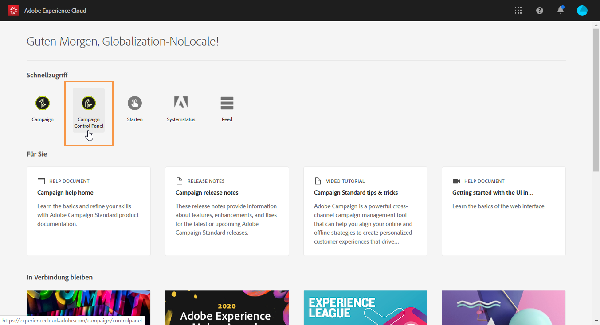
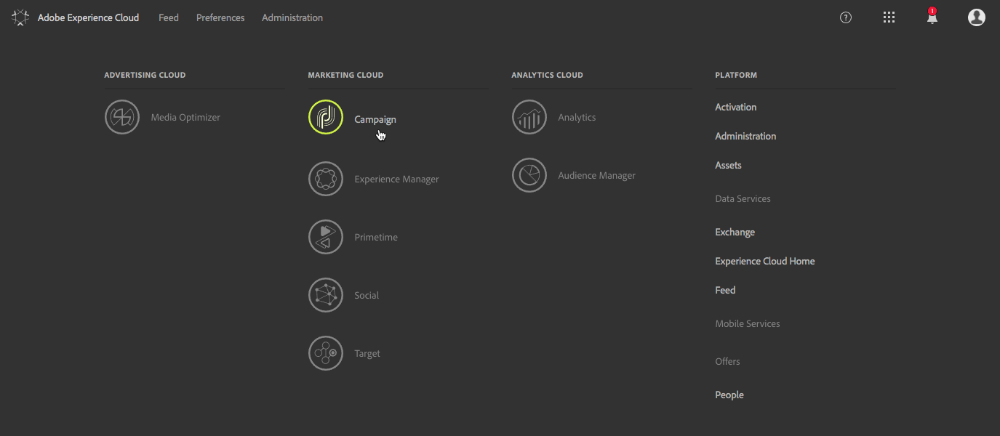
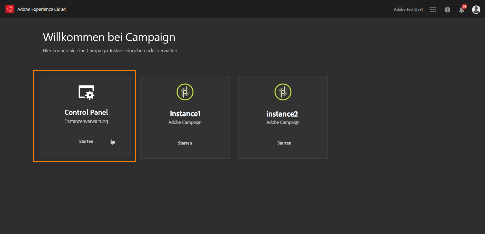
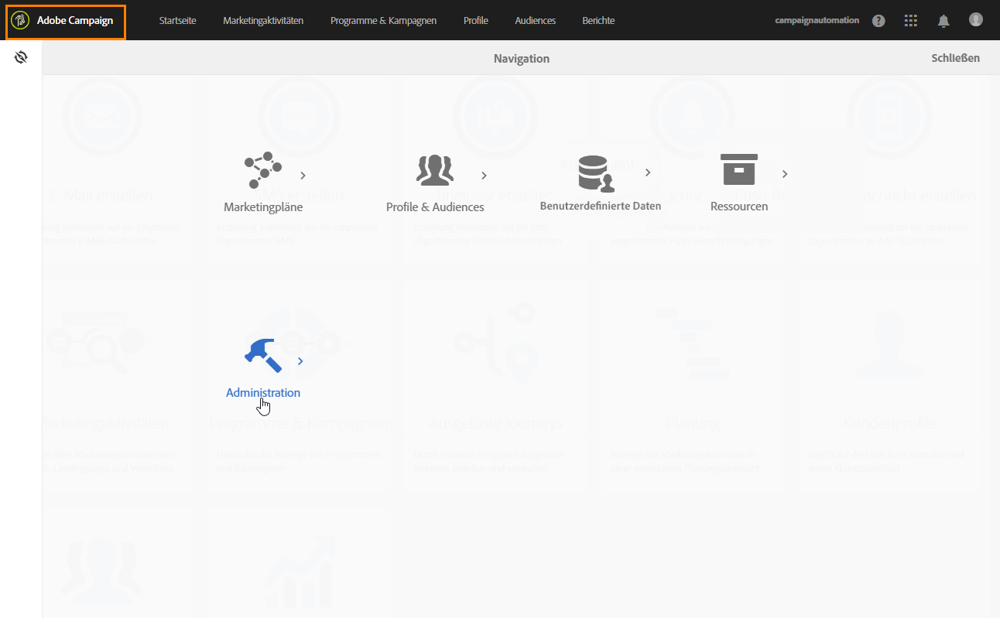
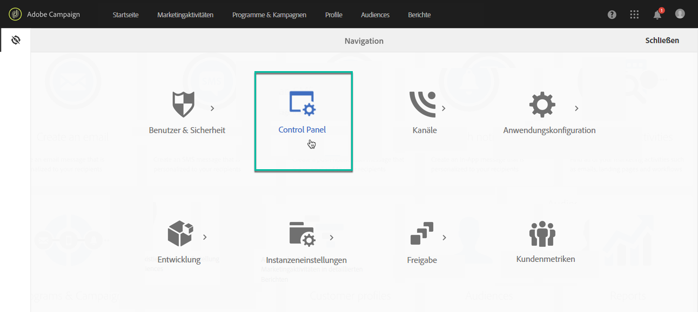

# Zugriff auf das Control Panel {#accessing-control-panel}

Das Control Panel ist direkt in Experience Cloud oder über das Produkt selbst verfügbar.

Es steht nur **Administratoren** zur Verfügung. Weitere Informationen zum Hinzufügen von Benutzern zur Gruppe der Administratoren finden Sie in [diesem Abschnitt](../../discover/using/managing-permissions.md).

## Zugriff über die Experience Cloud-Plattform {#access-experience-cloud-platform}

Um über die Experience Cloud-Plattform auf das Control Panel zuzugreifen, öffnen Sie die [Startseite der Experience Cloud-Plattform](https://experiencecloud.adobe.com/) und wählen Sie dann im Bereich **Schnellzugriff** den entsprechenden Link aus.

Der Zugriff auf das Control Panel ist auch über die Experience Cloud-Plattform in der **Auswahl der Lösungen** möglich:

1. Gehen Sie zu [Adobe Experience Cloud](https://experiencecloud.adobe.com/) und wählen Sie dann in der Lösungsauswahl **Campaign** aus.

   

1. Die Liste Ihrer Campaign-Instanzen wird angezeigt. Wählen Sie die Karte **Control Panel** aus, um das Control Panel zu starten.

   

## Zugriff über das Produkt {#access-product}

>[!NOTE]
>
>Der Zugriff über das Produkt ist nur für Campaign Standard verfügbar.

1. Öffnen Sie Campaign Standard und wählen Sie dann das Menü **[!UICONTROL Administration]** aus dem Bereich **[!UICONTROL Navigation]** aus.

   

1. Wählen Sie das Symbol **[!UICONTROL Control Panel]** aus.

   
