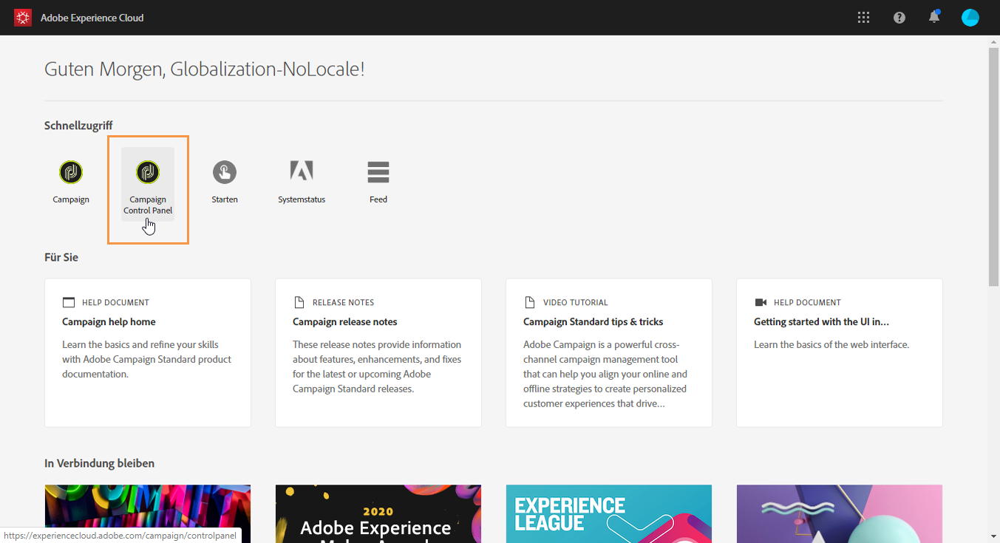
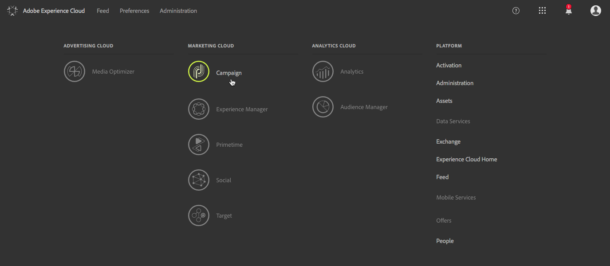
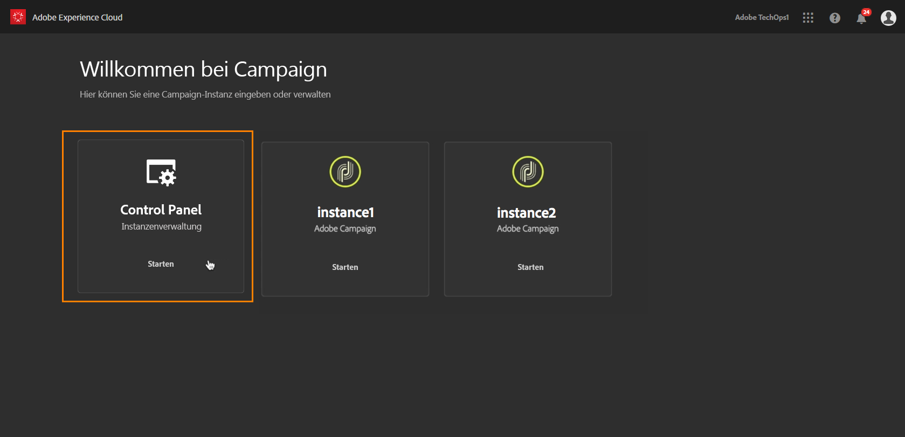
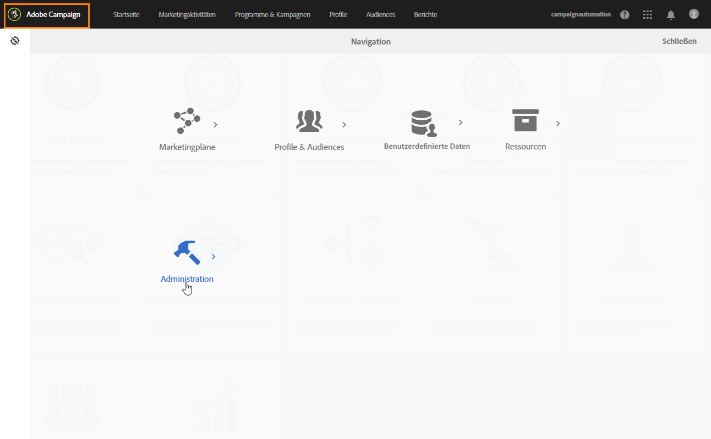
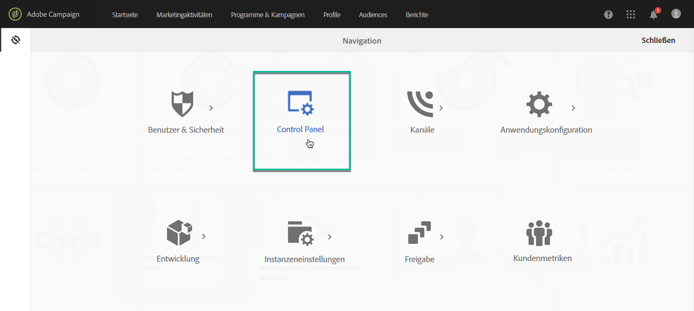

# Zugriff auf das Control Panel {#accessing-control-panel}

Das Control Panel ist direkt in Experience Cloud oder über das Produkt selbst verfügbar.

## Voraussetzungen {#prerequisites}

Beachten Sie für Campaign v7/v8, dass Ihre Instanz auf Amazon Web Services (AWS) gehostet und auf den neuesten [stabilen Campaign-Build](https://experienceleague.adobe.com/docs/campaign-classic/using/release-notes/rn-overview.html?lang=de#rn-statuses) (oder auf Build 9032 oder höher) aktualisiert werden muss. Erfahren Sie in [diesem Abschnitt](https://experienceleague.adobe.com/docs/campaign-classic/using/getting-started/starting-with-adobe-campaign/launching-adobe-campaign.html?lang=de#getting-your-campaign-version), wie Sie Ihre Version überprüfen. Um zu überprüfen, ob Ihre Instanz auf AWS gehostet wird, folgen Sie den Schritten auf [dieser Seite](../../faq.md#hosted-aws).

Campaign v8-Instanzen, die auf Microsoft Azure gehostet werden, haben außerdem Zugriff auf eine Untergruppe von Control Panel-Funktionen: [IP-Zulassungsauflistung für ](../../instances-settings/using/ip-allow-listing-instance-access.md)-Zugriff[, IP-Zulassungsauflistung für SFTP-Server](../../sftp/using/ip-range-allow-listing.md) und [kundenverwaltete SSL-Zertifikatverwaltung](../../subdomains-certificates/using/renewing-subdomain-certificate.md).

>[!IMPORTANT]
>
>Standardmäßig ist das Control Panel für Admin-Benutzende zugänglich, die zum Produktprofil der Admins gehören. Je nach Konfiguration Ihrer Organisation kann das Produktprofil unterschiedlich benannt sein („Admin“, „Admins“, „Validierungsadmin“ usw.). **Jedes Produktprofil, das das Wort „admin“ im Namen enthält, gewährt automatisch Zugriff auf das Control Panel**. Überprüfen Sie die Benennung des Produktprofils sorgfältig, um sicherzustellen, dass nur autorisierte Benutzende Zugriff auf das Control Panel haben. [Erfahren Sie, wie Sie Berechtigungen für das Control Panel verwalten](../../discover/using/managing-permissions.md).

## Zugriff über Experience Cloud Platform {#access-experience-cloud-platform}

Gehen Sie wie folgt vor, um über Adobe Experience Cloud Platform auf das Control Panel zuzugreifen.

1. Navigieren Sie zur [Startseite von Experience Cloud](https://experiencecloud.adobe.com/){target="_blank"}.

1. Klicken Sie auf den entsprechenden Link im Abschnitt **Schnellzugriff**.

   

Der Zugriff auf das Control Panel ist auch über Experience Cloud Platform in der **Auswahlfunktion für Lösungen** möglich:

1. Wählen Sie auf der [Startseite von Adobe Experience Cloud](https://experiencecloud.adobe.com/){target="_blank"} im Bereich **Schnellzugriff** oder im Menü oben rechts die Option **Campaign** aus.

   

1. Die Liste Ihrer Campaign-Instanzen wird angezeigt. Wählen Sie die Karte **Control Panel** aus, um das Control Panel zu starten.

   

## Zugriff über das Produkt {#access-product}

>[!NOTE]
>
>Der Zugriff über das Produkt ist nur für [Campaign Standard](https://experienceleague.adobe.com/docs/campaign-standard/using/campaign-standard-home.html?lang=de){target="_blank"} verfügbar.

1. Öffnen Sie Ihr Campaign Standard-Produkt.

1. Wählen Sie das Menü **[!UICONTROL Administration]** im Bereich **Navigation** aus.

   

1. Klicken Sie auf das **[!UICONTROL Control Panel]**-Symbol.

   
