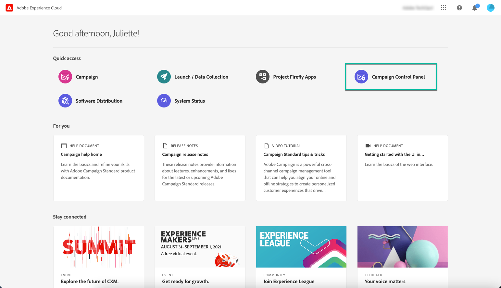

# Zugriff auf das Control Panel {#accessing-control-panel}

Das Control Panel ist direkt in Experience Cloud oder über das Produkt selbst verfügbar.

Es steht nur **Administratoren** zur Verfügung. Weitere Informationen zum Hinzufügen von Benutzern zur Gruppe der Administratoren finden Sie in [diesem Abschnitt](../../discover/using/managing-permissions.md).

## Zugriff über die Experience Cloud-Plattform {#access-experience-cloud-platform}

Gehen Sie wie folgt vor, um über die Adobe Experience Cloud-Plattform auf das Control Panel zuzugreifen.

1. Navigieren Sie zur [Experience Cloud-Homepage](https://experiencecloud.adobe.com/){target=&quot;_blank&quot;}.

1. Klicken Sie auf den entsprechenden Link im Abschnitt **Schnellzugriff** .

   

Der Zugriff auf das Control Panel ist auch über die Experience Cloud-Plattform in der **Auswahl der Lösungen** möglich:

1. Wählen Sie auf der [Adobe Experience Cloud-Homepage](https://experiencecloud.adobe.com/){target=&quot;_blank&quot;} **Kampagne** im Bereich **Schnellzugriff** oder im oberen Menü rechts aus.

   

1. Die Liste Ihrer Campaign-Instanzen wird angezeigt. Wählen Sie die Karte **Control Panel** aus, um das Control Panel zu starten.

   

## Zugriff über das Produkt {#access-product}

>[!NOTE]
>
>Der Produktzugriff ist nur für [Campaign Standard](https://experienceleague.adobe.com/docs/campaign-standard/using/campaign-standard-home.html?lang=de){target=&quot;_blank&quot;} verfügbar.

1. Öffnen Sie Ihr Campaign Standard-Produkt.

1. Wählen Sie das Menü **[!UICONTROL Administration]** aus dem Bereich **Navigation** aus.

   

1. Wählen Sie das Symbol **[!UICONTROL Control Panel]** aus.

   
