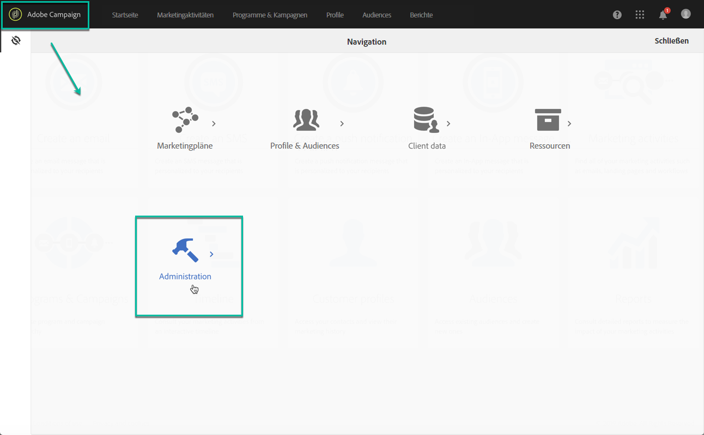

# Zugriff auf das Control Panel {#accessing-control-panel}

Die Systemsteuerung ist direkt in der Experience Cloud oder über das Produkt selbst verfügbar.

Er steht nur **Administratoren** zur Verfügung. Weitere Informationen zum Hinzufügen von Benutzern zur Gruppe der Administratoren finden Sie in [diesem Abschnitt](../../discover/using/managing-permissions.md).

## Zugriff über die Experience Cloud-Plattform {#access-experience-cloud-platform}

Um über die Experience Cloud-Plattform auf das Control Panel zuzugreifen, navigieren Sie zur [Homepage der Experience Cloud-Plattform](https://amc.experiencecloud.adobe.com/) und klicken Sie dann auf den entsprechenden Link im Bereich **Schnellzugriff**.

Der Zugriff auf das Control Panel ist auch über die **Lösungsauswahl** der Experience Cloud-Plattform möglich:

1. Gehen Sie zu [Adobe Experience Cloud](https://amc.experiencecloud.adobe.com/) und wählen Sie dann **Campaign** aus der Lösungsauswahl aus.

   

1. Die Liste Ihrer Campaign-Instanzen wird angezeigt. Click the **Control Panel** card to launch it.

   

## Zugriff vom Produkt aus {#access-product}

>[!NOTE]
>
>Bei **Campaign Classic** -Instanzen ist der Zugriff von innerhalb des Produkts ab Campaign Classic 19.1 verfügbar.

1. Öffnen Sie Ihr Campaign Standard-Produkt und wählen Sie dann das Menü **[!UICONTROL Administration]** aus dem Bereich **Navigation]aus.[!UICONTROL **

   

1. Klicken Sie auf das Symbol **[!UICONTROL Systemsteuerung]** .

   
