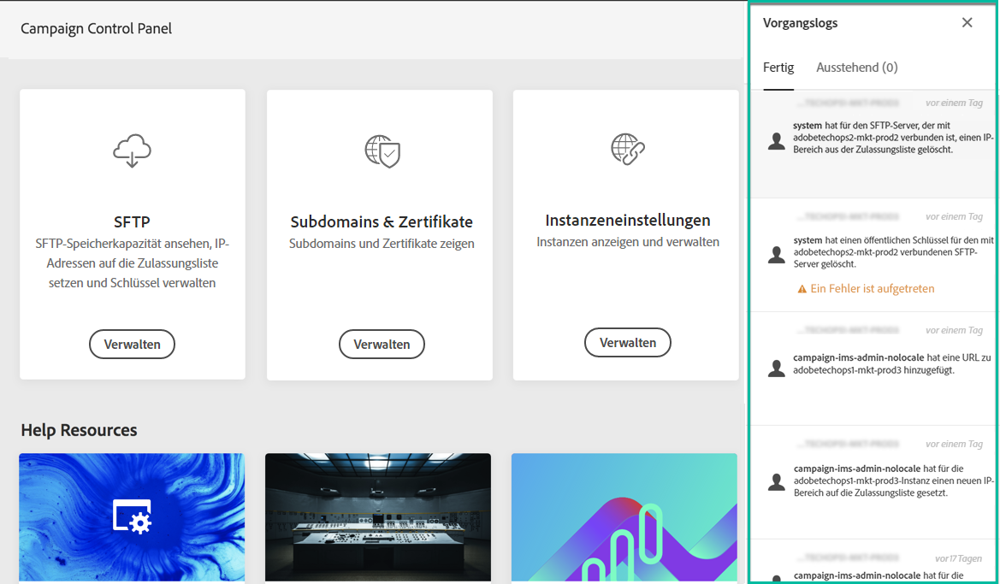

# Benutzeroberfläche der Systemsteuerung {#discovering-interface}

Auf der Startseite des Control Panels haben Sie Zugriff auf alle Aktionen, die auf Ihren Campaign-Instanzen ausgeführt werden können.

They are represented by cards that are organized into topics, for example **Storage &amp; Database Management**.

In den kommenden Campaign-Versionen werden weitere Themen und Karten bereitgestellt.

## Verarbeitungslogs {#job-logs}

Über die Schaltfläche **[!UICONTROL Verarbeitungslogs]** oben rechts können Sie alle Änderungen überprüfen, die von Benutzern Ihres Unternehmens vorgenommen wurden.

Durch Klicken auf ein Element der Liste werden weitere Details angezeigt.

Über die Schaltfläche **[!UICONTROL Öffnen]** können Sie direkt auf die Registerkarte „Control Panel“ zugreifen, auf der die Änderung vorgenommen wurde.

## Hilfe-Ressourcen {#help-resources}

The **[!UICONTROL Help Resources]** section provides useful documentation to help you in your use of the Control Panel and Campaign products. Lesen Sie einfach bei Bedarf nach.

