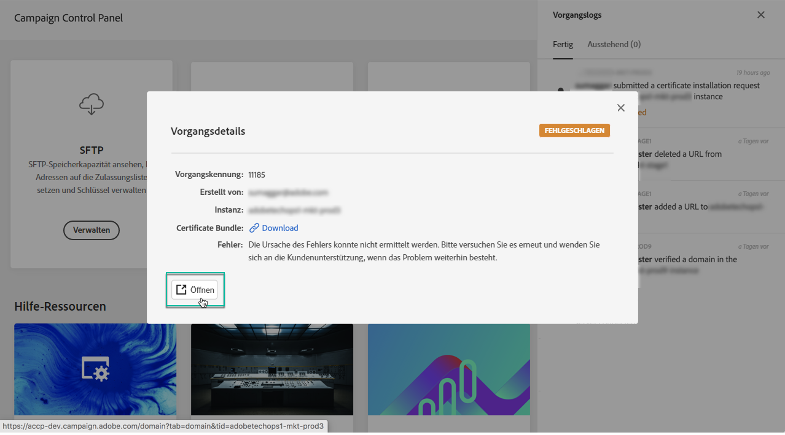

# Die Benutzeroberfläche des Control Panels {#discovering-interface}

Auf der Startseite des Control Panels haben Sie Zugriff auf alle Aktionen, die auf Ihren Campaign-Instanzen ausgeführt werden können.

Die Aktionen werden durch Karten dargestellt, die in unterschiedliche Themen geordnet sind, z. B. **Monitoring der Performance**.

<!--With upcoming Campaign releases, more topics and cards will be made available.-->

## Vorgangslogs {#job-logs}

Über die Schaltfläche **[!UICONTROL Vorgangslog]** oben rechts können Sie alle Änderungen überprüfen, die von Benutzern Ihres Unternehmens vorgenommen wurden.

Durch Auswahl der Elemente der Liste werden weitere Details angezeigt.

Über die Schaltfläche **[!UICONTROL Öffnen]** können Sie direkt auf die Registerkarte &quot;Control Panel&quot; zugreifen, auf der die Änderung vorgenommen wurde.

## Hilfe-Ressourcen {#help-resources}

Der Abschnitt **[!UICONTROL Hilfe-Ressourcen]** enthält nützliche Informationen zur Verwendung des Control Panels und der Campaign-Produkte. Lesen Sie einfach bei Bedarf nach.

## Unterstützte Sprachen {#languages}

Die Benutzeroberfläche von Control Panel wurde so konzipiert, dass sie in der Sprache angezeigt wird, die der Konfiguration Ihres Browsers entspricht.

Wenn Ihr Browser auf eine Sprache festgelegt ist, die nicht unterstützt wird, überprüft Control Panel die ersten drei Sprachen in der Sprachliste Ihres Browsers, bis eine unterstützte Sprache gefunden wird. Wenn keine der ersten drei Sprachen von Control Panel unterstützt wird, wird standardmäßig Englisch (USA) verwendet.

Nachfolgend finden Sie eine Liste der Sprachen, die derzeit von Control Panel unterstützt werden:

* Englisch (USA)
* Deutsch
* Französisch
* Japanisch
* Italienisch (Italien)
* Spanisch (Spanien)
* Koreanisch
* Portugiesisch (Brasilien)
* Chinesisch (vereinfacht)
* Chinesisch (traditionell)
