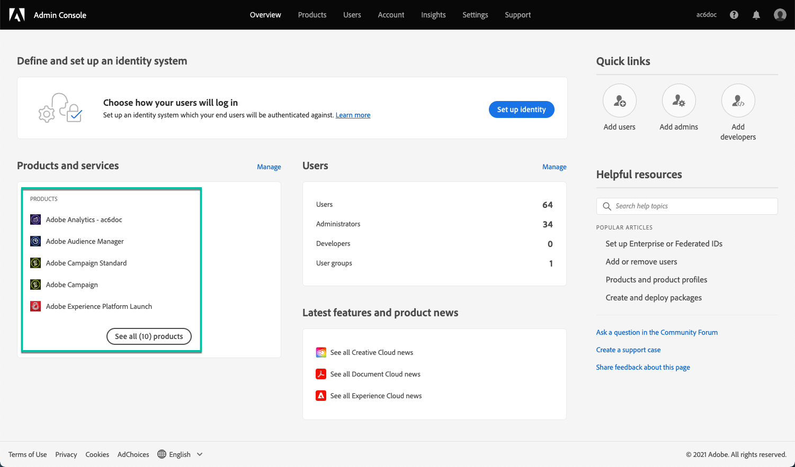
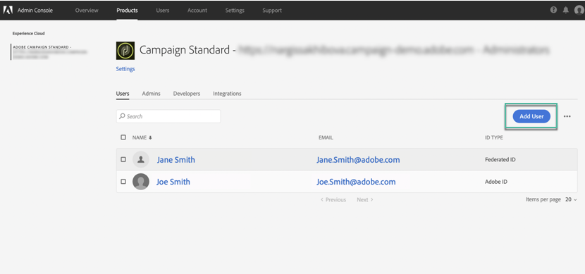

# Verwalten von Berechtigungen für das Control Panel {#managing-permissions-control-panel}

Auf das Control Panel haben alle Admin-Benutzer einer Campaign-Instanz Zugriff. Führen Sie die folgenden Schritte aus, um Benutzern Administratorrechte zu erteilen und ihnen Zugriff auf das Control Panel zu gewähren.

 Funktion kennenlernen im [Video](../../discover/using/managing-permissions.md#video)

1. Navigieren Sie zum [Adobe Experience Cloud-Homepage](https://experiencecloud.adobe.com/){target="_blank"}.

1. Starten Sie die **Admin Console**, indem Sie auf den verfügbaren Link im Bereich **Schnellzugriff** oder im Menü oben rechts klicken.

   

   >[!NOTE]
   >
   >Wenn der Link **Admin Console** nicht sichtbar ist, bedeutet das, dass Sie für Ihre Organisation keine Administratorrechte haben. Wenden Sie sich an die Administratoren Ihrer Organisation, um die entsprechenden Schritte auszuführen.

1. Wählen Sie in der **Admin Console** das gewünschte Campaign-Produkt aus der Liste **[!UICONTROL Produkte und Dienste]** aus.

   

   >[!NOTE]
   >
   >Wenn Sie Ihr Produkt nicht sehen, wenden Sie sich an die Administratoren Ihrer Organisation, damit diese Ihnen Zugriff darauf gewähren.

1. Die Liste der Instanzen für Ihr Campaign-Produkt wird angezeigt. Wählen Sie die Instanz aus, zu der Sie einen Admin-Benutzer hinzufügen möchten.

   

   >[!NOTE]
   >
   >Sie können für jede Campaign-Instanz unterschiedliche Admin-Benutzer hinzufügen. Admin-Benutzer können nur auf das Control Panel der Instanz zugreifen, zu der sie gehören.

1. Für die ausgewählte Instanz wird die Liste der **[!UICONTROL Produktprofile]** angezeigt. Wählen Sie das Produktprofil **[!UICONTROL Administratoren]** aus, um auf die Liste der Admin-Benutzer zuzugreifen.

   

   >[!NOTE]
   >
   >Standardmäßig gehören Admin-Benutzer dem Produktprofil &quot;Administratoren&quot; an. Je nach Konfiguration Ihrer Organisation kann das Produktprofil unterschiedlich benannt sein (&quot;admin&quot;, &quot;admins&quot; usw.).

1. Die Liste der Admin-Benutzer wird angezeigt. Wählen Sie die Schaltfläche **[!UICONTROL Benutzer hinzufügen]** aus, um den gewünschten Benutzer hinzuzufügen.

   

>[!NOTE]
>
>Sobald der Zugriff konfiguriert ist, muss sich der Benutzer bei Adobe Experience Cloud abmelden und erneut anmelden, um auf das Control Panel zugreifen zu können.

## Tutorial-Video {#video}

>[!VIDEO](https://video.tv.adobe.com/v/27147?quality=12)
