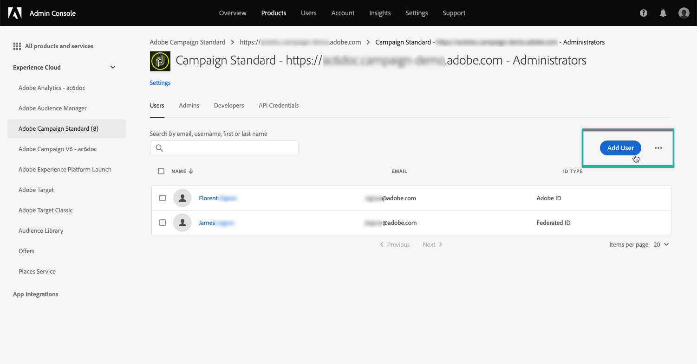

# Berechtigungen für das Control Panel verwalten {#managing-permissions-control-panel}

Auf das Control Panel haben alle Admin-Benutzer einer Campaign-Instanz Zugriff. Führen Sie die folgenden Schritte aus, um Benutzern Administratorrechte zu erteilen und ihnen Zugriff auf das Control Panel zu gewähren.

 Entdecken Sie diese Funktion im Video mit [Campaign Classic](https://experienceleague.adobe.com/docs/campaign-classic-learn/control-panel/getting-started-with-the-control-panel.html?lang=en#administrator-rights) oder [Campaign Standard](https://experienceleague.adobe.com/docs/campaign-standard-learn/control-panel/getting-started-with-the-control-panel.html?lang=en)

1. Gehen Sie zu [Adobe Experience Cloud](https://experiencecloud.adobe.com/) und wählen Sie dann die Registerkarte **[!UICONTROL Administration]** aus.

   

   >[!NOTE]
   >
   >Wenn die Registerkarte <b>Administration</b> nicht sichtbar ist, bedeutet das, dass Sie für Ihre Organisation keine Administratorrechte haben. Wenden Sie sich an die Administratoren Ihrer Organisation, um die entsprechenden Schritte auszuführen.

1. Starten Sie die **Admin Console**, indem Sie die verfügbaren Links auswählen.

   

1. Wählen Sie das gewünschte Campaign-Produkt aus.

   

   >[!NOTE]
   >
   >Wenn Sie Ihr Produkt nicht sehen, wenden Sie sich an die Administratoren Ihrer Organisation, damit diese Ihnen Zugriff darauf gewähren.

1. Die Liste der Instanzen für Ihr Campaign-Produkt wird angezeigt. Wählen Sie die Instanz aus, zu der Sie einen Admin-Benutzer hinzufügen möchten.

   

   >[!NOTE]
   >
   >Sie können für jede Campaign-Instanz unterschiedliche Admin-Benutzer hinzufügen. Die Admin-Benutzer können aber nur auf das Control Panel der Instanz zugreifen, zu der sie gehören.

1. Für die ausgewählte Instanz wird die Liste der Produktprofile angezeigt. Wählen Sie das Produktprofil **[!UICONTROL Administratoren]** aus, um auf die Liste der Admin-Benutzer zuzugreifen.

   

   >[!NOTE]
   >
   >Standardmäßig gehören Admin-Benutzer dem Produktprofil &quot;Administratoren&quot; an. Je nach Konfiguration Ihrer Organisation kann das Produktprofil unterschiedlich benannt sein (&quot;admin&quot;, &quot;admins&quot; usw.).

1. Die Liste der Admin-Benutzer wird angezeigt. Wählen Sie die Schaltfläche **[!UICONTROL Benutzer hinzufügen]** aus, um den gewünschten Benutzer hinzuzufügen.

   

>[!NOTE]
>
>Sobald der Zugriff konfiguriert ist, muss sich der Benutzer bei Adobe Experience Cloud abmelden und erneut anmelden, um auf das Control Panel zugreifen zu können.
