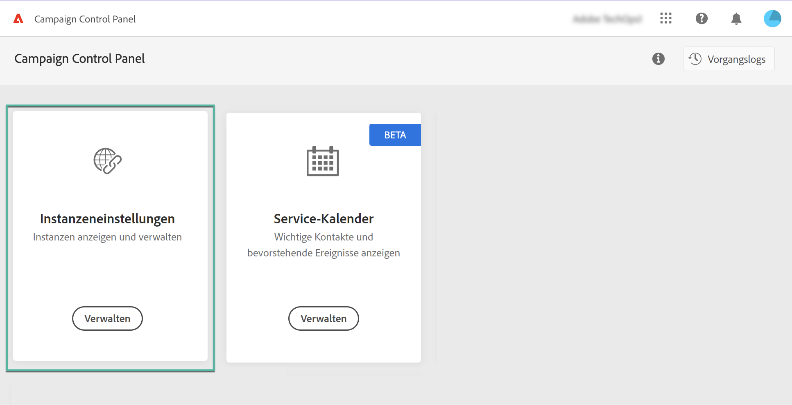
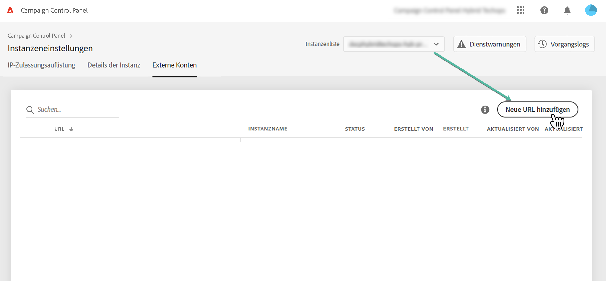
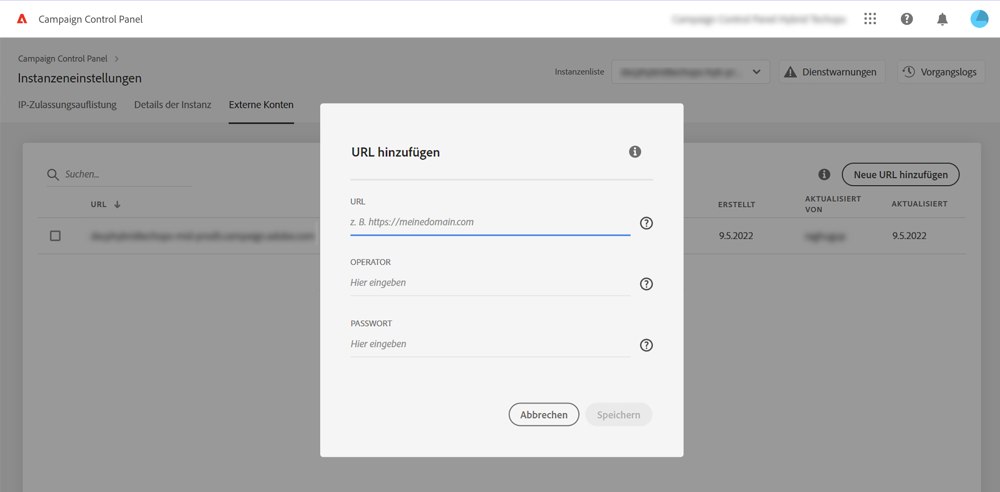
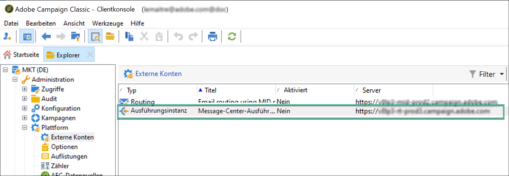
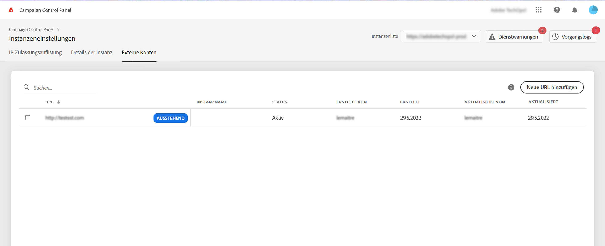
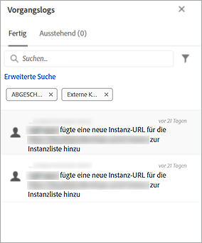

# Hinzufügen von MID-/RT-Instanzen (Hybridmodell){#add-mid-rt-instances-hybrid-model}

>[!CONTEXTUALHELP]
>id="cp_externalaccounts"
>title="Externe Konten"
>abstract="In diesem Bildschirm können Kunden mit Hybrid-Hosting-Modell ihre in der Marketing-Instanz im Control Panel konfigurierte URL für die MID/RT-Instanz bereitstellen, um die Funktionen des Control Panels zu nutzen."

Das Control Panel ermöglicht es Kunden mit einem hybriden Hosting-Modell, spezifische Funktionen des Control Panels zu nutzen. Gehen Sie dazu folgendermaßen vor:

* [Geben Sie die URL der MID/RT-Instanz an](#add), die in der Marketing-Instanz in Control Panel konfiguriert wurde.
* [Fügen Sie die IP-Adresse der MID/RT-Instanz zur Zulassungsliste hinzu](#ip), damit sich die Marketing-Instanz mit ihr verbinden kann.

Weitere Informationen zu Hosting-Modellen finden Sie in der [Dokumentation zu Campaign Classic](https://experienceleague.adobe.com/docs/campaign-classic/using/installing-campaign-classic/architecture-and-hosting-models/hosting-models-lp/hosting-models.html?lang=de).

## Hinzufügen einer MID-/RT-Instanz {#add}

>[!CONTEXTUALHELP]
>id="cp_externalaccounts_url"
>title="URL"
>abstract="Die URL der Instanz, die Sie in der Client-Konsole von Campaign im Menü „Administration“ > „Plattform“ > „Externe Konten“ finden."

>[!CONTEXTUALHELP]
>id="cp_externalaccounts_operator"
>title="Operator"
>abstract="Die Kennung des Benutzers, die nach der erstmaligen Bereitstellung durch den Adobe-Administrator bereitgestellt wurde."

>[!CONTEXTUALHELP]
>id="cp_externalaccounts_password"
>title="Passwort"
>abstract="Kennwort des Betreibers, das nach der Erstbereitstellung von Adobe-Admin angegeben wurde."

Hybrid-Kunden sollten eine Verbindung zum Control Panel über Experience Cloud herstellen. Beim erstmaligen Zugriff auf das Control Panel werden auf der Startseite nur zwei Karten angezeigt.

>[!NOTE]
>
>Falls Sie Probleme mit dem Zugriff auf das Control Panel haben, ist Ihre Marketing-Instanz höchstwahrscheinlich noch nicht Ihrer [Organisations-ID](https://experienceleague.adobe.com/docs/core-services/interface/administration/organizations.html?lang=de) zugeordnet. Wenden Sie sich an die Kundenunterstützung, um diese Einrichtung abzuschließen und fortzufahren. Bei erfolgreicher Verbindung wird die Startseite des Control Panels angezeigt.

Um auf die Funktionen des Control Panels zugreifen zu können, müssen Sie Ihre MID/RT-Instanzinformationen auf der Karte **[!UICONTROL Instanzeinstellungen]** angeben. Gehen Sie dazu wie folgt vor:

1. Wählen Sie auf der Karte **[!UICONTROL Instanzeinstellungen]** die Registerkarte **[!UICONTROL Externe Konten]**.

1. Wählen Sie die gewünschte Marketing-Instanz aus der Dropdown-Liste und klicken Sie dann auf **[!UICONTROL Neue URL hinzufügen]**.

   

1. Geben Sie Informationen über die zu hinzuzufügende MID-/RT-Instanz an.

   

   * **[!UICONTROL URL]**: URL der Instanz, die in der Client-Konsole von Campaign im Menü **[!UICONTROL Administration]** > **[!UICONTROL Plattform]** > **[!UICONTROL Externe Konten]** gefunden werden kann.

     

   * **[!UICONTROL Benutzer]** / **[!UICONTROL Passwort]**: Anmeldedaten des Benutzer, die nach der Bereitstellung von einem Adobe-Administrator bereitgestellt wurden.

     >[!NOTE]
     >
     >Wenn diese Informationen nicht verfügbar sind, wenden Sie sich an die Kundenunterstützung.

1. Klicken Sie zur Bestätigung auf **[!UICONTROL Speichern]**.

Beim Hinzufügen der MID/RT-URL wird ein asynchroner Prozess ausgelöst, um die Richtigkeit der URLs zu überprüfen. Dieser Vorgang kann einige Minuten dauern. Bis die URL der MID/RT-Instanz validiert ist, ist der Vorgang ausstehend. Erst nach Abschluss der Überprüfung können Sie auf die Hauptfunktionen des Control Panels zugreifen.

Sie können eine MID/RT-Instanz-URL jederzeit entfernen oder deaktivieren, indem Sie sie in der Liste auswählen.

Beachten Sie, dass Sie jede Aktion, die auf der Registerkarte **[!UICONTROL Externe Konten]** auf einer MID/RT-Instanz-URL ausgeführt wird, in den **[!UICONTROL Vorgangslogs]** überwachen können:

## Hinzufügen der IP-Adresse zur Zulassungsliste {#ip}

Nachdem die MID/RT-Instanz hinzugefügt wurde, müssen Sie ihre IP-Adresse zur Zulassungsliste hinzufügen, damit Ihre Marketing-Instanz eine Verbindung mit ihr herstellen kann.

Dies kann über die **[!UICONTROL IP-Zulassungsauflistung]** auf der Karte **[!UICONTROL Instanzeneinstellungen]** getan werden. [Erfahren Sie, wie Sie der Zulassungsliste IP-Adressen hinzufügen.](ip-allow-listing-instance-access.md)

Danach können Sie die Control Panel-Funktionen mit Ihrer MID/RT-Instanz verwenden.

## Für Hybridkunden verfügbare Funktionen {#capabilities}

Sobald eine MID/RT-Instanz zum Control Panel hinzugefügt worden ist, können Sie die unten aufgeführten Funktionen nutzen:

* [Überwachung wichtiger Kontakte und Ereignisse](../../service-events/service-events.md)
* [Details Ihrer Instanz anzeigen](../../instances-settings/using/instance-details.md),
* [Hinzufügen von IP-Adressen zur Zulassungsliste](../../instances-settings/using/ip-allow-listing-instance-access.md),
* [Einrichten neuer Subdomains](../../subdomains-certificates/using/setting-up-new-subdomain.md),
* [Erneuern von SSL-Zertifikaten der Subdomains](../../subdomains-certificates/using/renewing-subdomain-certificate.md).
