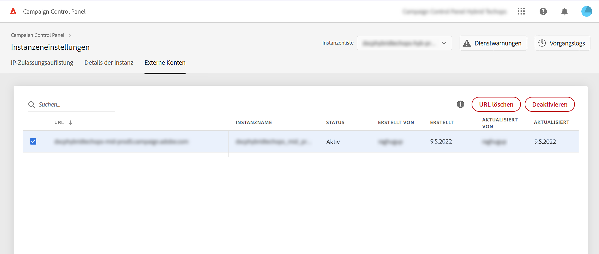

# MID-/RT-Instanzen hinzufügen (Hybridmodell)

>[!CONTEXTUALHELP]
>id="cp_externalaccounts"
>title="Externe Konten"
>abstract="In diesem Bildschirm können Kunden mit Hybrid-Hosting-Modell ihre in der Marketing-Instanz im Control Panel konfigurierte MID/RT-Instanz-URL bereitstellen, um die Funktionen des Control Panels zu nutzen."

Mit dem Control Panel können Kunden mit hybridem Hosting-Modell bestimmte Control Panel-Funktionen nutzen. Dazu müssen sie die in ihrer Marketing-Instanz im Control Panel konfigurierte MID/RT-Instanz-URL angeben.

Weitere Informationen zu Hosting-Modellen finden Sie in der [Dokumentation zu Campaign Classic](https://experienceleague.adobe.com/docs/campaign-classic/using/installing-campaign-classic/architecture-and-hosting-models/hosting-models-lp/hosting-models.html?lang=de).

## Hinzufügen einer MID/RT-Instanz {#add}

>[!CONTEXTUALHELP]
>id="cp_externalaccounts_url"
>title="URL"
>abstract="URL der Instanz, die Sie in der Campaign Client-Konsole im Menü Administration > Plattform > Externe Konten finden."

>[!CONTEXTUALHELP]
>id="cp_externalaccounts_operator"
>title="Operator"
>abstract="Kennung des Benutzers, der nach der erstmaligen Bereitstellung durch den Adobe-Administrator bereitgestellt wurde."

>[!CONTEXTUALHELP]
>id="cp_externalaccounts_password"
>title="Passwort"
>abstract="Kennwort des Benutzers, der nach der erstmaligen Bereitstellung durch den Adobe-Administrator bereitgestellt wird."

Hybrid-Kunden sollten über Experience Cloud eine Verbindung zum Control Panel herstellen. Beim erstmaligen Zugriff auf das Control Panel werden auf der Startseite nur zwei Karten angezeigt.

>[!NOTE]
>
>Falls Probleme beim Zugriff auf das Control Panel auftreten, ist Ihre Marketing-Instanz höchstwahrscheinlich noch nicht Ihrer Organisations-ID zugeordnet. Wenden Sie sich an die Kundenunterstützung , um diese Einrichtung abzuschließen und fortzufahren. Bei erfolgreicher Verbindung wird die Startseite des Control Panels angezeigt.

Um auf die Funktionen des Control Panels zugreifen zu können, müssen Sie Ihre MID/RT-Instanzinformationen auf der Karte **[!UICONTROL Instanzeinstellungen]** angeben. Gehen Sie dazu wie folgt vor:

1. Wählen Sie auf der Karte **[!UICONTROL Instanzeinstellungen]** die Registerkarte **[!UICONTROL Externe Konten]**.

1. Wählen Sie die gewünschte Marketinginstanz aus der Dropdown-Liste und klicken Sie dann auf **[!UICONTROL Neue URL hinzufügen]**.

   

1. Geben Sie Informationen zur hinzuzufügenden MID-/RT-Instanz an.

   

   * **[!UICONTROL URL]**: URL der Instanz, die Sie in der Campaign-Client-Konsole in der **[!UICONTROL Administration]** > **[!UICONTROL Plattform]** > **[!UICONTROL Externe Konten]** Menü.

      

   * **[!UICONTROL Benutzer]** / **[!UICONTROL Passwort]**: Anmeldedaten des Benutzer, die nach der Bereitstellung von einem Adobe-Administrator bereitgestellt wurden.

      >[!NOTE]
      >
      >Wenn diese Informationen nicht verfügbar sind, wenden Sie sich an die Kundenunterstützung.

1. Klicken Sie zur Bestätigung auf **[!UICONTROL Speichern]**.

Beim Hinzufügen der MID/RT-URL wird ein asynchroner Prozess ausgelöst, um die Richtigkeit der URLs zu überprüfen. Dieser Vorgang kann einige Minuten dauern. Bis die URL der MID/RT-Instanz validiert ist, ist der Auftrag ausstehend. Erst nach Abschluss der Überprüfung können Sie auf die Hauptfunktionen des Control Panels zugreifen.

Sie können eine MID/RT-Instanz-URL jederzeit entfernen oder deaktivieren, indem Sie sie in der Liste auswählen.

Beachten Sie, dass Sie jede Aktion überwachen können, die in der Variablen **[!UICONTROL Externe Konten]** auf einer MID/RT-Instanz-URL aus **[!UICONTROL Auftragsprotokolle]**:

## Für Hybridkunden verfügbare Funktionen {#capabilities}

Nachdem dem Control Panel eine MID-/RT-Instanz hinzugefügt wurde, können Sie die unten aufgeführten Funktionen nutzen:

* [Überwachung wichtiger Kontakte und Ereignisse](../../service-events/service-events.md)
* [Details Ihrer Instanz anzeigen](../../instances-settings/using/instance-details.md),
* [Hinzufügen von IP-Adressen zur Zulassungsliste](../../instances-settings/using/ip-allow-listing-instance-access.md) (für RT-Instanzen),
* [Informationen zu delegierten Subdomains anzeigen](../../subdomains-certificates/using/monitoring-subdomains.md),
* [Informationen zu SSL-Zertifikaten anzeigen](../../subdomains-certificates/using/monitoring-ssl-certificates.md).