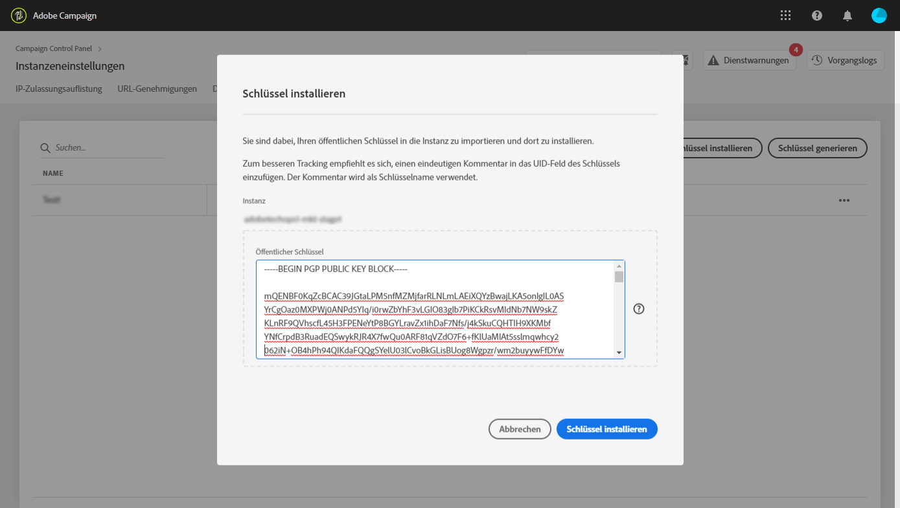
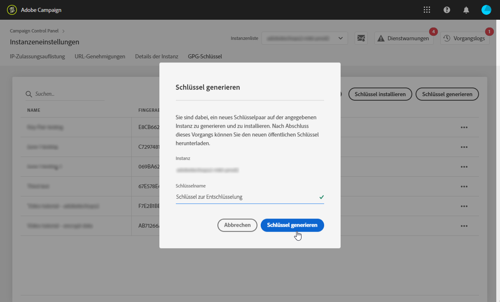

# GPG-Schlüsselverwaltung {#gpg-keys-management}

## Grundlagen zur GPG-Verschlüsselung {#about-gpg-encryption}

Mit der GPG-Verschlüsselung können Sie Ihre Daten mit einem System aus öffentlich-privaten Schlüsselpaaren schützen, die der [OpenPGP](https://www.openpgp.org/about/standard/) -Spezifikation entsprechen.

Nach der Implementierung können Sie eingehende Daten vor der Übertragung entschlüsseln und ausgehende Daten verschlüsseln lassen, um sicherzustellen, dass sie von niemandem ohne gültiges Schlüsselpaar zur Übereinstimmung aufgerufen werden.

Um die GPG-Verschlüsselung mit Kampagne zu implementieren, müssen GPG-Schlüssel von einem Administrator direkt über die Systemsteuerung installiert und/oder auf einer Marketinginstanz generiert werden.

Anschließend können Sie:

* **Gesendete Daten** verschlüsseln: Adobe Campaign sendet Daten nach der Verschlüsselung mit dem installierten öffentlichen Schlüssel.

* **Eingeladene Daten** deklarieren: Adobe Campaign empfängt Daten, die mithilfe eines öffentlichen Schlüssels aus der Systemsteuerung verschlüsselt wurden. Adobe Campaign entschlüsselt die Daten mit einem privaten Schlüssel, der aus der Systemsteuerung generiert wird.

## Überwachen von GPG-Schlüsseln

Um auf die GPG-Schlüssel zuzugreifen, die für Ihre Instanzen installiert und generiert wurden, öffnen Sie die Karte **[!UICONTROL Instanzeinstellungen]** und wählen Sie dann die Registerkarte **[!UICONTROL GPG-Schlüssel]** .

In der Liste werden alle für Ihre Instanzen installierten und generierten GPG-Verschlüsselungs- und Entschlüsselungs-Schlüssel mit detaillierten Informationen zu jedem Schlüssel angezeigt:

* **[!UICONTROL Name]**: Der Name, der beim Installieren oder Generieren des Schlüssels definiert wurde.
* **[!UICONTROL Anwendungsfall]**: Diese Spalte gibt den Anwendungsfall des Schlüssels an:

   : Der Schlüssel wurde zur Datenverschlüsselung installiert.

   : Der Schlüssel wurde generiert, um die Datenverschlüsselung zu ermöglichen.

* **[!UICONTROL Fingerabdruck]**: der Fingerabdruck des Schlüssels.
* **[!UICONTROL Läuft ab]**: Das Ablaufdatum des Schlüssels. Beachten Sie, dass die Systemsteuerung visuelle Hinweise bereitstellt, wenn sich der Schlüssel seinem Ablaufdatum nähert:

   * Dringend (rot) wird 30 Tage vorher angezeigt.
   * Warnung (gelb) wird 60 Tage zuvor angezeigt.
   * Sobald ein Schlüssel abgelaufen ist, wird ein rotes Banner &quot;Abgelaufen&quot;angezeigt.
   >[!NOTE]
   >
   >Beachten Sie, dass keine E-Mail-Benachrichtigung von der Systemsteuerung gesendet wird.

Als Best Practice empfehlen wir, alle Schlüssel zu entfernen, die Sie nicht mehr benötigen. Klicken Sie dazu auf die **...** und wählen Sie dann Schlüssel **[!UICONTROL löschen].**.

>[!IMPORTANT]
>
>Bevor Sie einen Schlüssel entfernen, stellen Sie sicher, dass er in keinem Adobe Campaign-Workflow verwendet wird, um ein Fehlschlagen zu verhindern.

## Verschlüsseln von Daten {#encrypting-data}

Über die Systemsteuerung können Sie Daten verschlüsseln, die aus Ihrer Adobe Campaign-Instanz stammen.

Dazu müssen Sie ein GPG-Schlüsselpaar aus einem PGP-Verschlüsselungstool generieren und dann den öffentlichen Schlüssel in der Systemsteuerung installieren. Sie können dann Daten verschlüsseln, bevor Sie sie von Ihrer Instanz senden. Gehen Sie dazu wie folgt vor:

1. Generieren Sie ein öffentliches/privates Schlüsselpaar mit einem GPG-Verschlüsselungstool nach der [OpenPGP-Spezifikation](https://www.openpgp.org/about/standard/). Installieren Sie dazu ein GPG-Dienstprogramm oder eine GNuGP-Software.

   >[!NOTE]
   >
   >Open Source freie Software zum Generieren von Schlüsseln ist verfügbar. Achten Sie jedoch darauf, die Richtlinien Ihres Unternehmens zu befolgen und das GPG-Dienstprogramm zu verwenden, das von Ihrer IT/Security-Organisation empfohlen wird.

1. Nachdem das Dienstprogramm installiert wurde, führen Sie den Befehl unten in Mac Terminal oder Windows aus.

   `gpg --full-generate-key`

1. Geben Sie bei Aufforderung die gewünschten Parameter für den Schlüssel an. Erforderliche Parameter sind:

   * **Schlüsseltyp**: RSA
   * **Schlüssellänge**: 1024 - 4096 Bits
   * **echter Name** und **E-Mail-Adresse**: Ermöglicht die Verfolgung, wer das Schlüsselpaar erstellt hat. Geben Sie einen Namen und eine E-Mail-Adresse ein, die mit Ihrer Organisation oder Abteilung verknüpft sind.
   * **Kommentar**: Wenn Sie eine Beschriftung zum Kommentarfeld hinzufügen, können Sie die Taste in der Liste der Systemsteuerung leicht identifizieren.
   * **Ablauf**: Datum oder 0 für kein Ablaufdatum.
   * **Passphrase**
   

1. Nach der Bestätigung generiert das Skript einen Schlüssel, den Sie in eine Datei exportieren oder direkt in die Systemsteuerung einfügen können. Um die Datei zu exportieren, führen Sie diesen Befehl aus, gefolgt vom Fingerabdruck des von Ihnen erstellten Schlüssels.

   `gpg -a --export <fingerprint>`

1. Um den öffentlichen Schlüssel in der Systemsteuerung zu installieren, rufen Sie die Registerkarte **[!UICONTROL GPG-Schlüssel]** auf und wählen Sie dann die gewünschte Instanz aus.

1. Klicken Sie auf die Schaltfläche &quot; **[!UICONTROL Installationsschlüssel]** &quot;.

   

1. Fügen Sie den öffentlichen Schlüssel ein, der aus Ihrem PGP-Verschlüsselungstool generiert wurde. Sie können die Datei mit dem öffentlichen Schlüssel auch direkt per Drag &amp; Drop verschieben.

   >[!NOTE]
   >
   >Der öffentliche Schlüssel sollte im OpenPGP Format vorliegen.

   

1. Klicken Sie auf die Schaltfläche &quot; **[!UICONTROL Installationsschlüssel]** &quot;.

Sobald der öffentliche Schlüssel installiert ist, wird er in der Liste angezeigt. Sie können die **...** zum Herunterladen oder Kopieren des Fingerabdrucks.

Der Schlüssel ist dann für die Verwendung in Adobe Campaign Workflows verfügbar. Sie können sie verwenden, um Daten zu verschlüsseln, wenn Sie Aktivitäten zur Extraktion von Daten verwenden.

Weitere Informationen finden Sie in der Dokumentation zum Adobe Campaign:

**Campaign Classic:**

* [Datei komprimieren oder verschlüsseln](https://docs.adobe.com/content/help/en/campaign-classic/using/automating-with-workflows/general-operation/how-to-use-workflow-data.html#zipping-or-encrypting-a-file)
* [Aktivität der Datendatei (Extraktion)](https://docs.adobe.com/content/help/en/campaign-classic/using/automating-with-workflows/action-activities/extraction--file-.html)

**Campaign Standard:**

* [Verwalten verschlüsselter Daten](https://docs.adobe.com/content/help/en/campaign-standard/using/managing-processes-and-data/workflow-general-operation/importing-data.html#managing-encrypted-data)
* [Aktivität „Dateiextraktion“](https://docs.adobe.com/content/help/en/campaign-standard/using/managing-processes-and-data/data-management-activities/extract-file.html)

## Entschlüsseln von Daten {#decrypting-data}

Über die Systemsteuerung können Sie externe Daten entschlüsseln, die in Ihre Adobe Campaign-Instanzen gelangen.

Dazu müssen Sie ein GPG-Schlüsselpaar direkt aus der Systemsteuerung generieren.

* Der **öffentliche Schlüssel** wird für das externe System freigegeben, das ihn zum Verschlüsseln der an die Kampagne zu sendenden Daten verwendet.
* Der **private Schlüssel** wird von der Kampagne verwendet, um die eingehenden verschlüsselten Daten zu entschlüsseln.

Gehen Sie wie folgt vor, um ein Schlüsselpaar in der Systemsteuerung zu generieren:

1. Rufen Sie die Registerkarte **[!UICONTROL GPG-Schlüssel]** auf und wählen Sie dann die gewünschte Adobe Campaign-Instanz aus.

1. Klicken Sie auf die Schaltfläche Schlüssel **[!UICONTROL generieren]** .

   

1. Geben Sie den Namen des Schlüssels an und klicken Sie dann auf Schlüssel **!UICONTROL generieren]**. Dieser Name hilft Ihnen bei der Identifizierung des Schlüssels für die Entschlüsselung in Kampagnen-Workflows

   

Sobald das Schlüsselpaar generiert wurde, wird der öffentliche Schlüssel in der Liste angezeigt. Beachten Sie, dass Entschlüsselungspaare ohne Ablaufdatum generiert werden.

Sie können die **...** zum Herunterladen des öffentlichen Schlüssels oder zum Kopieren des Fingerabdrucks.

Der öffentliche Schlüssel ist dann für jedes externe System freigegeben. Adobe Campaign kann den privaten Schlüssel beim Laden von Aktivitäten verwenden, um Daten zu entschlüsseln, die mit dem öffentlichen Schlüssel verschlüsselt wurden.

Weitere Informationen finden Sie in der Dokumentation zum Adobe Campaign:

**Campaign Classic:**

* [Datei vor der Verarbeitung dekomprimieren oder entschlüsseln](https://docs.adobe.com/content/help/en/campaign-classic/using/automating-with-workflows/general-operation/importing-data.html#unzipping-or-decrypting-a-file-before-processing)
* [Aktivität zum Laden von Daten](https://docs.adobe.com/content/help/en/campaign-classic/using/automating-with-workflows/action-activities/data-loading--file-.html)

**Campaign Standard:**

* [Verwalten verschlüsselter Daten](https://docs.adobe.com/content/help/en/campaign-standard/using/managing-processes-and-data/workflow-general-operation/importing-data.html#managing-encrypted-data)
* [Aktivität „Datei laden“](https://docs.adobe.com/content/help/en/campaign-standard/using/managing-processes-and-data/data-management-activities/load-file.html)