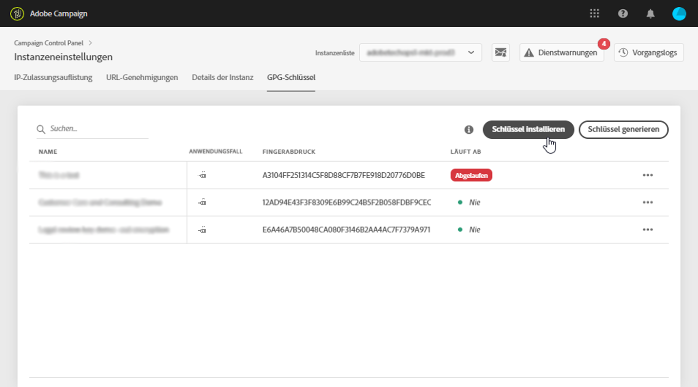
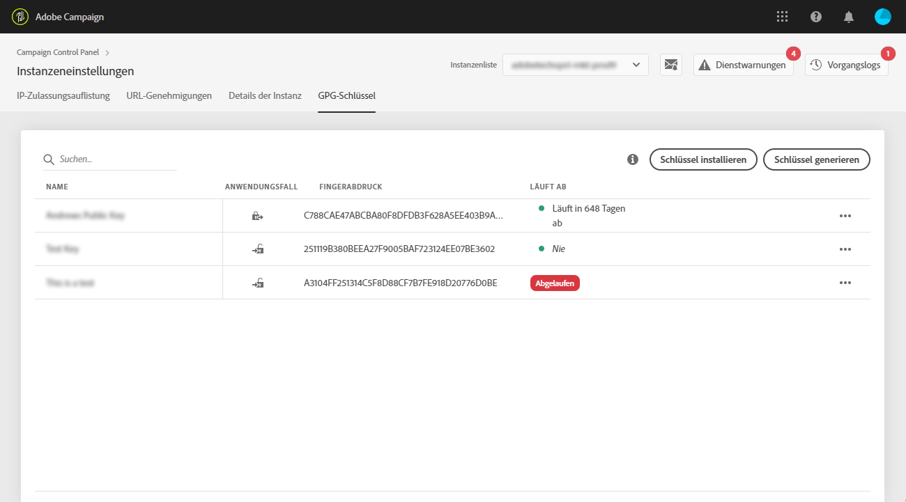

# GPG-Schlüsselverwaltung {#gpg-keys-management}

## Über die GPG-Verschlüsselung {#about-gpg-encryption}

Mit der GPG-Verschlüsselung können Sie Ihre Daten mithilfe eines Systems von öffentlich-privaten Schlüsselpaaren schützen, die der [OpenPGP](https://www.openpgp.org/about/standard/)-Spezifikation entsprechen.

Nach der Implementierung können eingehende Daten vor der Übertragung entschlüsselt und ausgehende Daten verschlüsselt werden, um sicherzustellen, dass niemand ohne ein entsprechendes gültiges Schlüsselpaar auf sie zugreifen kann.

Um die GPG-Verschlüsselung mit Campaign zu implementieren, müssen GPG-Schlüssel von einem Administrator direkt über das Control Panel in einer Marketing-Instanz installiert bzw. generiert werden.

Anschließend können Sie:

* **Gesendete Daten verschlüsseln**: Adobe Campaign sendet Daten nach der Verschlüsselung mit dem installierten öffentlichen Schlüssel.

* **Eingehende Daten entschlüsseln**: Adobe Campaign empfängt Daten, die von einem Drittsystem mit einem öffentlichen Schlüssel verschlüsselt wurden, der vom Control Panel heruntergeladen wurde. Adobe Campaign entschlüsselt die Daten mit einem privaten Schlüssel, der vom Control Panel generiert wird.

## Verschlüsseln von Daten {#encrypting-data}

Mit dem Control Panel können Sie Daten verschlüsseln, die aus Ihrer Adobe Campaign-Instanz stammen.

Dazu müssen Sie mithilfe eines PGP-Verschlüsselungs-Tools ein GPG-Schlüsselpaar generieren und dann den öffentlichen Schlüssel im Control Panel installieren. Sie können dann Daten verschlüsseln, bevor Sie diese von Ihrer Instanz senden. Gehen Sie dazu wie folgt vor:

 Funktion kennenlernen im [Video](#video).

1. Generieren Sie mithilfe eines PGP-Verschlüsselungs-Tools ein öffentlich-privates Schlüsselpaar gemäß der [OpenPGP-Spezifikation](https://www.openpgp.org/about/standard/). Installieren Sie dazu ein GPG-Dienstprogramm oder eine GNuGP-Software.

   >[!NOTE]
   >
   >Zum Generieren von Schlüsseln steht kostenlose Open-Source-Software zur Verfügung. Stellen Sie jedoch sicher, dass Sie die Richtlinien Ihrer Organisation befolgen und das von Ihrer IT-/Sicherheitsorganisation empfohlene GPG-Dienstprogramm verwenden.

1. Führen Sie nach der Installation des Dienstprogramms den folgenden Befehl in Terminal auf einem Mac oder im Eingabeaufforderungsfenster auf einem Windows-Computer aus.

   `gpg --full-generate-key`

1. Geben Sie bei Aufforderung die gewünschten Parameter für den Schlüssel an. Erforderliche Parameter sind:

   * **Schlüsseltyp**: RSA
   * **Schlüssellänge**: 1024–4096 Bit
   * **Richtiger Name** und **E-Mail-Adresse**: Ermöglicht die Verfolgung, wer das Schlüsselpaar erstellt hat. Geben Sie einen Namen und eine E-Mail-Adresse ein, die mit Ihrer Organisation oder Abteilung verknüpft sind.
   * **Kommentar**: Wenn Sie dem Kommentarfeld eine Bezeichnung hinzufügen, können Sie den Schlüssel, der zum Verschlüsseln Ihrer Daten verwendet werden soll, leicht identifizieren.
   * **Gültigkeit**: Datum oder „0“ für kein Ablaufdatum.
   * **Passphrase**

   

1. Nach der Bestätigung generiert das Skript einen Schlüssel mit dem zugehörigen Fingerabdruck, den Sie in eine Datei exportieren oder direkt in das Control Panel einfügen können. Um die Datei zu exportieren, führen Sie diesen Befehl aus, gefolgt vom Fingerabdruck des von Ihnen generierten Schlüssels.

   `gpg -a --export <fingerprint>`

1. Um den öffentlichen Schlüssel im Control Panel zu installieren, öffnen Sie die Karte **[!UICONTROL Instanzeneinstellungen]** und wählen Sie dann die Registerkarte **[!UICONTROL GPG-Schlüssel]** und die gewünschte Instanz aus.

1. Klicken Sie auf die Schaltfläche **[!UICONTROL Schlüssel installieren]**.

   

1. Fügen Sie den öffentlichen Schlüssel ein, der mit Ihrem PGP-Verschlüsselungs-Tool generiert wurde. Sie können die exportierte Datei mit dem öffentlichen Schlüssel auch direkt per Drag-and-Drop einfügen.

   >[!NOTE]
   >
   >Der öffentliche Schlüssel sollte im OpenPGP-Format vorliegen.

   

1. Klicken Sie auf die Schaltfläche **[!UICONTROL Schlüssel installieren]**.

Sobald der öffentliche Schlüssel installiert ist, wird er in der Liste angezeigt. Sie können die Schaltfläche **...** verwenden, um ihn herunterzuladen oder seinen Fingerabdruck zu kopieren.

Der Schlüssel kann dann in Adobe Campaign-Workflows verwendet werden. Sie können ihn bei Aktivitäten zur Datenextraktion zum Verschlüsseln von Daten verwenden.

 Funktion kennenlernen im [Video](#video)

Weitere Informationen zu diesem Thema finden Sie in der Adobe Campaign-Dokumentation:

**Campaign Classic:**

* [Datei komprimieren oder verschlüsseln](https://docs.adobe.com/de/content/help/de-DE/campaign-classic/using/automating-with-workflows/general-operation/how-to-use-workflow-data.html#zipping-or-encrypting-a-file)
* [Anwendungsfall: Verschlüsseln und Exportieren von Daten mit einem im Control Panel installierten Schlüssel](https://docs.adobe.com/content/help/de-DE/campaign-classic/using/automating-with-workflows/general-operation/how-to-use-workflow-data.html#use-case-gpg-encrypt)

**Campaign Standard:**

* [Verwalten verschlüsselter Daten](https://docs.adobe.com/content/help/de-DE/campaign-standard/using/managing-processes-and-data/importing-and-exporting-data/managing-encrypted-data.html)
* [Anwendungsfall: Verschlüsseln und Exportieren von Daten mit einem im Control Panel installierten Schlüssel](https://docs.adobe.com/content/help/de-DE/campaign-standard/using/managing-processes-and-data/importing-and-exporting-data/managing-encrypted-data.html#use-case-gpg-encrypt)

## Entschlüsseln von Daten {#decrypting-data}

Mit dem Control Panel können Sie externe Daten entschlüsseln, die in Ihre Adobe Campaign-Instanz eingehen.

Dazu müssen Sie ein GPG-Schlüsselpaar direkt im Control Panel generieren.

* Der **öffentliche Schlüssel** wird mit dem Drittsystem geteilt, das ihn zum Verschlüsseln der an Campaign zu sendenden Daten verwendet.
* Der **private Schlüssel** wird von Campaign verwendet, um die eingehenden verschlüsselten Daten zu entschlüsseln.

 Funktion kennenlernen im [Video](#video)

Gehen Sie wie folgt vor, um ein Schlüsselpaar im Control Panel zu generieren:

1. Öffnen Sie die Karte **[!UICONTROL Instanzeneinstellungen]** und wählen Sie dann die Registerkarte **[!UICONTROL GPG-Schlüssel]** und die gewünschte Adobe Campaign-Instanz aus.

1. Klicken Sie auf die Schaltfläche **[!UICONTROL Schlüssel generieren]**.

   

1. Geben Sie den Namen des Schlüssels an und klicken Sie dann auf **[!UICONTROL Schlüssel generieren]**. Mithilfe dieses Namens können Sie den Schlüssel identifizieren, der für die Entschlüsselung in Campaign-Workflows verwendet werden soll

   

Sobald das Schlüsselpaar generiert wurde, wird der öffentliche Schlüssel in der Liste angezeigt. Beachten Sie, dass Schlüsselpaare für die Entschlüsselung ohne Ablaufdatum generiert werden.

Sie können die Schaltfläche **...** verwenden, um den öffentlichen Schlüssel herunterzuladen oder seinen Fingerabdruck zu kopieren.

Der öffentliche Schlüssel kann dann mit jedem Drittsystem geteilt werden. Adobe Campaign kann den privaten Schlüssel bei Aktivitäten zum Laden von Daten verwenden, um Daten zu entschlüsseln, die mit dem öffentlichen Schlüssel verschlüsselt wurden.

Weitere Informationen hierzu finden Sie in der Adobe Campaign-Dokumentation:

**Campaign Classic:**

* [Datei vor der Verarbeitung dekomprimieren oder entschlüsseln](https://docs.adobe.com/content/help/de-DE/campaign-classic/using/automating-with-workflows/general-operation/importing-data.html#unzipping-or-decrypting-a-file-before-processing)
* [Anwendungsfall: Importieren von Daten, die mit einem vom Control Panel generierten Schlüssel verschlüsselt wurden](https://docs.adobe.com/content/help/de-DE/campaign-classic/using/automating-with-workflows/general-operation/importing-data.html#use-case-gpg-decrypt)

**Campaign Standard:**

* [Verwalten verschlüsselter Daten](https://docs.adobe.com/content/help/de-DE/campaign-standard/using/managing-processes-and-data/importing-and-exporting-data/managing-encrypted-data.html)
* [Anwendungsfall: Importieren von Daten, die mit einem vom Control Panel generierten Schlüssel verschlüsselt wurden](https://docs.adobe.com/content/help/de-DE/campaign-standard/using/managing-processes-and-data/importing-and-exporting-data/managing-encrypted-data.html#use-case-gpg-decrypt)

## Überwachen von GPG-Schlüsseln

Um auf die für Ihre Instanzen installierten und generierten GPG-Schlüssel zuzugreifen, öffnen Sie die Karte **[!UICONTROL Instanzeneinstellungen]** und wählen Sie dann die Registerkarte **[!UICONTROL GPG-Schlüssel]** aus.

In der Liste werden alle GPG-Schlüssel zur Ver- und Entschlüsselung angezeigt, die für Ihre Instanzen installiert und generiert wurden. Dabei werden zu jedem Schlüssel detaillierte Informationen bereitgestellt:

* **[!UICONTROL Name]**: Der Name, der beim Installieren oder Generieren des Schlüssels definiert wurde.
* **[!UICONTROL Anwendungsfall]**: Diese Spalte gibt den Anwendungsfall des Schlüssels an:

   : Der Schlüssel wurde zur Verschlüsselung von Daten installiert.

   : Der Schlüssel wurde generiert, um die Entschlüsselung von Daten zu ermöglichen.

* **[!UICONTROL Fingerabdruck]**: Der Fingerabdruck des Schlüssels.
* **[!UICONTROL Läuft ab]**: Das Ablaufdatum des Schlüssels. Beachten Sie, dass das Control Panel visuelle Hinweise gibt, wenn sich der Schlüssel seinem Ablaufdatum nähert:

   * „Dringend“ (rot) wird 30 Tage vor dem Ablaufdatum angezeigt.
   * „Warnung“ (gelb) wird 60 Tage vor dem Ablaufdatum angezeigt.
   * Sobald ein Schlüssel abgelaufen ist, wird ein rotes Banner „Abgelaufen“ angezeigt.

   >[!NOTE]
   >
   >Beachten Sie, dass das Control Panel keine E-Mail-Benachrichtigungen sendet.

Als Best Practice empfehlen wir, alle Schlüssel zu entfernen, die Sie nicht mehr benötigen. Klicken Sie dazu auf die Schaltfläche **...** und wählen Sie dann **[!UICONTROL Schlüssel löschen] aus.**

>[!IMPORTANT]
>
>Stellen Sie vor dem Entfernen eines Schlüssels sicher, dass er in keinem Adobe Campaign-Workflow verwendet wird, um ein Fehlschlagen zu verhindern.

## Anleitungsvideo {#video}

Im folgenden Video wird gezeigt, wie GPG-Schlüssel für die Datenverschlüsselung generiert und installiert werden.

Weitere Anleitungen zum Verwalten von GPG-Schlüsseln finden Sie in den Tutorials zu [Campaign Classic](https://experienceleague.adobe.com/docs/campaign-standard-learn/control-panel/instance-settings/gpg-key-management/gpg-key-management-overview.html?lang=de#instance-settings) und [Campaign Standard](https://experienceleague.adobe.com/docs/campaign-classic-learn/control-panel/instance-settings/gpg-key-management/gpg-key-management-overview.html?lang=de#instance-settings).

>[!VIDEO](https://video.tv.adobe.com/v/36386?quality=12&captions=ger)

