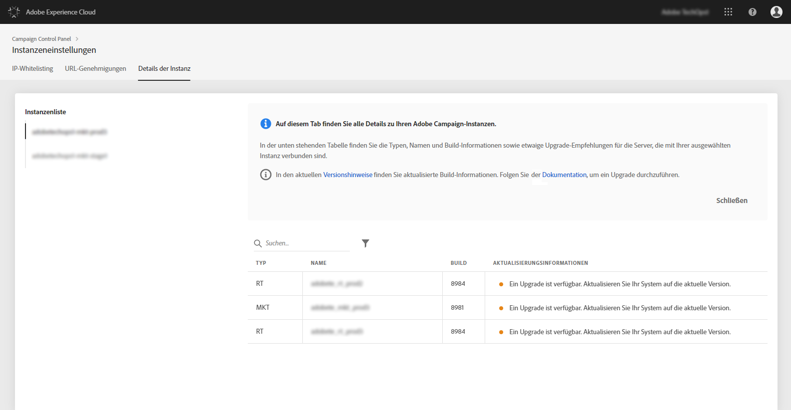

# Details der Instanz {#instance-details}

>[!CONTEXTUALHELP]
>id="cp_instancesettings_instancedetails"
>title="Über die Details der Instanz"
>abstract="Zeigen Sie die Details Ihrer Adobe Campaign-Instanzen an: Typen, Namen, Build-Informationen und mögliche Upgrade-Empfehlungen."
>additional-url="https://docs.adobe.com/content/help/de-DE/campaign-classic/using/release-notes/latest-release.html" text="Versionshinweise zu Campaign Classic"
>additional-url="https://docs.adobe.com/content/help/de-DE/campaign-standard/using/release-notes/release-notes.html" text="Versionshinweise zu Campaign Standard"

## Über die Details der Instanz {#about-instance-details}

>[!IMPORTANT]
>
>Diese Funktion ist nur für Campaign Classic v7- und Campaign v8-Instanzen verfügbar.

Ihre Adobe Campaign-Instanzenarchitektur kann mehrere Server enthalten, um die Flexibilität von Marketingaktivitäten zu ermöglichen. So können beispielsweise Marketing-, Echtzeit- (oder Message Center-) und Mid Sourcing-Server Ihre Instanz unterstützen.

Mit der Funktion &quot;Details der Instanz&quot; können Sie sich die flache Architektur Ihrer Instanz anzeigen lassen. Zusätzlich zu den Server-Informationen erfahren Sie hier auch, ob der Build Ihrer Instanz aktuell ist oder ob ein Upgrade empfohlen wird.

>[!NOTE]
>
>Es ist empfehlenswert, Instanzen mindestens einmal jährlich zu aktualisieren, um ein Nachlassen der Leistung zu verhindern und die neuesten Funktionen und Fehlerkorrekturen von Adobe Campaign Classic zu nutzen.

**Verwandte Themen:**

* [Durchführen eines Build-Upgrades](https://docs.campaign.adobe.com/doc/AC/getting_started/DE/buildUpgrade.html)
* [Adobe Campaign aktualisieren](https://docs.campaign.adobe.com/doc/AC/en/PRO_Updating_Adobe_Campaign_Introduction.html)

## Abrufen von Informationen zu Ihren Instanzen {#retrieving-information-about-instances}

Gehen Sie wie folgt vor, um Informationen zu den mit Ihren Instanzen verbundenen Servern zu erhalten:

1. Öffnen Sie die Karte **[!UICONTROL Instanzeneinstellungen]**, um auf die Registerkarte **[!UICONTROL Details der Instanz]** zuzugreifen.

   >[!NOTE]
   >
   >Wenn die Karte „Instanzeneinstellungen“ nicht auf der Startseite des Control Panel sichtbar ist, bedeutet das, dass Ihre Kennung der IMS-Organisation mit keiner Adobe Campaign Classic-Instanz verknüpft ist.

1. Wählen Sie im linken Bereich die gewünschte Campaign-Instanz aus.

   >[!NOTE]
   >
   >Alle Campaign-Instanzen werden auf der linken Fensterseite aufgelistet. Da die Funktion &quot;Details der Instanz&quot; nur für Campaign Classic-Instanzen unterstützt wird, erscheint bei der Auswahl einer Campaign Standard-Instanz die Meldung &quot;Nicht anwendbare Instanz&quot;.

1. Die mit der Instanz verbundenen Server werden angezeigt.

   

Diese Informationen sind verfügbar:

* **[!UICONTROL Typ:]** der Typ des Servers. Mögliche Werte sind MKT (Marketing), MID (Mid Sourcing) und RT (Message Center-/Echtzeit-Messaging).
* **[!UICONTROL Name:]** der Name des Servers.
* **[!UICONTROL Build:]** die auf dem Server installierte Build-Version.
* **[!UICONTROL Aktualisierungsinformationen:]** In dieser Spalte werden für den Server erforderliche Updates aufgeführt.
   * Grün: Ihr Server ist auf dem neuesten Stand, kein Upgrade ist erforderlich.
   * Gelb: Sie sollten ein Upgrade in Erwägung ziehen. Ihnen fehlen die neuesten Funktionen und Fehlerkorrekturen.
   * Rot: Führen Sie möglichst rasch ein Upgrade durch. Ihnen fehlen neue Funktionen und die Server-Leistung ist möglicherweise nicht optimal.

Informationen zur Aktualisierung von Servern finden Sie in [dieser Dokumentation](https://docs.campaign.adobe.com/doc/AC/getting_started/EN/buildUpgrade.html).

## Häufige Fragen {#common-questions}

**Ich kann in meiner Instanzenarchitektur keinen MID-Server sehen. Bedeutet das, dass meine Instanzen nicht ordnungsgemäß funktionieren? Benötige ich die RT-Instanz möglicherweise zur Ausführung künftiger Aufgaben?**

Ihre eigene Instanz kann völlig anders aussehen und möglicherweise verfügt sie nicht über alle Typen von Servern oder über mehrere Server vom selben Typ. Auch wenn bei Ihnen ein Server-Typ fehlt, bedeutet das nicht, dass Sie keine Echtzeitnachrichten senden oder andere Aktivitäten durchführen können. Sie können zusätzliche Server-Kapazität beantragen, wodurch höhere Gebühren anfallen.

Kontaktieren Sie die Kundenunterstützung, wenn Sie der Ansicht sind, dass auf der Seite &quot;Details der Instanz&quot; nicht alle Server aufgeführt werden. Geben Sie in Ihrer Nachricht die jeweilige Instanz-URL an.
