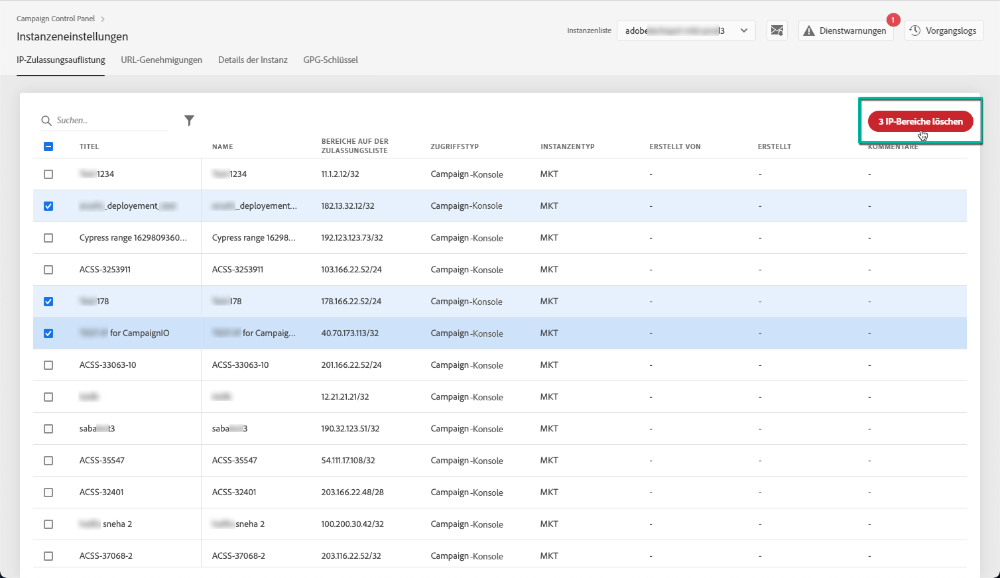

# IP-Zulassungsauflistung {#ip-allow-listing}

>[!CONTEXTUALHELP]
>id="cp_instancesettings_iprange"
>title="Über die Zulassungsauflistung von IP-Bereichen"
>abstract="Fügen Sie der Zulassungsliste IP-Adressen hinzu, um auf Ihre Instanzen zuzugreifen."
>additional-url="https://images-tv.adobe.com/mpcv3/045cac99-f948-478e-ae04-f8c161dcb9e2_1568132508.1920x1080at3000_h264.mp4" text="Demovideo ansehen"

## Über die Zulassungsauflistung von IP-Bereichen {#about-ip-allow-listing}

>[!IMPORTANT]
>
>Diese Funktion ist nur für Campaign v7/v8-Instanzen verfügbar.

Standardmäßig kann auf eine Adobe Campaign-Instanz nicht über verschiedene IP-Adressen zugegriffen werden.

Wenn Ihre IP-Adresse nicht auf der Zulassungsliste steht, können Sie sich nicht von dieser Adresse aus bei der Instanz anmelden. Ebenso können Sie keine API mit Ihrer Message Center- oder Marketing-Instanz verbinden, wenn die IP-Adresse nicht speziell für die Instanz auf die Zulassungsliste gesetzt wurde.

Im Control Panel können Sie neue Verbindungen mit Ihren Instanzen einrichten, indem Sie IP-Adressbereiche auf die Zulassungsliste setzen. Folgen Sie dazu den weiter unten beschriebenen Schritten.

Nachdem IP-Adressen auf die Zulassungsliste gesetzt wurden, können Sie Campaign-Benutzer erstellen und mit den Adressen verknüpfen, sodass die Benutzer auf die Instanz zugreifen können.

 [Funktion im Video kennenlernen](https://experienceleague.adobe.com/docs/campaign-classic-learn/control-panel/instance-settings/ip-allow-listing.html?lang=de#instance-settings).

## Best Practices {#best-practices}

Beachten Sie die folgenden Empfehlungen und Einschränkungen, wenn Sie IP-Adressen über das Control Panel auf die Zulassungsliste setzen.

* **Aktivieren Sie nicht den IP-Zugriff für alle Zugriffstypen**, wenn Sie nicht möchten, dass sich die IP-Adresse mit Ihren RT-Servern oder der AEM-Sicherheitszone verbindet.
* **Wenn Sie einer IP-Adresse einen temporären Zugriff auf Ihre Instanz gewährt haben**, entfernen Sie die IP-Adresse wieder aus der Zulassungsliste, wenn diese keine Verbindung mehr mit Ihrer Instanz herstellen muss.
* **Wir empfehlen, keine IP-Adressen öffentlicher Orte auf die Zulassungsliste zu setzen** (Flughäfen, Hotels etc.). Verwenden Sie Ihre unternehmenseigene VPN-Adresse, um jederzeit die Sicherheit Ihrer Instanz zu gewährleisten.

## Hinzufügen von IP-Adressen zur Zulassungsliste für den Zugriff auf Instanzen {#adding-ip-addresses-allow-list}

>[!CONTEXTUALHELP]
>id="cp_instancesettings_iprange_add"
>title="IP-Bereichskonfiguration"
>abstract="Definieren Sie den IP-Bereich, den Sie auf die Zulassungsliste setzen möchten, um sich mit Ihren Instanzen zu verbinden."

>[!NOTE]
>
>Wenn die Karte **[!UICONTROL Instanzeneinstellungen]** nicht auf der Startseite des Control Panel sichtbar ist, bedeutet dies, dass Ihre IMS-Organisations-ID mit keiner Adobe Campaign v7/v8-Instanz verknüpft ist.

Gehen Sie wie folgt vor, um IP-Adressen auf die Zulassungsliste zu setzen:

1. Öffnen Sie die Karte **[!UICONTROL Instanzeneinstellungen]**, um auf die Registerkarte „IP-Zulassungsauflistung“ zuzugreifen, und wählen Sie dann **[!UICONTROL Neuen IP-Bereich hinzufügen]** aus.

   

1. Füllen Sie wie unten angegeben die Informationen für den IP-Bereich aus, den Sie auf die Zulassungsliste setzen möchten.

   

   * **[!UICONTROL Instanz(en)]**: Die Instanzen, mit denen sich die IP-Adressen verbinden können. Mehrere Instanzen können gleichzeitig bearbeitet werden. Beispielsweise kann die IP-Zulassungsauflistung im selben Schritt sowohl für Produktions- als auch für Staging-Instanzen ausgeführt werden.
   * **[!UICONTROL IP-Bereich]**: Der IP-Bereich, der auf die Zulassungsliste gesetzt werden soll (im CIDR-Format). Beachten Sie, dass sich ein IP-Bereich nicht mit einem bereits auf der Zulassungsliste vorhandenen Bereich überschneiden darf. Löschen Sie in diesem Fall zunächst den Bereich, der die überlappende IP enthält.

   >[!NOTE]
   >
   >IP-Bereiche werden über das Control Panel im CIDR-Format (Classless Inter-Domain Routing) hinzugefügt. Die Syntax besteht aus einer IP-Adresse, gefolgt vom Zeichen / und einer Dezimalzahl. Format und Syntax sind in [diesem Artikel](https://whatismyipaddress.com/cidr) ausführlich beschrieben.
   >
   >Sie können im Internet nach kostenlosen Online-Tools suchen, mit denen Sie Ihren IP-Bereich in das CIDR-Format konvertieren können.

   * **[!UICONTROL Titel]**: Die Bezeichnung, die auf der Zulassungsliste erscheinen soll.
   * **[!UICONTROL Name]**: Der Name muss für den Zugriffstyp, die Instanz (im Fall einer externen API-Verbindung) und die IP-Adresse eindeutig sein.

1. Geben Sie die Art des Zugriffs an, den Sie den IP-Adressen gewähren möchten:

   * **[!UICONTROL Zugriff auf die Campaign-Konsole]**: Die IP-Adressen können sich mit der Campaign Client-Konsole verbinden. Beachten Sie, dass der Konsolenzugriff nur für Marketing-Instanzen möglich ist. Der Zugriff auf MID- und RT-Instanzen ist nicht erlaubt und deshalb auch nicht aktiviert.
   * **[!UICONTROL AEM-Verbindung]**: Die angegebenen AEM-IP-Adressen können sich mit der Marketing-Instanz verbinden.
   * **[!UICONTROL Externe API-Verbindung]**: Externe APIs mit den angegebenen IP-Adressen können sich mit der Marketing- und/oder Message Center (RT)-Instanz verbinden. Beachten Sie, dass die Verbindung mit der Konsole für RT-Instanzen nicht aktiviert ist.

   

1. Wählen Sie die Schaltfläche **[!UICONTROL Speichern]** aus. Der IP-Bereich wird der Zulassungsliste hinzugefügt.

   <!---->

Um einen oder mehrere IP-Bereiche aus der Zulassungsliste zu löschen, wählen Sie sie aus und klicken Sie anschließend auf die Schaltfläche **[!UICONTROL IP-Bereich löschen]**.

**Verwandtes Thema:**

* [Sicherheitszone mit einem Benutzer verknüpfen](https://docs.campaign.adobe.com/doc/AC/en/INS_Additional_configurations_Configuring_Campaign_server.html#Linking_a_security_zone_to_an_operator)
