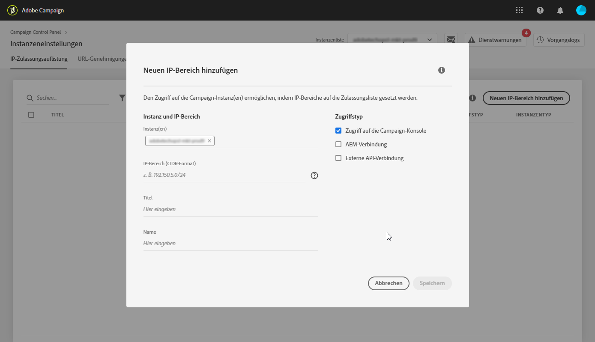
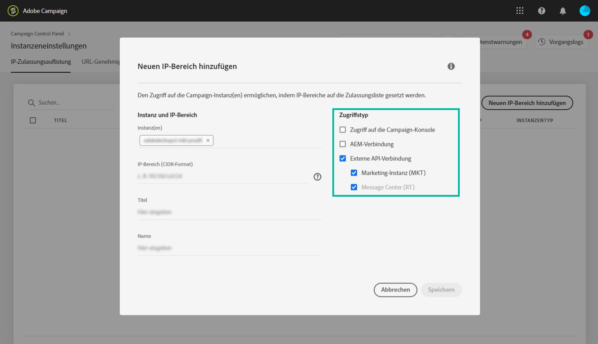

# IP whitelisting {#ip-whitelisting}

>[!CAUTION]
>
>Diese Funktion ist nur für Campaign Classic-Instanzen verfügbar.

## Über IP-Whitelisting {#about-ip-whitelisting}

Standardmäßig kann auf Ihre Adobe Campaign Classic-Instanz nicht von verschiedenen IP-Adressen aus zugegriffen werden.

Wenn Ihre IP-Adresse nicht auf der Whitelist steht, können Sie sich nicht von dieser Adresse aus bei der Instanz anmelden. Auf dieselbe Weise können Sie eine API möglicherweise nicht mit Ihrem Message Center oder Ihrer Marketing-Instanz verbinden, wenn die IP-Adresse nicht explizit mit der Instanz in die Positivliste gesetzt wurde.

Im Control Panel können Sie neue Verbindungen mit Ihren Instanzen einrichten, indem Sie IP-Adressbereiche auf die Whitelist setzen. Folgen Sie dazu den weiter unten beschriebenen Schritten.

Nachdem IP-Adressen auf die Whitelist gesetzt wurden, können Sie Campaign-Benutzer erstellen und mit den Adressen verknüpfen, sodass die Benutzer auf die Instanz zugreifen können.

## Best Practices {#best-practices}

Beachten Sie unbedingt die folgenden Empfehlungen und Einschränkungen, wenn Sie IP-Adressen über das Control Panel auf die Whitelist setzen.

* **Aktivieren Sie nicht den IP-Zugriff für alle Zugriffstypen**, wenn Sie nicht möchten, dass sich die IP-Adresse mit Ihren RT-Servern oder der AEM-Sicherheitszone verbindet.
* **Wenn Sie vorübergehend den Zugriff auf Ihre Instanz für eine IP-Adresse** aktiviert haben, müssen Sie sicherstellen, dass die IP-Adressen von den in der Positivliste eingetragenen IP-Adressen entfernt werden, sobald Sie keine Verbindung mehr zu Ihrer Instanz herstellen müssen.
* **Wir empfehlen nicht, die IP-Adressen von öffentlichen Orten** (Flughäfen, Hotels usw.) in der Positivliste anzugeben. Verwenden Sie Ihre unternehmenseigene VPN-Adresse, um jederzeit die Sicherheit Ihrer Instanz zu gewährleisten.

## IP-Adressen für den Zugriff auf eine Instanz auf die Whitelist setzen {#whistelisting-ip-addresses}

Gehen Sie wie folgt vor, um IP-Adressen in der Whitelist anzuzeigen:

1. Öffnen Sie die Karte **[!UICONTROL Instanzeinstellungen]**, um auf die Registerkarte „IP-Whitelisting“ zuzugreifen, und klicken Sie dann auf **[!UICONTROL Neuen IP-Bereich hinzufügen]**.

   >[!NOTE]
   >
   >Wenn die Karte Instanzeneinstellungen nicht auf der Startseite des Control Panels sichtbar ist, bedeutet das, dass Ihre IMS-ORG-Kennung mit keiner Adobe Campaign Classic-Instanz verknüpft ist.

   

1. Füllen Sie wie unten angegeben die Informationen für den IP-Bereich aus, den Sie auf die Whitelist setzen möchten.

   

   * **[!UICONTROL Instanz(en)]**: Die Instanzen, zu denen die IP-Adressen eine Verbindung herstellen können. Mehrere Instanzen können gleichzeitig bearbeitet werden. Beispielsweise kann IP-Whitelisting im selben Schritt sowohl für Produktions- als auch für Staging-Instanzen ausgeführt werden.
   * **[!UICONTROL IP-Bereich]**: Der IP-Bereich, den Sie als Whitelist im CIDR-Format festlegen möchten. Beachten Sie, dass sich ein IP-Bereich nicht mit einem bereits auf der Whitelist vorhandenen Bereich überschneiden darf. Löschen Sie in diesem Fall zunächst den Bereich, der die überlappende IP enthält.
   >[!NOTE]
   >
   >IP-Bereiche werden über das Control Panel im CIDR-Format (Classless Inter-Domain Routing) hinzugefügt. Die Syntax besteht aus einer IP-Adresse, gefolgt vom Zeichen / und einer Dezimalzahl. Format und Syntax sind in [diesem Artikel](https://whatismyipaddress.com/cidr) ausführlich beschrieben.
   >
   >Sie können im Internet nach kostenlosen Online-Tools suchen, mit denen Sie Ihren IP-Bereich in das CIDR-Format konvertieren können.

   * **!UICONTROL Beschriftung]**: Die Bezeichnung, die in der Liste der in der Positivliste eingetragenen IP-Adressen angezeigt wird.
   * **[!UICONTROL Name]**: Der Name muss eindeutig sein für Zugriffstyp, Instanz (bei externer API-Verbindung) und die IP-Adresse.

1. Geben Sie den Zugriffstyp an, den Sie den IP-Adressen zuweisen möchten:

   * **[!UICONTROL Zugriff]** auf Kampagnenkonsole: Die IP-Adressen dürfen eine Verbindung zur Campaign Classic-Konsole herstellen. Beachten Sie, dass der Konsolenzugriff nur für Marketinginstanzen möglich ist. Der Zugriff auf MID- und RT-Instanzen ist nicht erlaubt und deshalb auch nicht aktiviert.
   * **[!UICONTROL AEM-Verbindung]**: Die angegebenen AEM-IP-Adressen dürfen eine Verbindung zur Marketing-Instanz herstellen.
   * **[!UICONTROL Externe API-Verbindung]**: Externe APIs mit den angegebenen IP-Adressen dürfen eine Verbindung zur Marketing- und/oder Message Center-Instanz herstellen. Beachten Sie, dass die Verbindung mit der Konsole für RT-Instanzen nicht aktiviert ist.
   

1. Wählen Sie die Schaltfläche **[!UICONTROL Speichern]aus.** Der IP-Bereich wird zur Liste der auf der Whitelist befindlichen IP-Adressen hinzugefügt.

   

To delete whitelisted IP ranges, select them then click the **[!UICONTROL Delete IP range]** button.

**Verwandte Themen:**
* [IP Whitelisting (Video-Tutorial)](https://docs.adobe.com/content/help/en/campaign-learn/campaign-classic-tutorials/administrating/control-panel-acc/ip-whitelisting.html)
* [Sicherheitszone mit einem Benutzer verknüpfen](https://docs.campaign.adobe.com/doc/AC/en/INS_Additional_configurations_Configuring_Campaign_server.html#Linking_a_security_zone_to_an_operator)
