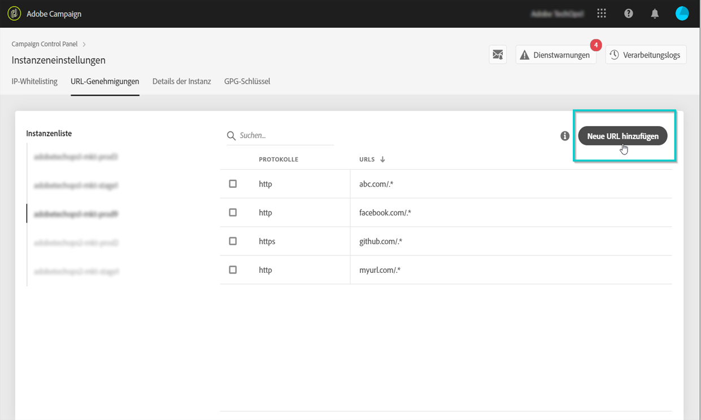
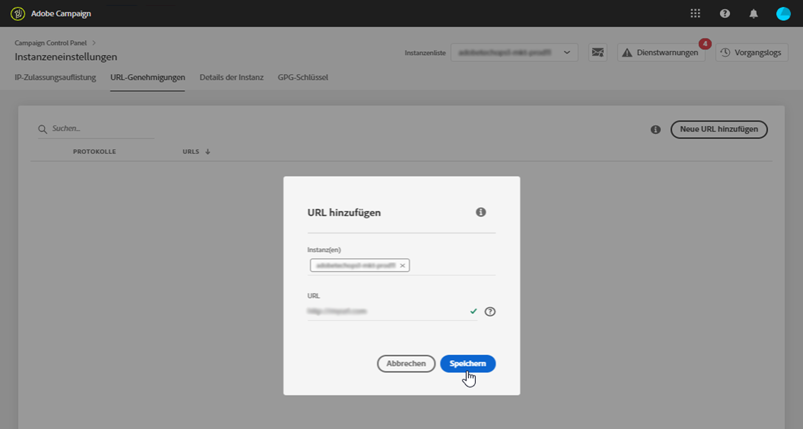
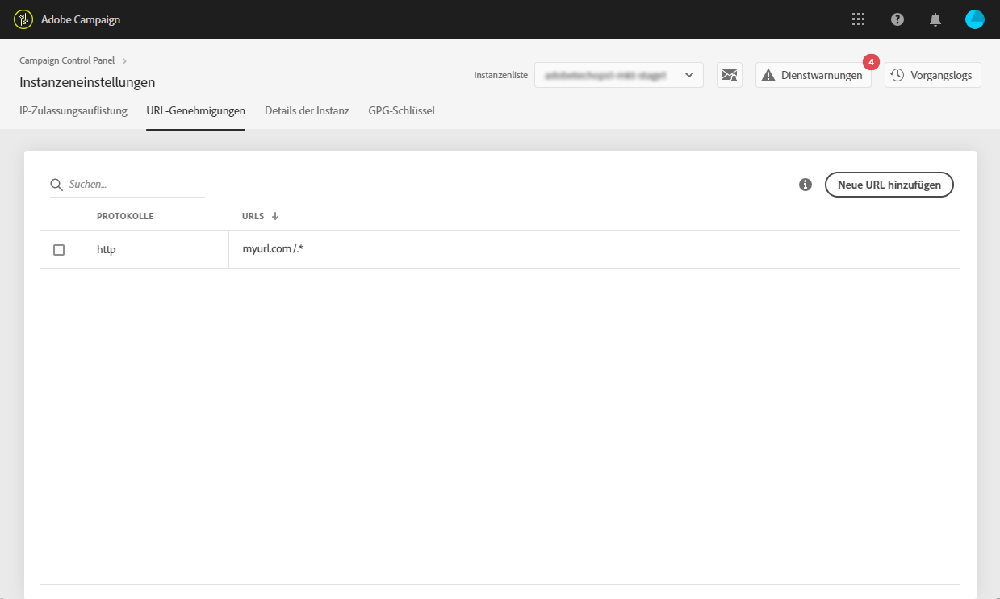

# URL-Genehmigungen {#url-permissions}

>[!CONTEXTUALHELP]
>id="cp_instancesettings_urlpermissions"
>title="Über URL-Genehmigungen"
>abstract="Verwalten Sie die URLs, mit denen Ihre Adobe Campaign-Instanzen eine Verbindung herstellen können."
>additional-url="https://images-tv.adobe.com/mpcv3/91206a19-d9af-4b6a-8197-0d2810a78941_1563488165.1920x1080at3000_h264.mp4" text="Demovideo ansehen"

## Über URL-Genehmigungen {#about-url-permissions}

>[!IMPORTANT]
>
>Diese Funktion ist ab Build 8850 nur für Campaign v8- und Campaign Classic v7-Instanzen verfügbar. Wenn Sie einen früheren Build verwenden, müssen Sie ein Upgrade durchführen, um diese Funktion zu verwenden.

Die Liste der URLs, die standardmäßig von JavaScript-Codes (Workflows usw.) über Ihre Campaign Classic-Instanzen aufgerufen werden können, durch Ihre Campaign-Instanzen begrenzt ist. Diese URLs ermöglichen das ordnungsgemäße Funktionieren der Instanzen.

Standardmäßig sind Instanzen nicht berechtigt, eine Verbindung zu externen URLs herzustellen. Über das Control Panel haben Sie die Möglichkeit, externe URLs zur Liste der berechtigten URLs hinzufügen, sodass sich Ihre Instanz mit ihnen verbinden kann. Dadurch können Sie zwischen Ihren Campaign-Instanzen und externen Systemen, wie z. B. SFTP-Servern oder Websites, eine Verbindung herstellen, um den Datei- und/oder Datentransfer zu ermöglichen.

Nach dem Hinzufügen einer URL wird sie in der Konfigurationsdatei der Instanz referenziert (serverConf.xml).

 [Funktion im Video kennenlernen](https://experienceleague.adobe.com/docs/campaign-classic-learn/control-panel/instance-settings/adding-url-permissions.html?lang=de#instance-settings).

**Verwandte Themen:**

* [Campaign-Server konfigurieren](https://docs.campaign.adobe.com/doc/AC/en/INS_Additional_configurations_Configuring_Campaign_server.html)
* [Schutz der ausgehenden Verbindung](https://experienceleague.adobe.com/docs/campaign-classic/using/installing-campaign-classic/security-privacy/server-configuration.html?lang=de#outgoing-connection-protection)

## Best Practices {#best-practices}

* Verbinden Sie Ihre Campaign-Instanz nicht mit Websites/Servern, zu denen Sie keine Verbindung benötigen.
* Löschen Sie URLs, die Sie nicht mehr benötigen. Beachten Sie jedoch, dass für andere Abteilungen Ihres Unternehmens, die die von Ihnen gelöschte URL weiterhin benötigen, keine Verbindung mehr zu dieser URL möglich ist.
* Das Control Panel unterstützt die Protokolle **HTTP**, **HTTPS** und **SFTP**. Die Eingabe ungültiger URLs oder Protokolle hat Fehler zur Folge.

## Verwaltung von URL-Genehmigungen {#managing-url-permissions}

>[!CONTEXTUALHELP]
>id="cp_instancesettings_url_add"
>title="Neue URL hinzufügen"
>abstract="Fügen Sie URLs hinzu, um Verbindungen zu Ihrer Campaign-Instanz zuzulassen."

Gehen Sie wie folgt vor, um eine URL hinzuzufügen, mit der sich Ihre Instanz verbinden kann:

1. Öffnen Sie die Karte **[!UICONTROL Instanzeneinstellungen]**, um auf die Registerkarte **[!UICONTROL URL-Genehmigungen]** zuzugreifen.

   >[!NOTE]
   >
   >Wenn die Karte Instanzeinstellungen nicht auf der Startseite des Control Panels sichtbar ist, bedeutet das, dass Ihre IMS-Organisations-ID mit keiner Adobe Campaign-Instanz verknüpft ist.
   >
   >Auf der Registerkarte <b>URL-Genehmigungen</b> werden alle externen URLs aufgelistet, mit denen Ihre Instanz eine Verbindung herstellen kann. Diese Liste enthält jedoch nicht die URLs, die für das Funktionieren von Campaign erforderlich sind (z. B. Verbindungen zwischen Infrastrukturelementen).

1. Wählen Sie auf der linken Seite die gewünschte Instanz aus und danach die Schaltfläche **[!UICONTROL Neue URL hinzufügen]**.

   

   >[!NOTE]
   >
   >Alle Campaign-Instanzen werden auf der linken Fensterseite aufgelistet.
   >
   >Da die Verwaltung der URL-Genehmigungen nur für Campaign Classic-Instanzen möglich ist, erscheint bei der Auswahl einer Campaign Standard-Instanz die Meldung &quot;Nicht anwendbare Instanz&quot;.

1. Geben Sie die URL ein, die genehmigt werden soll, einschließlich des mit ihr verknüpften Protokolls (HTTP, HTTPS oder SFTP).

   >[!NOTE]
   >
   >Es ist auch möglich, die Verbindung von mehreren Instanzen mit der URL zu genehmigen. Fügen Sie die Instanzen direkt im Feld Instanz(en) ein, indem Sie den ersten Buchstaben tippen.

   

1. Die URL wird der Liste hinzugefügt und Sie können sich jetzt damit verbinden.

   >[!NOTE]
   >
   >Nach der Validierung werden am Ende der eingegebenen URL automatisch die Zeichen &quot;/.*&quot; hinzugefügt, damit auch alle Unterseiten eingeschlossen sind.

   

Sie können eine URL jederzeit löschen, indem Sie sie selektieren und danach die Schaltfläche **[!UICONTROL URL löschen]** auswählen.

Beachten Sie, dass eine gelöschte URL von Ihrer Instanz nicht mehr aufgerufen werden kann.

## Häufige Fragen {#common-questions}

**Ich habe eine neue URL hinzugefügt, meine Instanz kann aber noch immer keine Verbindung mit ihr herstellen. Warum passiert das?**

In manchen Fällen ist es nötig, dass URLs auf die Zulassungsliste gesetzt werden, ein Passwort eingegeben oder eine andere Form der Authentifizierung durchgeführt wird, um eine Verbindung mit URLs herzustellen. Das Control Panel unterstützt keine zusätzlichen Formen der Authentifizierung.
