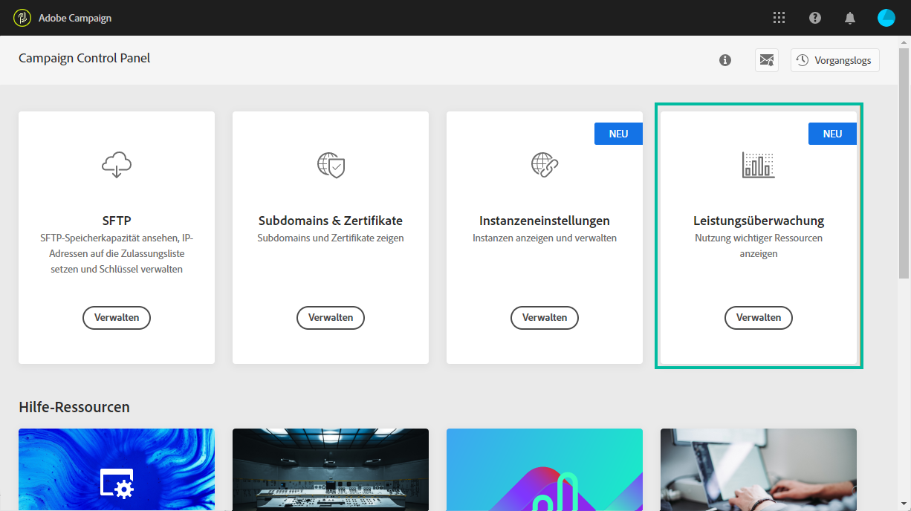

# Über das Monitoring der Leistung {#about-performance-monitoring}

Das Control Panel bietet verschiedene Funktionen, mit denen Sie Ihre Instanzen überwachen und eine optimale Leistung sicherstellen können.

Mit der Karte **[!UICONTROL Leistungsüberwachung]** auf der Startseite von Control Panel können Sie die Nutzung Ihrer Campaign-Instanzen (wie z. B. deren Datenbankkapazität) überwachen. Weiterführende Informationen hierzu finden Sie in [diesem Abschnitt](../../performance-monitoring/using/database-monitoring.md).

>[!NOTE]
>
>In den kommenden Versionen des Control Panel werden zusätzliche Überwachungsfunktionen auf dieser Karte bereitgestellt.

