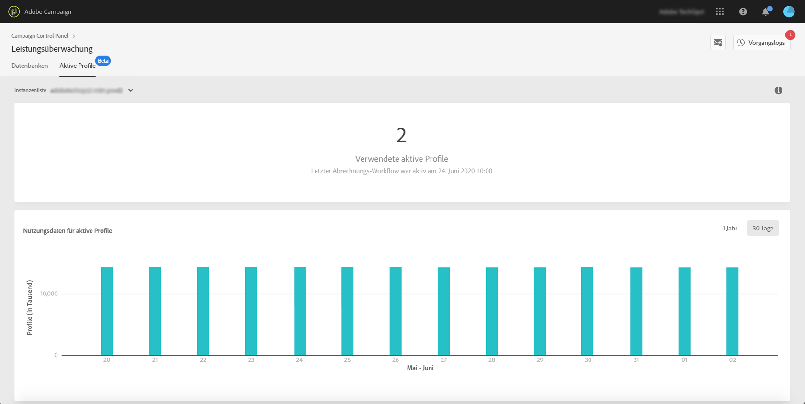

# Überwachen aktiver Profile {#active-profiles-monitoring}

## Über aktive Profile {#about-active-profiles}

>[!IMPORTANT]
>
>Die Überwachung aktiver Profile über das Control Panel befindet sich in der Beta-Phase und unterliegt häufigen Aktualisierungen und Änderungen ohne Vorankündigung. Diese Funktion ist ab Campaign Standard-Build 10368 verfügbar.

Gemäß Ihrem Vertrag erhalten alle Ihre Campaign-Instanzen eine bestimmte Anzahl aktiver Profile, die zu Abrechnungszwecken gezählt werden. Informationen zur Anzahl der gekauften aktiven Profile finden Sie in Ihrem aktuellen Vertrag.

Profil bezeichnet einen Datensatz, der einen Endkunden, einen Interessenten oder Lead repräsentiert. Bei diesen Daten kann es sich z. B. um einen Datensatz in der nmsRecipient-Tabelle oder einer externen Tabelle handeln, die die Kennung eines Cookies, eines Kunden oder eines Mobiltelefons oder andere für einen bestimmten Kanal relevante Informationen enthält.

Profile gelten als aktiv, wenn sie in den letzten 12 Monaten über einen beliebigen Kanal angesprochen wurden oder über einen beliebigen Kanal mit ihnen kommuniziert wurde.

>[!NOTE]
>
>Die Kanäle Facebook und X (früher bekannt als Twitter) werden nicht berücksichtigt.

Weitere Informationen zu aktiven Profilen finden Sie in den Dokumentationen zu [Campaign Standard](https://experienceleague.adobe.com/docs/campaign-standard/using/profiles-and-audiences/managing-profiles/active-profiles.html?lang=de) und [Campaign v7/v8](https://experienceleague.adobe.com/docs/campaign-classic/using/getting-started/profile-management/about-profiles.html?lang=de#active-profiles).

## Überwachen der Verwendung aktiver Profile {#monitoring-active-profiles}

>[!CONTEXTUALHELP]
>id="cp_performancemonitoring_active_profile"
>title="Über die Überwachung aktiver Profile"
>abstract="Auf dieser Registerkarte erhalten Sie in Echtzeit Informationen über die aktuelle und frühere Nutzung und Entwicklung aktiver Profile für jede Ihrer Campaign-Instanzen und Ihre Organisation."

Um die Verwendung aktiver Profile in Control Panel zu überwachen, navigieren Sie zu **[!UICONTROL Überwachen der Performance]** Karte > **[!UICONTROL Aktive Profile]** und wählen Sie die gewünschte Instanz aus der **[!UICONTROL Instanzliste]** aus.

Es werden Informationen zu Ihrer Verwendung aktiver Profile angezeigt.

Im oberen Abschnitt werden die folgenden Informationen angezeigt:

* Die Anzahl der aktiven Profile, die derzeit in der ausgewählten Instanz verwendet werden, sowie der Zeitstempel der letzten Ausführung des Abrechnungs-Workflows für Ihre Instanz.

* Die Gesamtzahl der aktiven Profile, die in Ihrer Organisation in allen Instanzen verwendet werden.

  >[!NOTE]
  >
  >Dieser Abschnitt ist nur sichtbar, wenn Ihrer Organisation mehrere Instanzen zugeordnet sind.

* Die Gesamtzahl der aktiven Profile, die Ihrer Organisation zugewiesen sind.

Der untere Abschnitt bietet eine visuelle Darstellung der Verwendung aktiver Profile in den letzten 30 Tagen. Mit dem Filter oben rechts können Sie diesen Zeitrahmen auf 1 Jahr ändern. Wenn Sie den Mauszeiger über den Diagrammbalken bewegen, können Sie die genaue Anzahl der aktiven Profile abrufen, die im ausgewählten Zeitraum verwendet wurden.

Die Informationen zur Verwendung aktiver Profile werden im Control Panel auf der Grundlage von dedizierten technischen [!DNL Campaign]-Workflows für die „Abrechnung“ aktualisiert, die regelmäßig auf Ihren Instanzen ausgeführt werden.

| Campaign-Version | Technischer Workflow | Ausführungen |
|  ---  |  ---  |  ---  |
| Campaign Standard | [Abrechnung](https://experienceleague.adobe.com/docs/campaign-standard/using/administrating/application-settings/technical-workflows.html?lang=de) | Täglich |
| Campaign v7/v8 | [Abrechnung](https://experienceleague.adobe.com/docs/campaign-classic/using/automating-with-workflows/advanced-management/about-technical-workflows.html?lang=de) | Monatlich |

