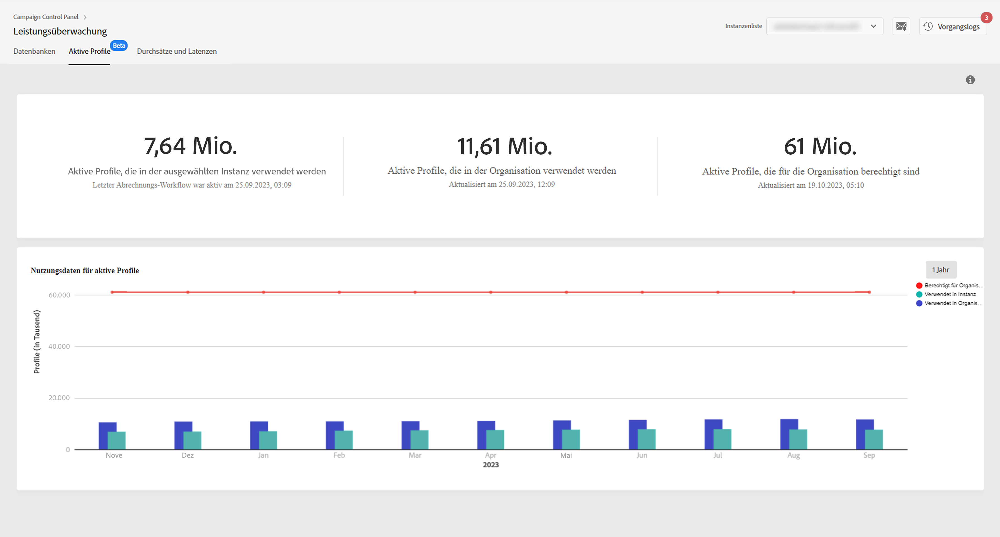

# Überwachung aktiver Profile {#active-profiles-monitoring}

## Über aktive Profile {#about-active-profiles}

>[!IMPORTANT]
>
>Die Überwachung aktiver Profile über das Control Panel befindet sich in der Beta-Phase und unterliegt häufigen Aktualisierungen und Änderungen ohne Vorankündigung. Diese Funktion ist ab Campaign Standard-Build 10368 verfügbar.

Gemäß Ihrem Vertrag erhalten alle Ihre Campaign-Instanzen eine bestimmte Anzahl aktiver Profile, die zu Abrechnungszwecken gezählt werden. Informationen zur Anzahl der gekauften aktiven Profile finden Sie in Ihrem aktuellen Vertrag.

Profil bezeichnet einen Datensatz, der einen Endkunden, einen Prospect oder Lead repräsentiert. Bei diesen Daten kann es sich z. B. um einen Datensatz in der nmsRecipient-Tabelle oder einer externen Tabelle handeln, die die Kennung eines Cookies, eines Kunden oder eines Mobiltelefons oder andere für einen bestimmten Kanal relevante Informationen enthält.

Profile gelten als aktiv, wenn sie in den letzten 12 Monaten über einen beliebigen Kanal angesprochen wurden oder über einen beliebigen Kanal mit ihnen kommuniziert wurde.

>[!NOTE]
>
>Die Kanäle Facebook und Twitter werden nicht berücksichtigt.

Weitere Informationen zu aktiven Profilen finden Sie in den Dokumentationen [Campaign Standard](https://https://experienceleague.adobe.com/docs/campaign-standard/using/profiles-and-audiences/managing-profiles/active-profiles.html) und [Campaign Classic v7](https://https://experienceleague.adobe.com/docs/campaign-classic/using/getting-started/profile-management/about-profiles.html#active-profiles) .

## Überwachen aktiver Profile {#monitoring-active-profiles}

Mit dem Control Panel können Sie die Nutzung aktiver Profile für jede Ihrer Campaign-Instanzen überwachen.

Gehen Sie dazu wie folgt vor:

1. Öffnen Sie die Karte **[!UICONTROL Leistungsüberwachung]** und wählen Sie dann den Tab **[!UICONTROL Aktive Profile]** aus.

1. Wählen Sie die gewünschte Instanz aus der **[!UICONTROL Instanzenliste]** aus.

1. Die Anzahl der von der Instanz verwendeten aktiven Profile sowie das letzte Mal, als der Abrechnungs-Workflow für Ihre Instanz ausgeführt wurde, werden angezeigt.

>[!NOTE]
>
>Aktive Profile werden anhand spezieller technischer Workflows gezählt, die täglich für Ihre Instanzen ausgeführt werden:
>
>* Der Workflow „[Abrechnung](https://docs.adobe.com/help/de-DE/campaign-standard/using/administrating/application-settings/technical-workflows.html)“ für Campaign Standard,
>* Der Workflow „[Anzahl aktiver Abrechnungsprofile](https://experienceleague.adobe.com/docs/campaign-classic/using/automating-with-workflows/advanced-management/about-technical-workflows.html?lang=de)“ für Campaign Classic.

Der untere Bereich zeigt eine grafische Darstellung der Nutzung aktiver Profile in den letzten 30 Tagen. Sie können den angezeigten Zeitraum mithilfe der oben rechts verfügbaren Filter auf 1 Jahr ändern.

Wenn Sie den Mauszeiger über einen der Diagrammbalken bewegen, können Sie die genaue Anzahl der aktiven Profile abrufen, die im ausgewählten Zeitraum verwendet wurden.
