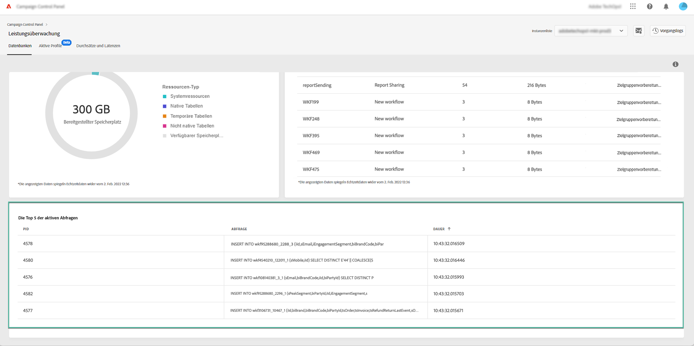

# Überwachen aktiver Abfragen {#long-running-queries}

Im Bereich **[!UICONTROL Aktive Abfragen]** auf der Registerkarte **[!UICONTROL Datenbanken]** werden die fünf Abfragen aufgelistet, die schon am längsten auf der ausgewählten Instanz ausgeführt werden.

Die Spalte **[!UICONTROL Dauer]** gibt an, wie lange eine Abfrage schon auf der Instanz ausgeführt wird. Die Dauer wird in folgendem Format angezeigt: `hh:mm:ss.ms`.

>[!IMPORTANT]
>
>Wenn eine der Abfragen seit mehr als 24 Stunden aktiv ist, wenden Sie sich an die Kundenunterstützung, damit diese das Problem erkennt und behebt. Sie müssen dabei den Wert in der Spalte **[!UICONTROL PID]** angeben, der eine eindeutige Kennung für die Abfrage ist.
