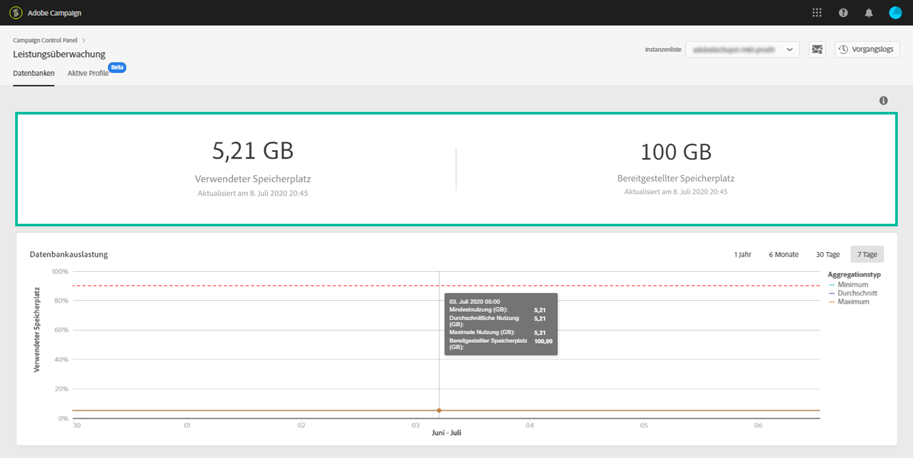
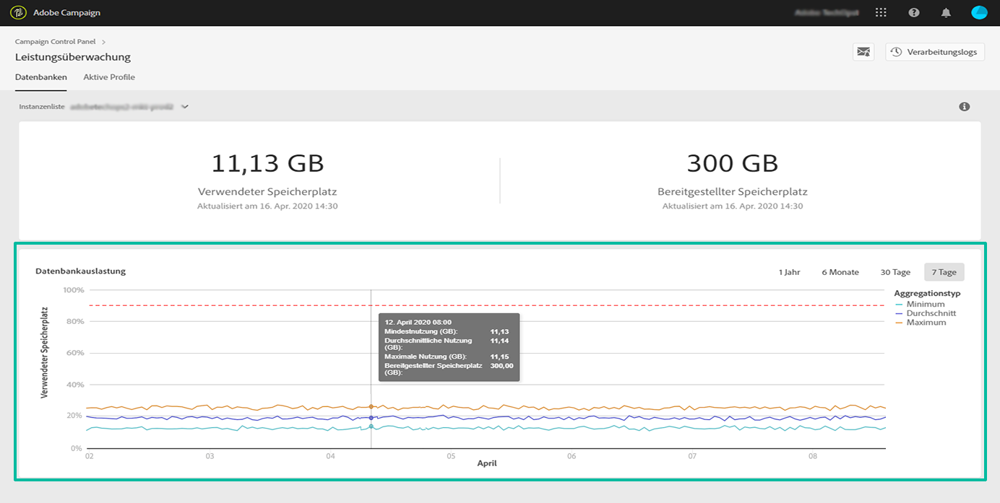
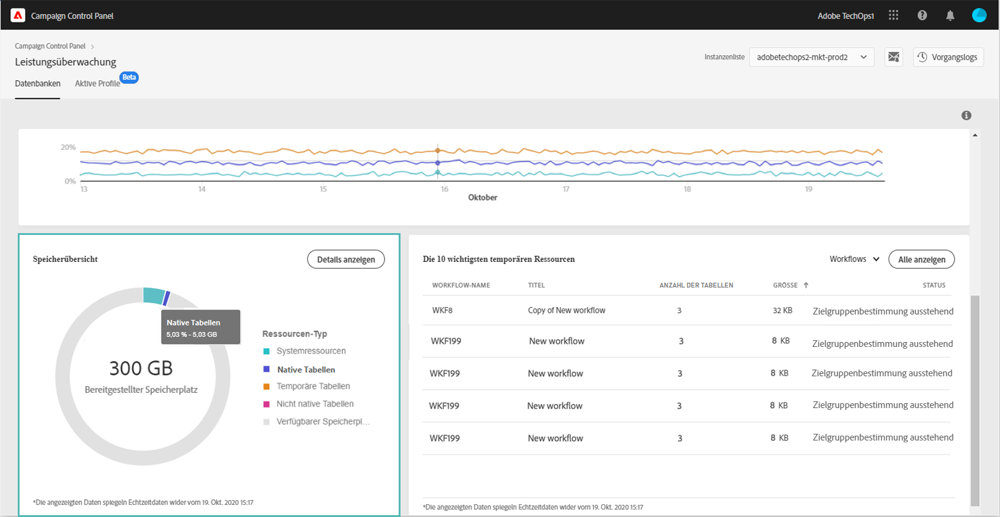
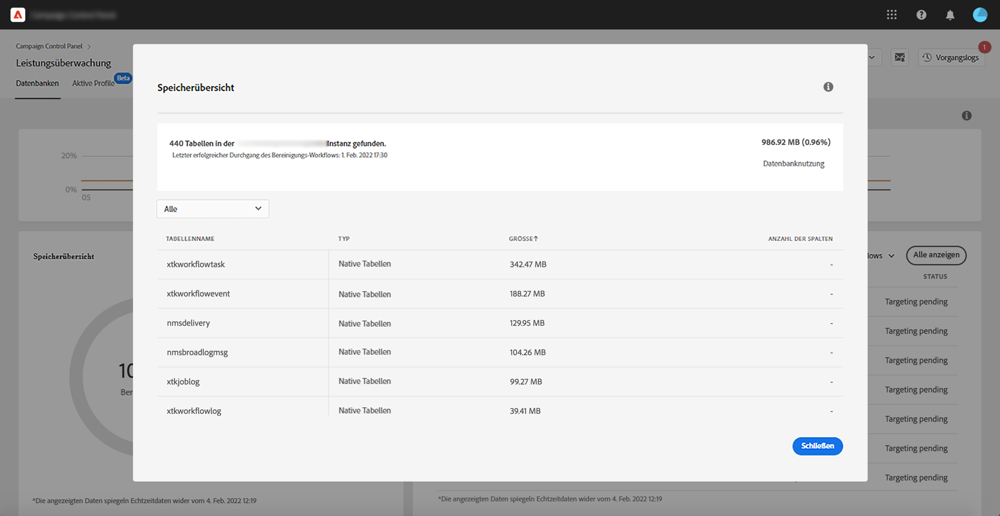
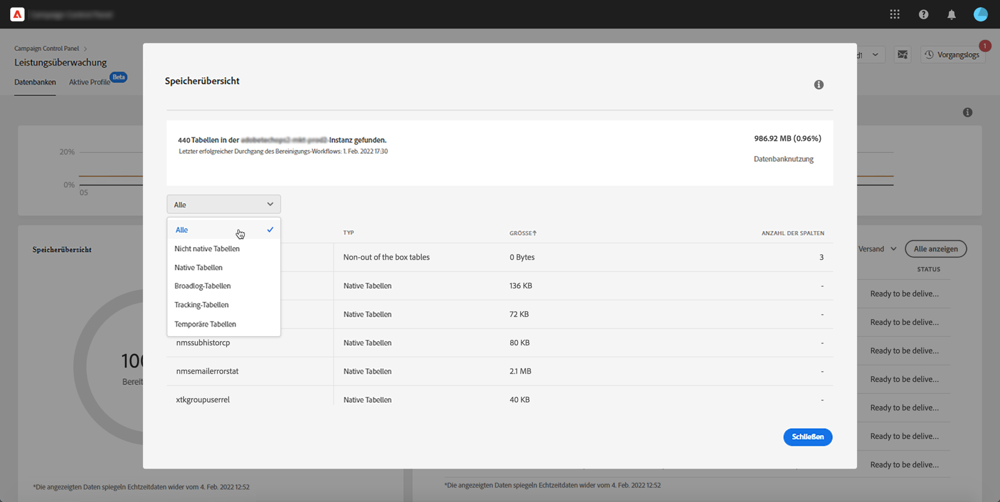
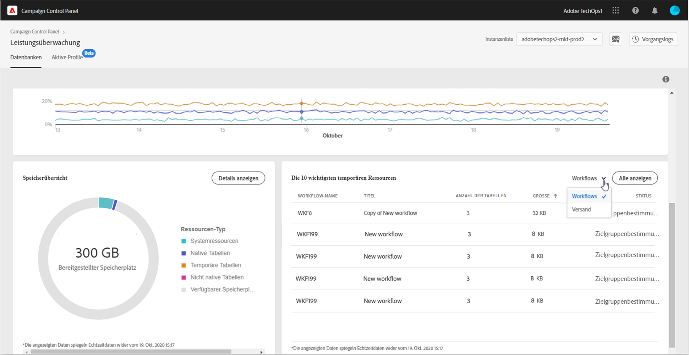
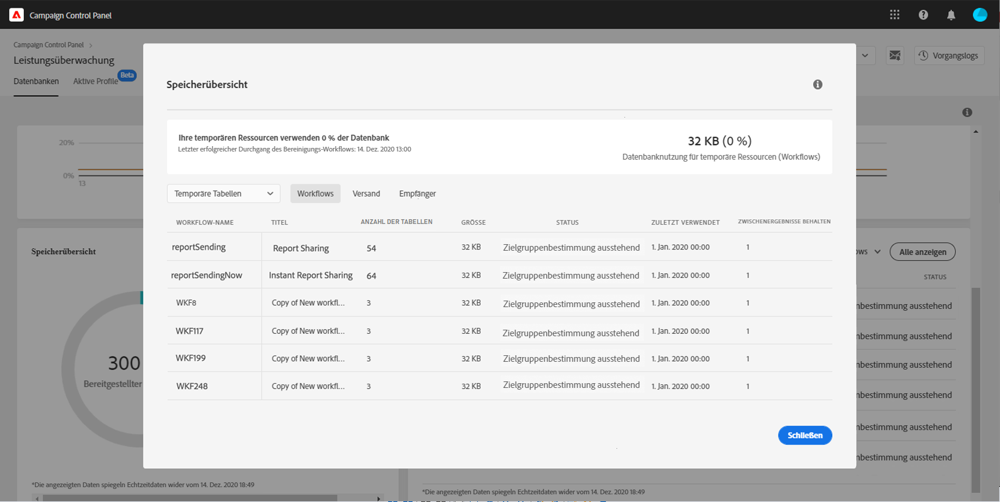

# Datenbanküberwachung {#database-monitoring}

## Über Datenbanken von Instanzen {#about-instances-databases}

Gemäß Ihrem Vertrag erhalten alle Ihre Campaign-Instanzen eine bestimmte Menge an Datenbankplatz.

Datenbanken beinhalten alle **Assets**, **Workflows** und **Daten**, die in Adobe Campaign gespeichert werden.

Im Laufe der Zeit können Datenbanken ihre maximale Kapazität erreichen, insbesondere wenn gespeicherte Ressourcen nie aus der Instanz gelöscht werden oder sich viele Workflows in angehaltenem Zustand befinden.

Ein Überlaufen der Datenbank einer Instanz kann zu verschiedenen Problemen führen (Anmeldung nicht möglich, Versand von E-Mails nicht möglich usw.). Daher ist für optimale Leistung eine Überwachung der Datenbanken Ihrer Instanzen unerlässlich.

>[!NOTE]
>
>Wenn die im Control Panel angegebene Menge an bereitgestelltem Datenbankspeicherplatz nicht der in Ihrem Vertrag angegebenen Menge entspricht, wenden Sie sich an die Kundenunterstützung.

## Überwachen der Datenbanknutzung {#monitoring-instances-database}

Mit dem Control Panel können Sie die Datenbanknutzung für jede Ihrer Campaign-Instanzen überwachen. Öffnen Sie dazu die Karte **[!UICONTROL Leistungsüberwachung]** und wählen Sie dann den Tab **[!UICONTROL Datenbanken]** aus.

Wählen Sie die gewünschte Instanz aus der **[!UICONTROL Instanzenliste]** aus, um Informationen zur Datenbankkapazität und zum verwendeten Speicherplatz der Instanz anzuzeigen.

>[!NOTE]
>
>Beachten Sie, dass die Daten in diesem Dashboard basierend auf dem **[!UICONTROL technischen Workflow für die Datenbankbereinigung]** aktualisiert werden, der in Ihrer Campaign-Instanz ausgeführt wird (siehe die Dokumentationen zu [Campaign Standard](https://docs.adobe.com/help/de-DE/campaign-standard/using/administrating/application-settings/technical-workflows.html#list-of-technical-workflows) und [Campaign Classic](https://docs.adobe.com/help/de-DE/campaign-classic/using/monitoring-campaign-classic/data-processing/database-cleanup-workflow.html)).
>
>Unter den Metriken **[!UICONTROL Verwendeter Speicherplatz]** und **[!UICONTROL Bereitgestellter Speicherplatz]** können Sie überprüfen, wann der Workflow zuletzt ausgeführt wurde. Wenn der Workflow seit mehr als 3 Tagen nicht mehr ausgeführt wird, empfehlen wir, sich an die Adobe-Kundenunterstützung zu wenden, um zu untersuchen, warum der Workflow nicht ausgeführt wird.

In diesem Dashboard stehen zusätzliche Metriken (weiter unten erklärt) zur Verfügung, mit denen Sie die Verwendung der Datenbank der Instanz analysieren können:

* [Datenbankauslastung](../../performance-monitoring/using/database-monitoring.md#database-utilization)
* [Speicherübersicht](../../performance-monitoring/using/database-monitoring.md#storage-overview)
* [Die 10 wichtigsten temporären Ressourcen](../../performance-monitoring/using/database-monitoring.md#top-10)

### Datenbankauslastung {#database-utilization}

Der Bereich **[!UICONTROL Datenbankauslastung]** bietet eine grafische Darstellung der minimalen, durchschnittlichen und maximalen Datenbankauslastung über die letzten sieben Tage sowie des Schwellenwerts von 90 % Datenbankauslastung, gekennzeichnet durch eine rot gepunktete Kurve.

Um den Zeitraum zu ändern, verwenden Sie die Filter oben rechts im Diagramm.

Zur besseren Lesbarkeit können Sie auch eine oder mehrere Kurven im Diagramm hervorheben. Wählen Sie diese dazu aus der Legende **[!UICONTROL Aggregationstyp]** aus.

Bewegen Sie den Mauszeiger über das Diagramm, um weitere Informationen zu einem bestimmten Zeitraum anzuzeigen und Informationen über die zu diesem Zeitpunkt erfolgte Datenbanknutzung anzuzeigen.

### Speicherübersicht {#storage-overview}

Der Bereich **[!UICONTROL Speicherübersicht]** bietet eine grafische Darstellung des belegten Speicherplatzes durch:

* **[!UICONTROL Systemressourcen]**

   Wir empfehlen, sich an die Kundenunterstützung zu wenden, wenn die Systemressourcen einen großen Teil des Datenbankspeichers beanspruchen.

* **[!UICONTROL Native Tabellen]**, die standardmäßig mit den Campaign-Instanzen bereitgestellt werden,
* **[!UICONTROL Temporäre Tabellen]**, die von Workflows und Sendungen erstellt wurden,
* **[!UICONTROL Nicht native Tabellen]**, die nach der Erstellung benutzerdefinierter Ressourcen generiert wurden.

Klicken Sie auf **[!UICONTROL Details anzeigen]**, um weitere Informationen zu den verschiedenen Assets zu erhalten, die Datenbankspeicher belegen.

Verwenden Sie den Filter, um die Suche zu verfeinern und Tabellen nur für einen bestimmten Asset-Typ anzuzeigen.

### Die 10 wichtigsten temporären Ressourcen {#top-10}

Im Bereich **[!UICONTROL Die 10 wichtigsten temporären Ressourcen]** werden die 10 größten temporären Ressourcen aufgelistet, die durch Workflows und Sendungen generiert wurden.

Die Überwachung von Workflows und Sendungen, die große temporäre Ressourcen erzeugen, ist ein wichtiger Schritt zur Überwachung Ihrer Datenbank. Wenn eine temporäre Ressource zu viel Datenbankspeicherplatz beansprucht, prüfen Sie, ob dieser Workflow oder dieser Versand erforderlich ist, und navigieren Sie schließlich zu Ihrer Instanz, um sie zu stoppen.

>[!IMPORTANT]
>
>Es wird allgemein empfohlen, zu vermeiden, **mehr als 40 Spalten** nicht nativer Ressourcen zu haben.

>[!NOTE]
>
>Wenn festgestellt wird, dass ein Workflow eine große Anzahl von Tabellenzahlen oder Datenbankgrößen aufweist, empfehlen wir, den Workflow zu überprüfen und zu untersuchen, warum so viele Daten generiert werden.
>
>Am Ende dieser Seite finden Sie auch Ressourcen für Campaign Standard und Campaign Classic, mit denen Sie eine Überlastung der Datenbank verhindern können.

Über **[!UICONTROL Alle anzeigen]** können Sie auf detaillierte Informationen zu diesen temporären Ressourcen zugreifen.

>[!NOTE]
>
>Der Wert in der Spalte **[!UICONTROL Zwischenergebnisse behalten]** gibt an, ob die Option in Campaign aktiviert („1“) oder deaktiviert („0“) ist. Die Option **[!UICONTROL Zwischenergebnisse behalten]** steht in den Eigenschaften der Workflows zur Verfügung. Sie können die Ergebnisse der Transitionen zwischen den verschiedenen Aktivitäten eines Workflows speichern (siehe die Dokumentationen zu [Campaign Standard](https://docs.adobe.com/content/help/de-DE/campaign-standard/using/managing-processes-and-data/executing-a-workflow/managing-execution-options.html) und [Campaign Classic](https://docs.adobe.com/content/help/de-DE/campaign-classic/using/automating-with-workflows/general-operation/workflow-best-practices.html#logs)).
>
>Wenn die Option für einen Ihrer Workflows aktiviert ist, kann der Workflow für die Datenbankbereinigung den durch Zwischenergebnisse belegten Speicherplatz nicht zurückgewinnen. Wir empfehlen daher, den Workflow zu untersuchen, um zu prüfen, ob die Option deaktiviert werden kann.

## Verhindern einer Überbelegung von Datenbanken {#preventing-database-overload}

Campaign Standard und Classic bieten verschiedene Möglichkeiten, um eine Überbelegung von Speicherplatz in Datenbanken zu verhindern.

Im folgenden Abschnitt finden Sie nützliche Ressourcen aus Campaign-Dokumentationen, die Ihnen bei der Optimierung der Datenbanknutzung helfen:

**Workflow-Überwachung**

* [Workflow-Best Practices](https://docs.adobe.com/content/help/de-DE/campaign-standard/using/managing-processes-and-data/workflow-general-operation/best-practices-workflows.htmls) (Campaign Standard)
* [Überwachung der Workflow-Ausführung](https://docs.adobe.com/help/de-DE/campaign-classic/using/automating-with-workflows/monitoring-workflows/monitoring-workflow-execution.html) (Campaign Classic)

**Wartung der Datenbank**

* Technischer Workflow für die Datenbankbereinigung ([Campaign Standard](https://docs.adobe.com/help/de-DE/campaign-standard/using/administrating/application-settings/technical-workflows.html#list-of-technical-workflows) / [Campaign Classic](https://docs.adobe.com/help/de-DE/campaign-classic/using/monitoring-campaign-classic/data-processing/database-cleanup-workflow.html))
* [Handbuch zur Datenbankwartung](https://docs.adobe.com/content/help/de-DE/campaign-classic/using/monitoring-campaign-classic/database-maintenance/recommendations.html) (Campaign Classic)
* [Behebung von Problemen mit der Datenbankleistung](https://docs.adobe.com/content/help/de-DE/campaign-classic/using/monitoring-campaign-classic/troubleshooting/database-performances.html) (Campaign Classic)
* [Datenbankbezogene Optionen](https://docs.adobe.com/help/de-DE/campaign-classic/using/installing-campaign-classic/appendices/configuring-campaign-options.html#database) (Campaign Classic)
* Datenaufbewahrung ([Campaign Standard](https://docs.adobe.com/help/de-DE/campaign-standard/using/administrating/application-settings/data-retention.html) / [Campaign Classic](https://docs.adobe.com/help/de-DE/campaign-classic/using/configuring-campaign-classic/data-model/data-model-best-practices.html#data-retention))

>[!NOTE]
>
>Zusätzlich stehen Ihnen auch Benachrichtigungen zur Verfügung, die an Sie gesendet werden, wenn eine Ihrer Datenbanken ihre Kapazitätsgrenze erreicht. Abonnieren Sie dazu [Warnungen per E-Mail](../../performance-monitoring/using/email-alerting.md).
