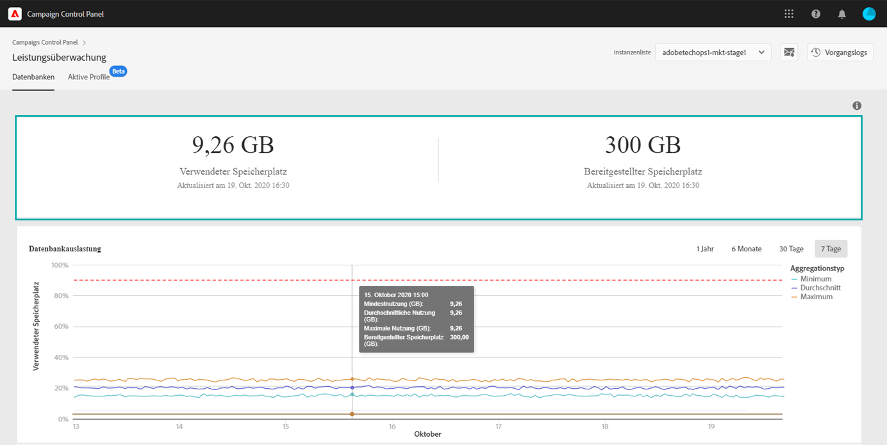

# Über die Datenbanküberwachung {#database-monitoring}

## Über Datenbanken von Instanzen {#about-instances-databases}

Gemäß Ihrem Vertrag erhalten alle Ihre Campaign-Instanzen eine bestimmte Menge an Datenbankplatz.

Datenbanken beinhalten alle **Assets**, **Workflows** und **Daten**, die in Adobe Campaign gespeichert werden.

Im Laufe der Zeit können Datenbanken ihre maximale Kapazität erreichen, insbesondere wenn gespeicherte Ressourcen nie aus der Instanz gelöscht werden oder sich viele Workflows in angehaltenem Zustand befinden.

Ein Überlaufen der Datenbank einer Instanz kann zu verschiedenen Problemen führen (Anmeldung nicht möglich, Versand von E-Mails nicht möglich usw.). Daher ist für optimale Leistung eine Überwachung der Datenbanken Ihrer Instanzen unerlässlich.

## Überwachen der Datenbanknutzung{#monitoring-database-usage}

>[!CONTEXTUALHELP]
>id="cp_performancemonitoring_database"
>title="Über die Datenbanküberwachung"
>abstract="Auf dieser Registerkarte erhalten Sie Echtzeitinformationen über die aktuelle und frühere Datenbanknutzung und -entwicklung für jede Ihrer Campaign-Instanzen."
>additional-url="https://experienceleague.adobe.com/docs/control-panel/using/performance-monitoring/about-performance-monitoring.html?lang=de" text="Über die Leistungsüberwachung "

Mit dem Control Panel können Sie die Datenbanknutzung für jede Ihrer Campaign-Instanzen überwachen. Öffnen Sie dazu die Karte **[!UICONTROL Leistungsüberwachung]** und wählen Sie dann den Tab **[!UICONTROL Datenbanken]** aus.

Wählen Sie die gewünschte Instanz aus der **[!UICONTROL Instanzenliste]** aus, um Informationen zur Datenbankkapazität und zum verwendeten Speicherplatz der Instanz anzuzeigen.

Zusätzlich stehen Ihnen auch Benachrichtigungen zur Verfügung, die an Sie gesendet werden, wenn eine Ihrer Datenbanken ihre Kapazitätsgrenze erreicht. Abonnieren Sie dazu [Benachrichtigungen per E-Mail](../../performance-monitoring/using/email-alerting.md).

>[!NOTE]
>
>Wenn die im Control Panel angegebene Menge an verfügbarem Datenbankspeicherplatz nicht der in Ihrem Vertrag angegebenen Menge entspricht, wenden Sie sich an die Kundenunterstützung.

Daten aus diesem Dashboard werden auf der Grundlage des **[!UICONTROL technischen Workflows zur Datenbankbereinigung]** aktualisiert, der auf Ihrer Campaign-Instanz ausgeführt wird (siehe die Dokumentationen zu [Campaign Standard](https://experienceleague.adobe.com/docs/campaign-standard/using/administrating/application-settings/technical-workflows.html?lang=de#list-of-technical-workflows) und [Campaign v7/v8](https://experienceleague.adobe.com/docs/campaign-classic/using/monitoring-campaign-classic/data-processing/database-cleanup-workflow.html?lang=de)). Unter den Metriken **[!UICONTROL Verwendeter Speicherplatz]** und **[!UICONTROL Bereitgestellter Speicherplatz]** können Sie überprüfen, wann der Workflow zuletzt ausgeführt wurde. Wenn der Workflow seit mehr als 3 Tagen nicht mehr ausgeführt wird, empfehlen wir, sich an die Adobe-Kundenunterstützung zu wenden, um zu untersuchen, warum der Workflow nicht ausgeführt wird.

In diesem Dashboard stehen zusätzliche Metriken zur Verfügung, mit denen Sie die Verwendung der Datenbank der Instanz analysieren können. Sie werden in den folgenden Abschnitten beschrieben:

* [Datenbankauslastung](../../performance-monitoring/using/database-utilization.md)
* [Speicherübersicht](../../performance-monitoring/using/database-storage-overview.md)
* [Die zehn wichtigsten temporären Ressourcen](../../performance-monitoring/using/database-top-ten-resources.md)
* [Aktive Abfragen](../../performance-monitoring/using/database-active-queries.md)

 Entdecken Sie diese Funktion bei der Verwendung von [Campaign v7/v8](https://experienceleague.adobe.com/docs/campaign-classic-learn/control-panel/performance-monitoring/monitoring-databases.html?lang=de#performance-monitoring) oder [Campaign Standard](https://experienceleague.adobe.com/docs/campaign-standard-learn/control-panel/performance-monitoring/monitoring-databases.html?lang=de#performance-monitoring) im Video.
