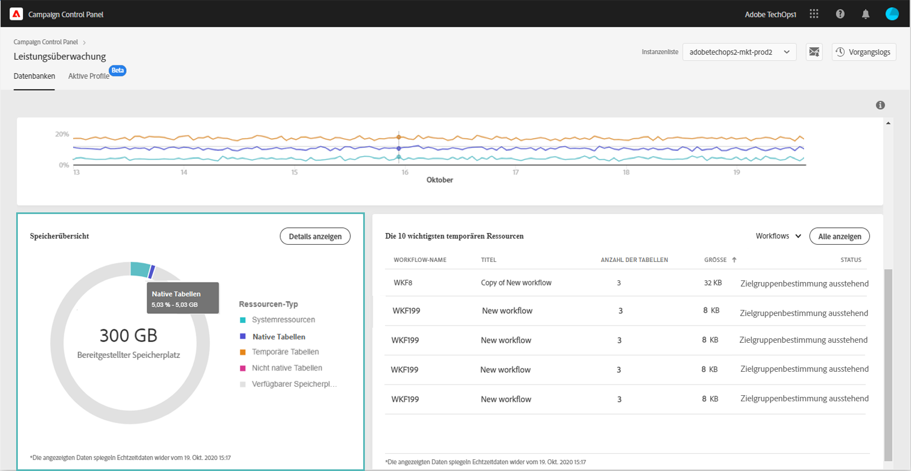
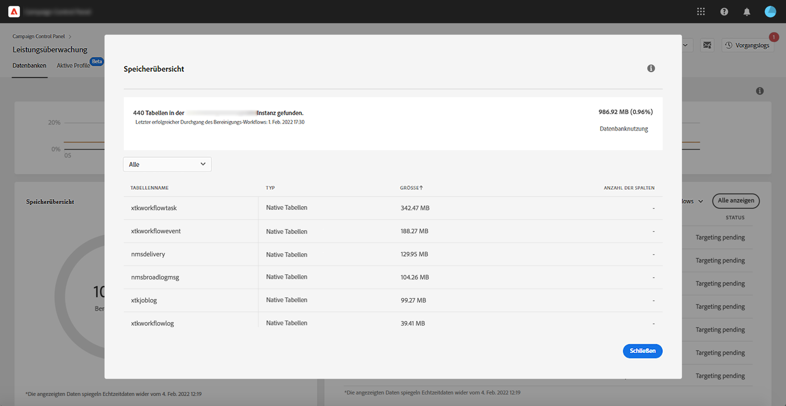

# Speicherübersicht {#storage-overview}

>[!CONTEXTUALHELP]
>id="cp_dbdetails_storagedetails"
>title="Über die Speicherübersicht"
>abstract="Auf dieser Registerkarte befinden sich detaillierte Informationen zu den verschiedenen Campaign-Ressourcen, die Datenbankspeicherplatz belegen."

Der Bereich **[!UICONTROL Speicherübersicht]** bietet eine grafische Darstellung des belegten Speicherplatzes durch:

* **[!UICONTROL Systemressourcen]**

  Wir empfehlen, sich an die Kundenunterstützung zu wenden, wenn die Systemressourcen einen großen Teil des Datenbankspeichers beanspruchen.

* **[!UICONTROL Native Tabellen]**, die standardmäßig mit den Campaign-Instanzen bereitgestellt werden,
* **[!UICONTROL Temporäre Tabellen]**, die von Workflows und Sendungen erstellt wurden,
* **[!UICONTROL Nicht native Tabellen]**, die nach der Erstellung benutzerdefinierter Ressourcen generiert wurden.

Klicken Sie auf **[!UICONTROL Details anzeigen]**, um weitere Informationen zu den verschiedenen Assets zu erhalten, die Datenbankspeicher belegen.

Sie können die Dropdown-Liste verwenden, um Ihre Suche zu verfeinern und nur Tabellen aus einem bestimmten Asset-Typ anzuzeigen (Workflows, Sendungen, Empfänger).

Beachten Sie, dass Sie in diesem Bildschirm auch Workflow-Parameter überwachen können, die besondere Aufmerksamkeit erfordern, um Probleme in Ihren Instanzen zu vermeiden. Weitere Informationen finden Sie auf [dieser Seite](workflow-monitoring.md).
