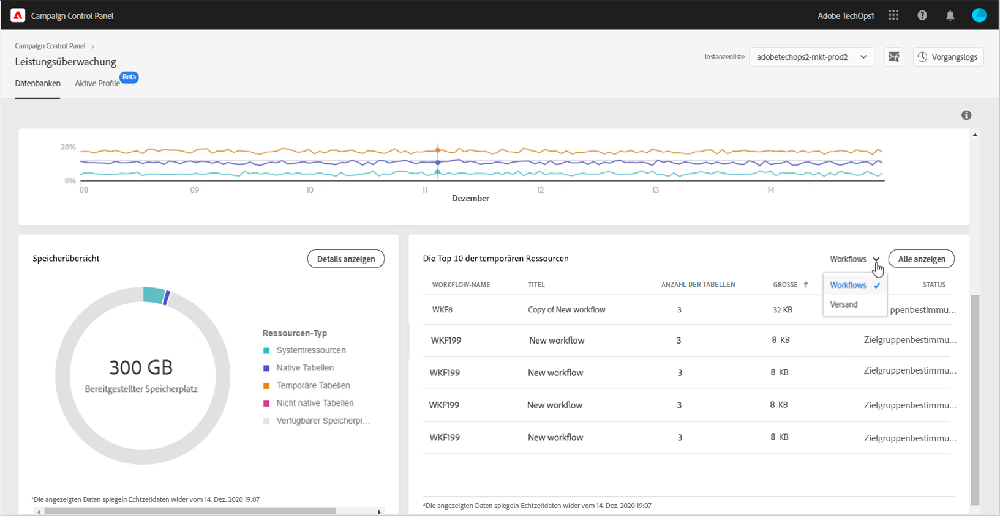

# Die zehn wichtigsten temporären Ressourcen {#top-10}

Im Bereich **[!UICONTROL Die zehn wichtigsten temporären Ressourcen]** werden die 10 größten temporären Ressourcen aufgelistet, die durch Workflows und Sendungen generiert wurden.

Die Überwachung von Workflows und Sendungen, die große temporäre Ressourcen erzeugen, ist ein wichtiger Schritt zur Überwachung Ihrer Datenbank. Wenn eine temporäre Ressource zu viel Datenbankspeicherplatz beansprucht, prüfen Sie, ob dieser Workflow oder dieser Versand erforderlich ist, und navigieren Sie schließlich zu Ihrer Instanz, um sie zu stoppen.

>[!IMPORTANT]
>
>Es wird allgemein empfohlen zu vermeiden, **mehr als 40 Spalten** nicht vorkonfigurierter Ressourcen zu haben. Wenn ein Workflow eine große Anzahl von Tabellen oder eine hohe Datenbankgröße aufweist, empfehlen wir, den Workflow zu überprüfen, um herauszufinden, warum er so viele Daten erzeugt.
>
>Die Richtlinien für Campaign Standard und Classic sind auch auf [dieser Seite](database-preventing-overload.md) verfügbar. Sie helfen Ihnen, eine Überlastung der Datenbank zu vermeiden.

Über die Schaltfläche **[!UICONTROL Alles anzeigen]** können Sie auf die Details der **[!UICONTROL Speicherübersicht]** zugreifen, um detaillierte Informationen zu diesen temporären Ressourcen zu erhalten. Weitere Informationen hierzu finden Sie auf [dieser Seite](database-storage-overview.md).
