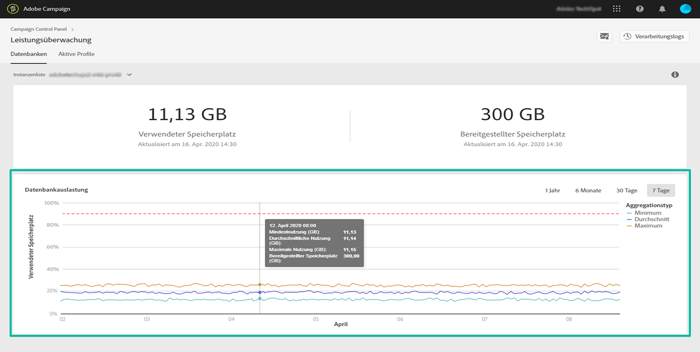

# Datenbankauslastung {#database-utilization}

Der Bereich **[!UICONTROL Datenbankauslastung]** bietet eine grafische Darstellung der minimalen, durchschnittlichen und maximalen Datenbankauslastung über die letzten sieben Tage sowie des Schwellenwerts von 90 % Datenbankauslastung, gekennzeichnet durch eine rot gepunktete Kurve.

Um den Zeitraum zu ändern, verwenden Sie die Filter oben rechts im Diagramm.

Zur besseren Lesbarkeit können Sie auch eine oder mehrere Kurven im Diagramm hervorheben. Wählen Sie diese dazu aus der Legende **[!UICONTROL Aggregationstyp]** aus.

Bewegen Sie den Mauszeiger über das Diagramm, um weitere Informationen zu einem bestimmten Zeitraum anzuzeigen und Informationen über die zu diesem Zeitpunkt erfolgte Datenbanknutzung anzuzeigen.

