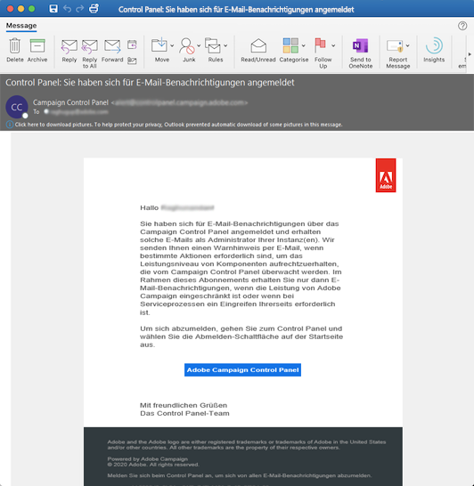

# Benachrichtigungen per E-Mail {#email-alerting}

Das Control Panel verfügt über eine Funktion mit echtzeitbasierten E-Mail-Warnungen, damit Sie Ihre Arbeit flexibler gestalten können.

Gehen Sie wie folgt vor, um diese Warnhinweise zu abonnieren:

1. Klicken Sie an einer beliebigen Stelle im Control Panel auf die Schaltfläche **[!UICONTROL Warnbenachrichtigungen]** und dann auf **[!UICONTROL Abonnieren]**.

   

1. Sie erhalten eine E-Mail zur Bestätigung Ihres Abonnements.

   

1. Nach dem Abonnieren benachrichtigt Sie das Control Panel über Systemprobleme und empfiehlt zu ergreifende Maßnahmen. E-Mail-Warnungen werden an alle Personen gesendet, die sich für **alle Instanzen** angemeldet haben, bei denen sie Administratoren sind.

   

Die Liste der Warnungen lautet wie folgt:

* **Nutzung des SFTP-Speichers**: Einer Ihrer SFTP-Server hat mindestens 80 % seiner Kapazität erreicht. Siehe [SFTP-Speicherverwaltung](../../sftp/using/sftp-storage-management.md).

* **Datenbanknutzung**: Eine der Datenbanken Ihrer Instanzen hat mindestens 80 % ihrer Kapazität erreicht. Siehe [Datenbanküberwachung](../../performance-monitoring/using/database-monitoring.md).

* **Ablauf des SSL-Zertifikats**: Eines der SSL-Zertifikate Ihrer Subdomains ist abgelaufen oder läuft in 60 Tagen oder weniger ab. Siehe [Überwachen von SSL-Zertifikaten der Subdomains](../../subdomains-certificates/using/monitoring-ssl-certificates.md).

* **Ablauf der SFTP-IP-Zulassungsauflistung**: Einer der von Ihnen definierten IP-Bereiche ist abgelaufen oder läuft in spätestens 10 Tagen ab. Weitere Informationen finden Sie unter [IP-Bereich-Zulassungsauflistung](../../sftp/using/ip-range-allow-listing.md).

* **Ablauf des öffentlichen SFTP-Schlüssels**: Einer der von Ihnen definierten öffentlichen Schlüssel ist abgelaufen oder läuft in spätestens 10 Tagen ab. Weitere Informationen finden Sie unter [Schlüsselverwaltung](../../sftp/using/key-management.md).

* **Langlaufen Abfragen**: Eine Abfrage wird seit mehr als 24 Stunden auf einer Ihrer Instanzen ausgeführt. Siehe [Aktive Abfragen überwachen](database-active-queries.md).