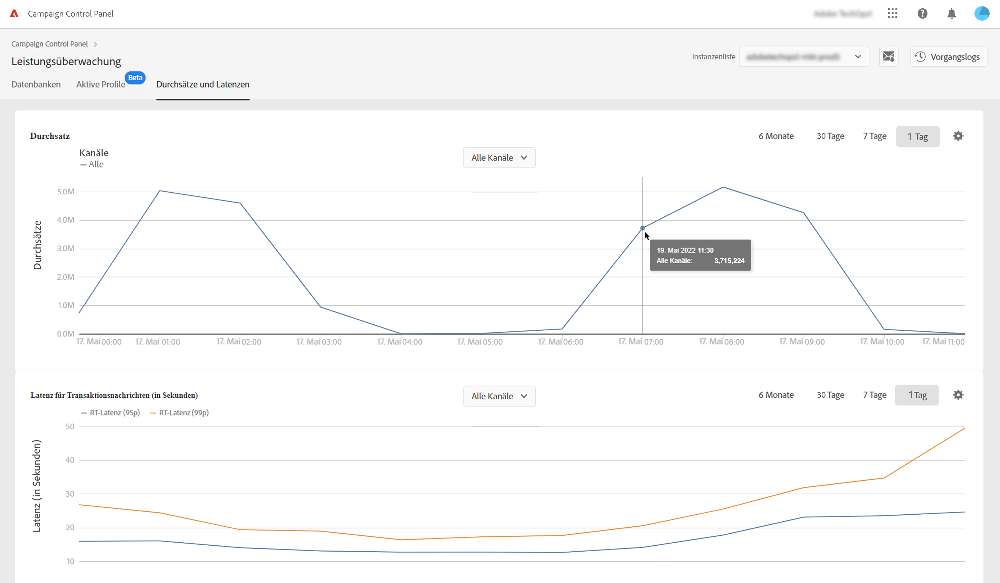
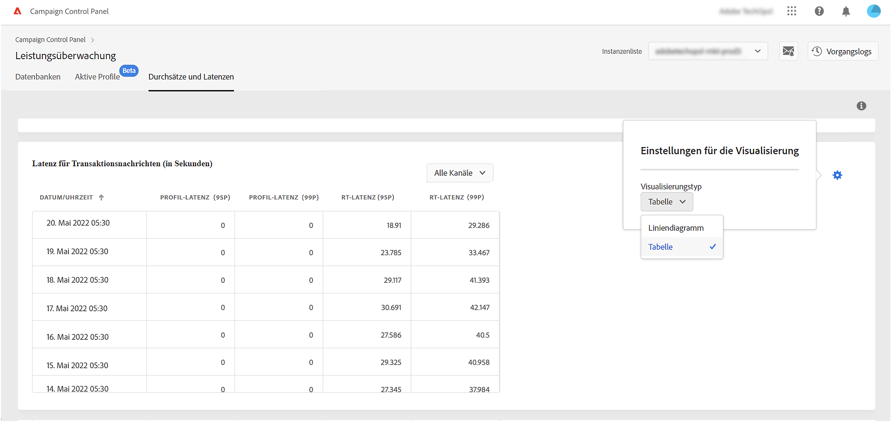

# Überwachung von Durchsätzen und Latenzzeiten {#throughputs-latency-monitoring}

>[!CONTEXTUALHELP]
>id="cp_performancemonitoring_throughputslatencies"
>title="Über die Überwachung von Durchsätzen und Latenzzeiten "
>abstract="Auf dieser Registerkarte können Sie die Entwicklung der Durchsätze und Latenzzeiten Ihrer Instanzen über einen bestimmten Zeitraum hinweg überwachen."

Um die Nutzung Ihrer Instanzen zu verstehen und sicherzustellen, dass sie eine gute Leistung erzielen, müssen Sie unbedingt überwachen, wie sich die Versanddurchsätze und die Latenzzeiten über einen bestimmten Zeitraum verhalten.

Diese Informationen werden im Control Panel für jede Ihrer Campaign-Instanzen auf der Karte **[!UICONTROL Leistungsüberwachung]** auf der Registerkarte **[!UICONTROL Durchsätze und Latenzzeiten]** verfügbar gemacht (beachten Sie, dass es im Control Panel bis zu 1 Stunde dauern kann, bis die Zahlen angezeigt werden).

* Der Bereich **[!UICONTROL Durchsatz]** enthält Informationen zur Anzahl der Nachrichten, die pro Stunde von der ausgewählten Campaign-Instanz für alle Kommunikationskanäle gesendet werden, für die Sie eine Berechtigung haben.

* Der Bereich **[!UICONTROL Latenz]** enthält Informationen zur Latenzzeit, die in der ausgewählten Instanz beim Versand von Echtzeit-Transaktionsnachrichten auftritt. Latenzzeiten werden im 95- und 99-Perzentil erfasst und visualisiert. Das bedeutet, dass 95 % bzw. 99 % der Anfragen schneller als die angegebene Latenzzeit sein sollten.

>[!NOTE]
>
>Alle in diesem Bereich angezeigten Zahlen sind ungefähre Zahlen und dienen nur Informationszwecken.

Standardmäßig werden Daten für den aktuellen Tag angezeigt. Sie können den angezeigten Zeitraum mithilfe der Schaltflächen **[!UICONTROL 6 Monate]**, **[!UICONTROL 30 Tage]** und **[!UICONTROL 7 Tage]** ändern.

Sie können diese Informationen auch in tabellarischer Form mit sortierbaren Spalten anstatt mit einem Diagramm visualisieren. Klicken Sie dazu auf die Schaltfläche **[!UICONTROL Visualisierungseinstellungen]** und wählen Sie **[!UICONTROL Tabelle]**.

