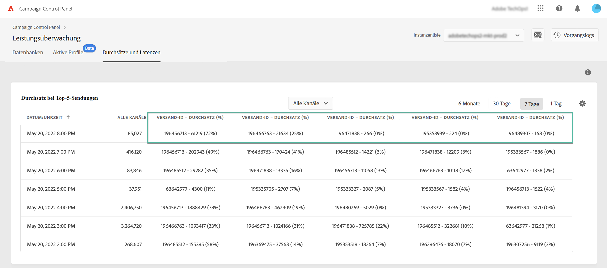
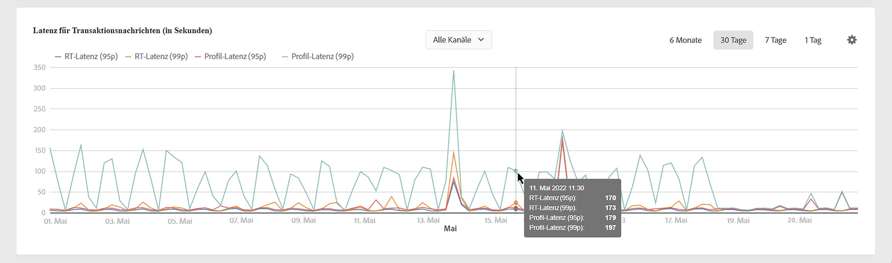
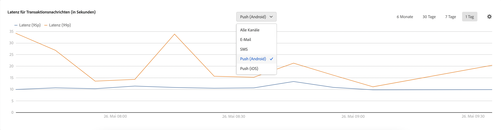

# Überwachen von Durchsätzen und Latenzzeiten {#throughputs-latency-monitoring}

>[!CONTEXTUALHELP]
>id="cp_performancemonitoring_throughputslatencies"
>title="Über die Überwachung von Durchsätzen und Latenzzeiten "
>abstract="Auf dieser Registerkarte können Sie die Entwicklung der Durchsätze und Latenzzeiten Ihrer Instanzen über einen bestimmten Zeitraum hinweg überwachen. Um Informationen über Sendungen zu erhalten, die zum Durchsatz beitragen, wechseln Sie zur Tabellenansicht."

Mit dem Control Panel können Sie den Versanddurchsatz und die Latenzzeit für jede Ihrer Instanzen überwachen.

>[!IMPORTANT]
>
>Diese Funktion steht allen Campaign Standard, v8-Kunden und Campaign v7-Kunden mit den Build-Nummern 9032 und höher zur Verfügung, einschließlich [Standalone-Implementierungen](https://experienceleague.adobe.com/docs/campaign-classic/using/installing-campaign-classic/deployment-types-/standalone-deployment.html?lang=de) (ohne Mid-Instanz).

Die Überwachung der Entwicklung von Versanddurchsatz und Latenz über einen bestimmten Zeitraum ist wichtig, um die Nutzung Ihrer Instanzen zu verstehen und sicherzustellen, dass sie eine gute Leistung erzielen.

Diese Informationen werden im Control Panel für jede Ihrer Campaign-Instanzen auf der Karte **[!UICONTROL Leistungsüberwachung]** auf der Registerkarte **[!UICONTROL Durchsätze und Latenzzeiten]** verfügbar gemacht (beachten Sie, dass es im Control Panel bis zu 1 Stunde dauern kann, bis die Zahlen angezeigt werden).

>[!NOTE]
>
>Alle in diesem Bereich angezeigten Zahlen sind ungefähre Zahlen und dienen nur Informationszwecken.

Standardmäßig werden Daten für den aktuellen Tag angezeigt. Sie können den angezeigten Zeitraum mithilfe der Schaltflächen **[!UICONTROL 6 Monate]**, **[!UICONTROL 30 Tage]** und **[!UICONTROL 7 Tage]** ändern. Die Daten werden folgenderweise vorgestellt:
* stündlich für die Ansicht von 1 Tag und 7 Tagen,
* 6-stündlich für die Ansicht von 30 Tagen,
* täglich für die Ansicht von 6 Monaten.

Sie können diese Informationen auch in tabellarischer Form mit sortierbaren Spalten anstatt mit einem Diagramm visualisieren. Klicken Sie dazu auf die Schaltfläche **[!UICONTROL Visualisierungseinstellungen]** und wählen Sie **[!UICONTROL Tabelle]**.

## Überwachung des Durchsatzes {#throughput}

Der Bereich **[!UICONTROL Durchsatz]** enthält Informationen zur Anzahl der Nachrichten, die pro Stunde von der ausgewählten Campaign-Instanz für alle Kommunikationskanäle gesendet werden, für die Sie eine Berechtigung haben.

>[!NOTE]
>
>Bei Campaign v7/v8 entspricht der angezeigte Durchsatzwert dem Durchsatz, der von MID-Instanzen (Mid-Sourcing) erzielt wurde. Bei eigenständigen Marketing-Bereitstellungen (MKT), d. h. ohne MID-Instanz, wird stattdessen der Durchsatz von der MKT-Instanz angezeigt.

Darüber hinaus ermöglicht Ihnen das Control Panel die Identifizierung der IDs der 5 Sendungen, die während des ausgewählten Zeitraums am stärksten zum Durchsatz beitragen. Diese Informationen sind nur in der Tabellenansicht verfügbar:

## Überwachen der Latenzzeit {#latency}

Der Bereich **[!UICONTROL Latenz]** enthält Informationen zur Latenzzeit, die in der ausgewählten Instanz beim Versand von Echtzeit-Transaktionsnachrichten auftritt.

>[!NOTE]
>
>Beachten Sie, dass die Informationen zu **Profil-Latenz** nur für [!DNL Campaign Standard]-Instanzen verfügbar sind.

Latenzzeiten werden im 95- und 99-Perzentil erfasst und visualisiert. Das bedeutet, dass 95 % bzw. 99 % der Anfragen schneller als die angegebene Latenzzeit sein sollten.

Standardmäßig werden die Latenzzeiten für alle Kanäle angezeigt. Sie können die Latenzzeit für einen bestimmten Kanal mithilfe der Dropdown-Liste visualisieren.

>[!NOTE]
>
>Die Kanalfilterung ist nur für Campaign Classic v7/v8-Instanzen verfügbar.
