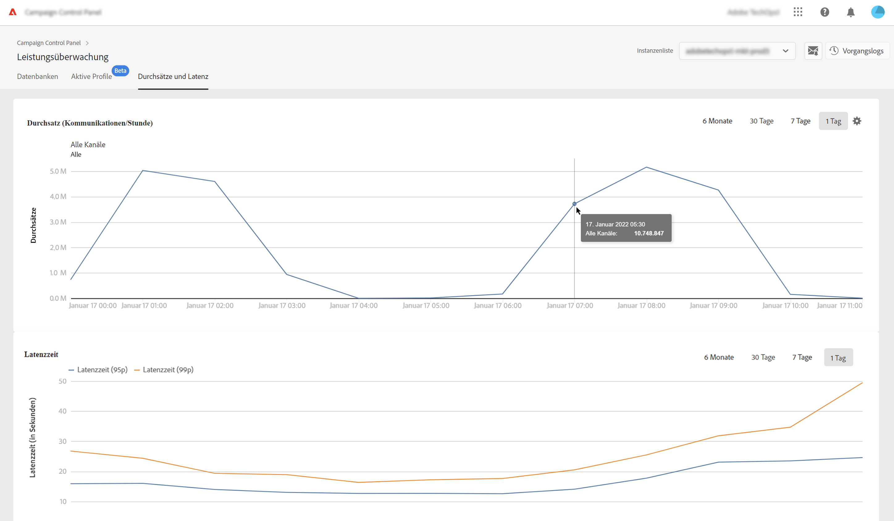
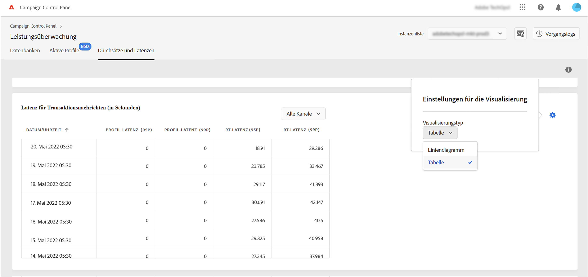
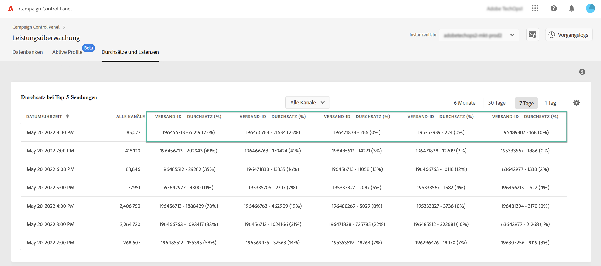
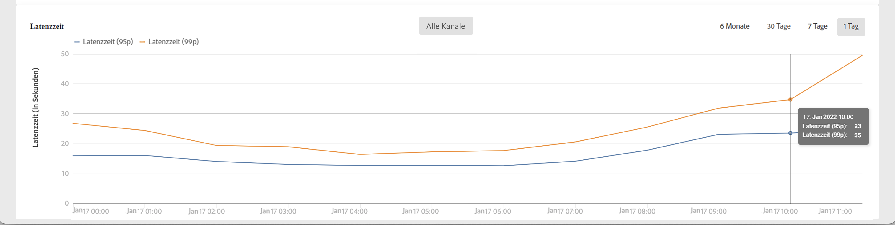
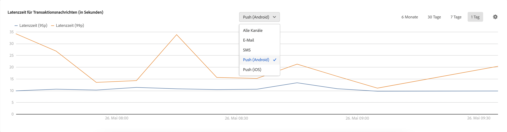

# Überwachen von Durchsätzen und Latenzen {#throughputs-latency-monitoring}

>[!CONTEXTUALHELP]
>id="cp_performancemonitoring_throughputslatencies"
>title="Über die Überwachung von Durchsätzen und Latenzen "
>abstract="Auf dieser Registerkarte kann die Entwicklung der Durchsätze und Latenzen auf den Instanzen über einen bestimmten Zeitraum hinweg überwacht werden. Um Informationen über Versände zu erhalten, die zum Durchsatz beitragen, muss zur Tabellenansicht gewechselt werden."

Mit dem Control Panel können Sie den Versanddurchsatz und die Latenz für jede Ihrer Instanzen überwachen.

>[!IMPORTANT]
>
>Diese Funktion steht allen Kunden von Campaign Standard, Campaign v8 und Campaign v7 mit den Build-Nummern 9032 und höher zur Verfügung, einschließlich [eigenständiger Bereitstellungen](https://experienceleague.adobe.com/docs/campaign-classic/using/installing-campaign-classic/deployment-types-/standalone-deployment.html?lang=de) (ohne Mid-Instanz).

Die Überwachung der Entwicklung von Versanddurchsatz und Latenz über einen bestimmten Zeitraum ist wichtig, um die Nutzung Ihrer Instanzen zu verstehen und sicherzustellen, dass sie eine gute Leistung erzielen.

Diese Informationen werden im Control Panel für jede Ihrer Campaign-Instanzen auf der Karte **[!UICONTROL Performance-Überwachung]** auf der Registerkarte **[!UICONTROL Durchsätze und Latenzen]** verfügbar gemacht (beachten Sie, dass es im Control Panel bis zu 1 Stunde dauern kann, bis die Zahlen angezeigt werden).

>[!NOTE]
>
>Alle in diesem Bereich angezeigten Zahlen sind ungefähre Zahlen und dienen nur Informationszwecken.

Standardmäßig werden Daten für den aktuellen Tag angezeigt. Sie können den angezeigten Zeitraum mithilfe der Schaltflächen **[!UICONTROL 6 Monate]**, **[!UICONTROL 30 Tage]** und **[!UICONTROL 7 Tage]** ändern. Die Daten werden folgenderweise vorgestellt:
* stündlich für die Ansicht von 1 Tag und 7 Tagen,
* 6-stündlich für die Ansicht von 30 Tagen,
* täglich für die Ansicht von 6 Monaten.

Sie können diese Informationen auch in tabellarischer Form mit sortierbaren Spalten anstatt mit einem Diagramm visualisieren. Klicken Sie dazu auf die Schaltfläche **[!UICONTROL Visualisierungseinstellungen]** und wählen Sie **[!UICONTROL Tabelle]**.

## Überwachen des Durchsatzes {#throughput}

Der Bereich **[!UICONTROL Durchsatz]** enthält Informationen zur Anzahl der Nachrichten, die pro Stunde von der ausgewählten Campaign-Instanz für alle Kommunikationskanäle gesendet werden, für die Sie eine Berechtigung haben.

>[!NOTE]
>
>Bei Campaign v7/v8 entspricht der angezeigte Durchsatzwert dem Durchsatz, der von MID-Instanzen (Mid-Sourcing) erzielt wurde. Bei eigenständigen Marketing-Bereitstellungen (MKT), d. h. ohne MID-Instanz, wird stattdessen der Durchsatz von der MKT-Instanz angezeigt.

Darüber hinaus ermöglicht Ihnen das Control Panel die Identifizierung der IDs der 5 Sendungen, die während des ausgewählten Zeitraums am stärksten zum Durchsatz beitragen. Diese Informationen sind nur in der Tabellenansicht verfügbar:

## Überwachen der Latenz {#latency}

Der Bereich **[!UICONTROL Latenz]** enthält Informationen zur Latenz, die in der ausgewählten Instanz beim Versand von Echtzeit-Transaktionsnachrichten auftritt.

>[!NOTE]
>
>Beachten Sie, dass die Informationen zu **Profil-Latenz** nur für [!DNL Campaign Standard]-Instanzen verfügbar sind.

Latenzen werden im 95- und 99-Perzentil erfasst und visualisiert. Das bedeutet, dass 95 % bzw. 99 % der Anfragen schneller als die angegebene Latenz sein sollten.

Standardmäßig werden die Latenzen für alle Kanäle angezeigt. Sie können die Latenz für einen bestimmten Kanal mithilfe der Dropdown-Liste visualisieren.

>[!NOTE]
>
>Die Kanalfilterung ist nur für Campaign Classic v7/v8-Instanzen verfügbar.
