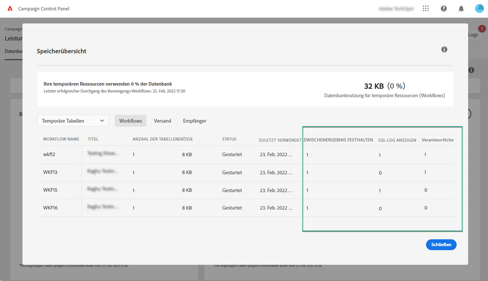
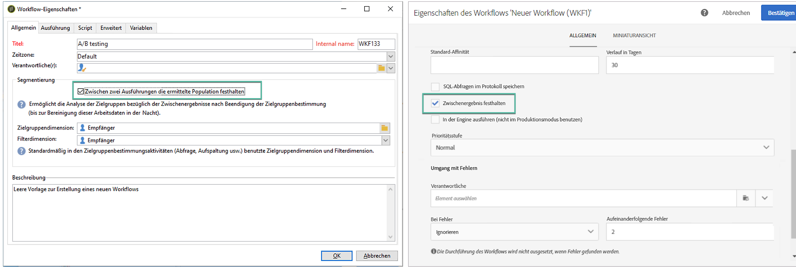
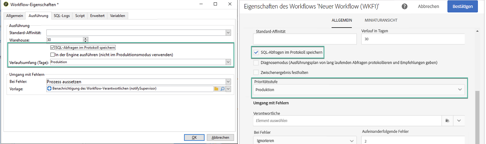
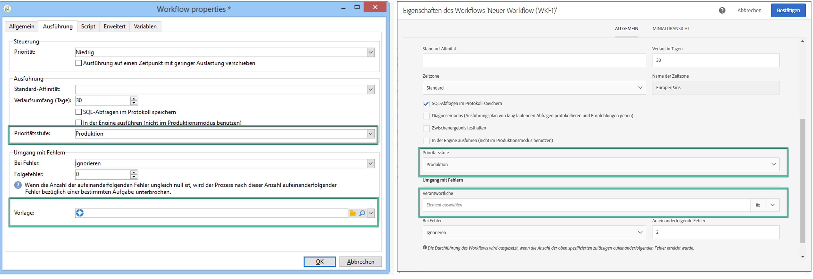

# Überwachen von Workflows {#monitor-workflows}

<!-- Clean paused and completed workflows

When [!DNL Adobe Campaign] workflows are paused or completed, they leave temporary tables on your instances database that consume space and can lead to performance issues.

Control Panel allows you to identify those workflows and clean the temporary resources generated on your instances.

>[!NOTE]
>
>Technically, this operation executes the **[!UICONTROL Database cleanup technical workflow]** that runs on your Campaign instance everyday (see [Campaign Standard](https://experienceleague.adobe.com/docs/campaign-standard/using/administrating/application-settings/technical-workflows.html#list-of-technical-workflows) and [Campaign Classic](https://experienceleague.adobe.com/docs/campaign-classic/using/monitoring-campaign-classic/data-processing/database-cleanup-workflow.html) documentation). 

To clean paused and completed workflows, follow these steps:

1. Navigate to the **[!UICONTROL Performance monitoring]** card.

1. In the **[!UICONTROL Databases]** tab, select the instance where you want to perform the operation.

1. Access the **[!UICONTROL Storage overview]** details, then filter the list on **[!UICONTROL Temporary tables]**. Learn more on **[!UICONTROL Storage overview]** in [this page](database-storage-overview.md).

    

1. All temporary tables generated on your instances by workflows and deliveries display. Click the **[!UICONTROL Clean now]** button to delete the resources generated by paused and completed workflows.

    

1. Once the operation is confirmed, you can track the estimated remaining time in the **[!UICONTROL Storage overview]** list.

    

Monitor workflow parameters -->

In Adobe Campaign gibt es einige Workflow-Parameter, die möglicherweise besondere Aufmerksamkeit erfordern, um Probleme in Ihren Instanzen zu vermeiden. Über die Control Panel-Details **[!UICONTROL Speicherübersicht]** können Sie überprüfen, ob eine dieser Optionen für Ihre Workflows aktiviert ist.

## **[!UICONTROL Zwischenergebnis festhalten]** {#keep-results}

Wenn diese Option aktiviert ist (Wert „1“), werden die Ergebnisse der Übergänge zwischen den verschiedenen Aktivitäten eines Workflows gespeichert. Weitere Informationen finden Sie in der Dokumentation zu [Campaign Standard](https://experienceleague.adobe.com/docs/campaign-standard/using/managing-processes-and-data/executing-a-workflow/managing-execution-options.html?lang=de) und [Campaign Classic](https://experienceleague.adobe.com/docs/campaign-classic/using/automating-with-workflows/introduction/workflow-best-practices.html?lang=de#logs).

>[!IMPORTANT]
>
>Diese Option darf in einem Produktions-Workflow niemals aktiviert sein. Sie wird für Analyse- und Testzwecke verwendet und darf daher nur in Entwicklungs- oder Staging-Umgebungen eingesetzt werden. Wir empfehlen dringend, sie in Campaign zu deaktivieren.

## **[!UICONTROL SQL-Protokoll anzeigen]** {#sql}

Wenn diese Option aktiviert ist, werden die SQL-Abfragen, die während der Workflow-Ausführung an die Datenbank gesendet werden, in Adobe Campaign angezeigt. Weitere Informationen finden Sie in der Dokumentation zu [Campaign Standard](https://experienceleague.adobe.com/docs/campaign-standard/using/managing-processes-and-data/executing-a-workflow/managing-execution-options.html?lang=de) und [Campaign Classic](https://experienceleague.adobe.com/docs/campaign-classic/using/automating-with-workflows/advanced-management/workflow-properties.html?lang=de#execution).

Der Wert „1“ zeigt an, dass für den Workflow das Feld **Schweregrad** auf „Produktion“ eingestellt ist und dass die Option für das SQL-Abfrageprotokoll aktiviert ist.

>[!IMPORTANT]
>
>Die Aktivierung dieser Option kann die Leistung beeinträchtigen und die Protokolldateien auf dem Server ausfüllen. Sie sollte nur für Analyse- und Diagnosezwecke verwendet werden.

## **[!UICONTROL Verantwortliche]** {#supervisors}

Dieses Feld ermöglicht es Ihnen, einem Workflow einen Benutzer zuzuweisen. Wenn der Workflow fehlschlägt, wird der jeweilige Verantwortliche benachrichtigt. Weitere Informationen finden Sie in der Dokumentation zu [Campaign Standard](https://experienceleague.adobe.com/docs/campaign-standard/using/managing-processes-and-data/executing-a-workflow/monitoring-workflow-execution.html?lang=de#error-management) und [Campaign Classic](https://experienceleague.adobe.com/docs/campaign-classic/using/automating-with-workflows/advanced-management/workflow-properties.html?lang=de#error-management).

Der Wert „1“ zeigt an, dass für den Workflow das Feld **Schweregrad** auf „Produktion“ eingestellt ist und dass dem Workflow keine Gruppe von Verantwortlichen zugewiesen wurde.

