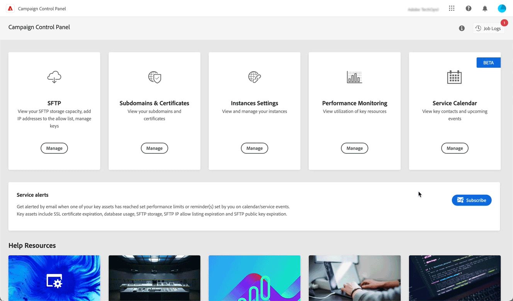

# Versionshinweise 2023 {#rn-2023}

## September 2023 {#september-2023}

<table>
<thead>
<tr>
<th><strong>Verwaltung von DMARC- und BIMI-Einträgen</strong> </th>
</tr>
</thead>
<tbody>
<tr>
<td>

Sie können jetzt DMARC- und BIMI-Einträge direkt über Control Panel hinzufügen:

<ul><li><strong>DMARC-Einträge</strong> bieten eine Möglichkeit, die Absender-Domain zu authentifizieren und die unbefugte Nutzung der Domain für böswillige Zwecke zu verhindern. <a href="../subdomains-certificates/using/dmarc.md">Erfahren Sie, wie Sie DMARC-Einträge hinzufügen</a></li>
<li><strong>BIMI-Einträge</strong> ermöglichen es Ihnen, ein genehmigtes Logo neben Ihren E-Mails in den Postfächern von E-Mail-Anbietern anzuzeigen, um die Markenerkennung und das Vertrauen zu fördern. <a href="../subdomains-certificates/using/bimi.md">Erfahren Sie, wie Sie BIMI-Einträge hinzufügen</a></li></ul>
</td>
</tr>
</tbody>
</table>

## Juni 2023 {#june-2023}

* Sie können jetzt die SSL-Zertifikate bereits delegierter Subdomains direkt aus der Liste der Subdomains an Adobe delegieren. [Weitere Informationen](../subdomains-certificates/using/delegate-ssl.md)

* Die Absenderadresse der Warn-E-Mails wurde in `"alert@notifications.campaign.adobe.com"` geändert.

## Verbesserungen von Mai 2023 {#may-2023}

**Delegierung von SSL-Zertifikaten der Subdomains an Adobe**

Sie können jetzt die SSL-Zertifikate Ihrer Subdomains von Adobe verwalten lassen. Wenn Sie CNAMEs zum Einrichten Ihrer Subdomain verwenden, werden automatisch Zertifikatseinträge generiert und bereitgestellt, um ein Zertifikat in Ihrer Domain-Hosting-Lösung zu generieren.

Beachten Sie, dass diese Funktion nur beim Einrichten einer neuen Subdomain verfügbar ist. Sie können keine Zertifikate für bestehende, zugewiesene Subdomains delegieren. [Weitere Informationen](../subdomains-certificates/using/setting-up-new-subdomain.md)

>[!NOTE]
>
>Adobe Managed SSL ist eine kostenlose Funktion, die Benutzenden gebührenfrei zur Verfügung steht.

## März 2023 {#march-2023}

**Entfernen der Subdomain-Delegierung für CNAME-Einträge**

Sie können nun die Delegierung von Subdomains, die mithilfe von CNAME-Einträgen konfiguriert wurden, aufheben. [Weitere Informationen](../subdomains-certificates/using/remove-delegated-subdomains.md)

## Februar 2023 {#february-2023}

**Entfernung der Delegation für an Adobe delegierte Subdomains**

Sie können jetzt die Delegation einer Subdomain entfernen, die vollständig Adobe delegiert ist. [Weitere Informationen](../subdomains-certificates/using/remove-delegated-subdomains.md)

>[!NOTE]
>
>Bei Subdomains, die mit CNAME eingerichtet wurden, können Delegierungen derzeit nicht entfernt werden.

**Service-Kalender**

Der Service-Kalender bietet jetzt eine Kalenderansicht, in der Sie wichtige Ereignisse verfolgen können, die in Ihren Instanzen auftreten. Darüber hinaus wurden Informationen zu den Benachrichtigungen hinzugefügt, die an Benutzende gesendet werden, die Warnhinweise von Control Panel abonniert haben. [Weitere Informationen](../service-events/service-events.md)

## Januar 2023 {#january-2023}

**Neue Hybrid-Hosting-Modellfunktion**

Kundinnen und Kunden mit Hybrid-Hosting-Modell können der Zulassungsliste nun IP-Adressen für den Zugriff auf MID-Instanzen hinzufügen. [Weitere Informationen](../instances-settings/using/ip-allow-listing-instance-access.md)

**Verbesserung bei Certificate Signing Request (CSR)**

Das Feld „Stadt/Ort“ ist jetzt bei der Erstellung einer Certificate Signing Request optional.
