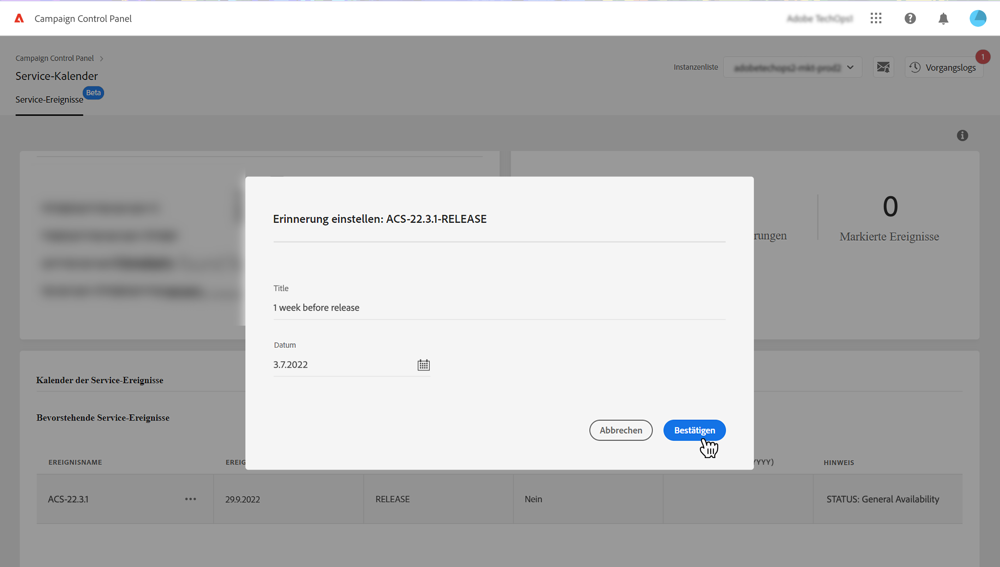

# Wichtige Kontakte und Ereignisse identifizieren {#keycontacts-events}

>[!CONTEXTUALHELP]
>id="cp_servicecalendar_serviceevents"
>title="Service-Kalender"
>abstract="Im Abschnitt „Wichtige Kontakte“ finden Sie eine Liste der Ansprechpartner bei Adobe, an die Sie sich bei Anfragen oder Problemen mit Ihren Instanzen wenden können. Im Abschnitt Dienstereigniskalender können Sie frühere/bevorstehende Versionen und Warnungen für die ausgewählte Instanz identifizieren und Erinnerungen für ein bestimmtes Ereignis einrichten."

>[!IMPORTANT]
>
>Der Service-Kalender ist als Beta-Version verfügbar und unterliegt häufigen Aktualisierungen und Änderungen ohne Vorankündigung.

Um Ihre Campaign-Instanzen effektiv überwachen zu können, ist es wichtig, wichtige Ereignisse zu verfolgen, die sich auf Ihre Instanz(en) auswirken können. Im Control Panel können Sie Ereignisse wie neue Versionen, Upgrades, Patches, Hotfixes usw. identifizieren. und stellt eine Liste der wichtigsten Ansprechpartner für Adoben bei Anfragen oder Problemen bereit.

Auf diese Informationen kann über die **[!UICONTROL Dienstkalender]** Karte auf der Startseite des Control Panels.

## Wichtige Kontakte {#key-contacts}

Im Abschnitt **[!UICONTROL Wichtige Kontakte]** sind die Personen bei Adobe aufgeführt, an die Sie sich bei allen Anfragen oder Problemen mit Ihren Instanzen wenden können.

>[!NOTE]
>
>In diesem Abschnitt werden nur Informationen zu Managed Service-Konten angezeigt.

Zu den wichtigen Kontakten gehören die folgenden Rollen:

* **[!UICONTROL TAM]**: technischer Kundenbetreuer,
* **[!UICONTROL CSM]**: Customer Success Manager,
* **[!UICONTROL Zustellbarkeit]**: Ansprechpartner für Zustellvorgänge,
* **[!UICONTROL Transition Manager]**: Managed Services Transition Manager (nur Managed Services-Konto),
* **[!UICONTROL Onboarding-Spezialist]**: Dem Konto zugewiesener Spezialist, der Sie beim Einstieg in Campaign Classic unterstützt (nur Managed Services-Konto).

## Wichtige Ereignisse verfolgen {#events}

Die **[!UICONTROL Dienstereigniskalender]** enthält alle früheren und kommenden Versionen sowie Warnhinweise, die Benutzer abonniert haben, die in den E-Mail-Warnungen des Control Panels angezeigt wurden. Darüber hinaus ermöglicht das Control Panel Benutzern das Festlegen von Erinnerungen und das Kennzeichnen relevanter Ereignisse für die ausgewählte Instanz, damit diese besser organisiert und effizient sind.

Ereignisse werden entweder in einem Kalender oder in einer Liste angezeigt. Sie können mit der **[!UICONTROL Kalender]** und **[!UICONTROL Liste]** -Schaltflächen in der oberen rechten Ecke des Bereichs.

<table><tr style="border: 0;">
<td>
</td><td>In der Kalenderansicht sind Navigationsschaltflächen in der oberen rechten Ecke verfügbar, mit denen Sie die Ereignisse durchsuchen können. Verwenden Sie die <b>Doppelpfeile</b> um zum ersten Ereignis zu navigieren, das nach/vor dem ausgewählten Monat auftritt, und die <b>Einzelpfeile</b> um von einem Monat zum nächsten zu navigieren. Klicken Sie auf <b>Kreis-Schaltfläche</b> , um zur heutigen Ansicht zurückzukehren.</td>
</tr></table>

Es werden drei Ereignistypen angezeigt:

* **Erinnerungen** von Benutzern festgelegt werden, damit sie benachrichtigt werden können, bevor ein Ereignis eintritt. Diese werden in der Kalenderansicht grün angezeigt. [Erfahren Sie, wie Sie Erinnerungen festlegen](#reminders)
* **Warnhinweise** werden vom Control Panel per E-Mail gesendet, um Benutzer über Probleme in ihren Instanzen zu informieren, z. B. über eine Speicherüberlastung oder den Ablauf von SSL-Zertifikaten. Diese werden in der Kalenderansicht orange angezeigt. Die Ereignisbeschreibung gibt an, ob der Warnhinweis je nach Abonnement für E-Mail-Warnungen an den angemeldeten Benutzer gesendet wird. [Weitere Informationen zu den Funktionen für E-Mail-Warnungen im Control Panel](../performance-monitoring/using/email-alerting.md)

* **Versionen** Geben Sie sowohl vergangene als auch bevorstehende Implementierungen für die Instanz an, die in der Kalenderansicht in Grau bzw. Blau angezeigt werden. In den Ereignisdetails wird der mit der jeweiligen Bereitstellung verknüpfte Freigabetyp angegeben:

   * **[!UICONTROL Allgemeine Verfügbarkeit]**: Neuester verfügbarer stabiler Build.
   * **[!UICONTROL Eingeschränkte Verfügbarkeit]**: Implementierung nur auf Anfrage.
   * **[!UICONTROL Release-Kandidat]**: technisch validiert. Fertigstellung für die Produktion ist ausstehend.
   * **[!UICONTROL Vorabversion]**: Frühere Verfügbarkeit für spezifische Kundenanforderungen.
   * **[!UICONTROL Nicht mehr verfügbar]**: Mit diesem Build bestehen zwar keine größeren Probleme, aber es ist ein neuerer Build mit zusätzlichen Fehlerkorrekturen verfügbar. Ein Upgrade ist erforderlich.
   * **[!UICONTROL Veraltet]**: Ein Build, der bekannte Regressionen enthält. Der Build wird nicht mehr unterstützt. Ein Upgrade ist unbedingt erforderlich.

Sie können einem oder mehreren kommenden Ereignissen eine Markierung zuweisen, um sie zu verfolgen. Klicken Sie dazu auf die Suchschaltfläche neben dem Ereignisnamen.

## Erinnerungen einstellen {#reminders}

Mit Service-Kalender können Sie Erinnerungen festlegen, um vor einem Ereignis per E-Mail benachrichtigt zu werden.

>[!NOTE]
>
>Um über bevorstehende Ereignisse benachrichtigt zu werden, müssen Sie im Control Panel E-Mail-Benachrichtigungen abonniert haben. [Weitere Informationen](../performance-monitoring/using/email-alerting.md)

Gehen Sie wie folgt vor, um eine Benachrichtigung für ein Ereignis einzurichten:

1. Bewegen Sie den Mauszeiger über das Ereignis, an das Sie erinnert werden möchten, oder klicken Sie in der Listenansicht auf die Schaltfläche mit den Auslassungspunkten und wählen Sie **[!UICONTROL Set Reminder]**.

1. Geben Sie der Erinnerung einen Titel und wählen Sie das Datum aus, an dem Sie benachrichtigt werden möchten, bevor das Ereignis eintritt.

   

   >[!NOTE]
   >
   >Wenn Sie Control Panel-Benachrichtigungen noch nicht abonniert haben, wird eine Meldung angezeigt, in der Sie sich für den Erhalt von E-Mail-Benachrichtigungen anmelden können.

1. Die Erinnerung ist jetzt für das ausgewählte Ereignis eingerichtet. Wenn Sie den Mauszeiger darüber bewegen, wird der Titel angezeigt.

   

   >[!NOTE]
   >
   >Sie können für jedes Ereignis bis zu 2 Erinnerungen einrichten.

1. An dem in der Erinnerung angegebenen Datum wird eine E-Mail gesendet, um Sie über das bevorstehende Ereignis zu informieren, und die Erinnerung wird automatisch aus der Liste **[!UICONTROL Erinnerungen]** im Service-Kalender-Menü entfernt.
