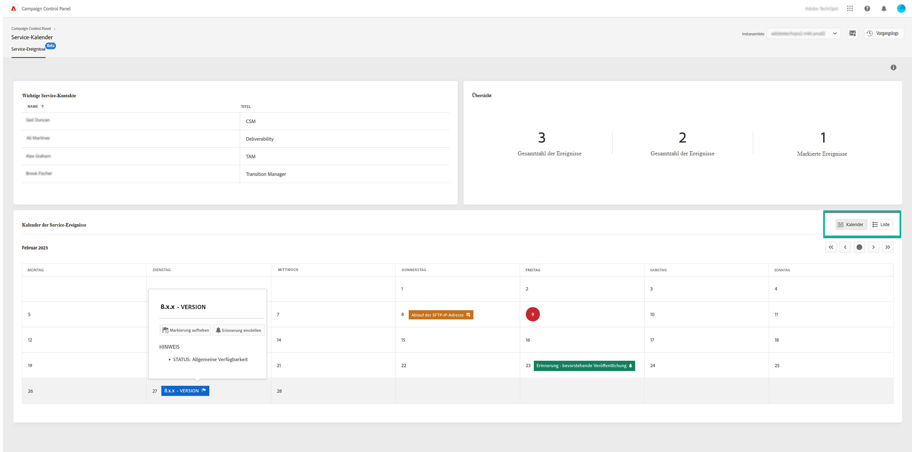

# Überwachung wichtiger Kontakte und Ereignisse {#keycontacts-events}

>[!CONTEXTUALHELP]
>id="cp_servicecalendar_serviceevents"
>title="Service-Kalender"
>abstract="Im Abschnitt „Wichtige Kontakte“ finden Sie eine Liste der Ansprechpartner bei Adobe, an die Sie sich bei Anfragen oder Problemen mit Ihren Instanzen wenden können. Im Abschnitt „Kalender der Service-Ereignisse“ finden Sie alle früheren und künftigen Releases und Service-Reviews für die ausgewählte Instanz."

>[!IMPORTANT]
>
>Der Service-Kalender ist als Beta-Version verfügbar und unterliegt häufigen Aktualisierungen und Änderungen ohne Vorankündigung.

Die Identifizierung von Ereignissen, die auf Ihren Instanzen geplant sind, ist für die Überwachung Ihrer Campaign-Instanzen unerlässlich.

Mit dem Control Panel können Sie Releases und Service-Reviews auf Ihren Instanzen überwachen und auf eine Liste der wichtigsten Ansprechpartner bei Adobe zugreifen, wenn Sie eine Anfrage oder ein Problem haben.

Diese Informationen sind über die Karte **[!UICONTROL Service-Kalender]** auf der Startseite des Control Panels zugänglich.

## Wichtige Kontakte {#key-contacts}

Im Abschnitt **[!UICONTROL Wichtige Kontakte]** sind die Personen bei Adobe aufgeführt, an die Sie sich bei allen Anfragen oder Problemen mit Ihren Instanzen wenden können.

>[!NOTE]
>
>In diesem Abschnitt werden Informationen nur für Managed Service-Konten angezeigt.

Zu den wichtigen Kontakten gehören die folgenden Rollen:

* **[!UICONTROL TAM]**: technischer Kundenbetreuer,
* **[!UICONTROL CSM]**: Customer Success Manager,
* **[!UICONTROL Zustellbarkeit]**: Ansprechpartner für Zustellvorgänge,
* **[!UICONTROL Transition Manager]**: Managed Services Transition Manager (nur Managed Services-Konto),
* **[!UICONTROL Onboarding-Spezialist]**: Dem Konto zugewiesener Spezialist, der Sie beim Einstieg in Campaign Classic unterstützt (nur Managed Services-Konto).

## Ereignisse {#events}

Der Abschnitt **[!UICONTROL Kalender der Service-Ereignisse]** enthält alle früheren und künftigen Releases und Service-Reviews für die ausgewählte Instanz.

Die Spalte **[!UICONTROL Hinweise]** enthält Informationen zum Status jeder Version:

* **[!UICONTROL Allgemeine Verfügbarkeit]**: Neuester verfügbarer stabiler Build.
* **[!UICONTROL Eingeschränkte Verfügbarkeit]**: Implementierung nur auf Anfrage.
* **[!UICONTROL Release-Kandidat]**: technisch validiert. Fertigstellung für die Produktion ist ausstehend.
* **[!UICONTROL Vorabversion]**: Frühere Verfügbarkeit für spezifische Kundenanforderungen.
* **[!UICONTROL Nicht mehr verfügbar]**: Mit diesem Build bestehen zwar keine größeren Probleme, aber es ist ein neuerer Build mit zusätzlichen Fehlerkorrekturen verfügbar. Ein Upgrade ist erforderlich.
* **[!UICONTROL Veraltet]**: Ein Build, der bekannte Regressionen enthält.
Der Build wird nicht mehr unterstützt. Ein Upgrade ist unbedingt erforderlich.

Sie können einem oder mehreren kommenden Ereignissen eine Markierung zuweisen, um sie zu verfolgen. Klicken Sie dazu auf die Schaltfläche mit den Auslassungspunkten neben dem Ereignisnamen.

