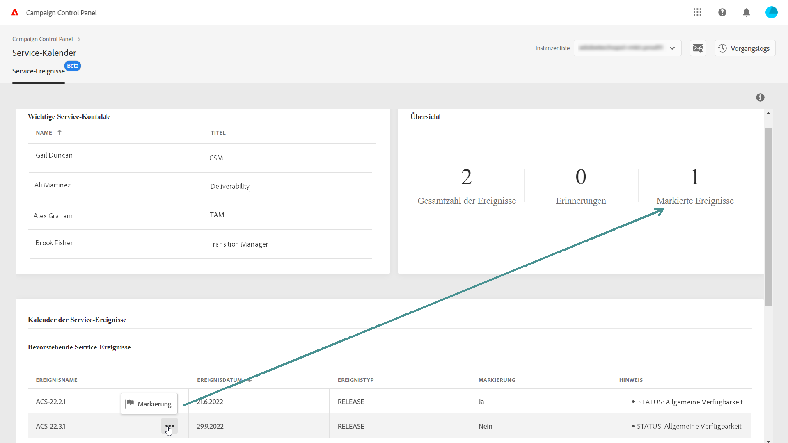

# Identifizieren wichtiger Kontakte und Ereignisse {#keycontacts-events}

>[!CONTEXTUALHELP]
>id="cp_servicecalendar_serviceevents"
>title="Service-Kalender"
>abstract="Im Abschnitt „Wichtige Kontakte“ finden Sie eine Liste der Ansprechpartner bei Adobe, an die Sie sich bei Anfragen oder Problemen mit Ihren Instanzen wenden können. Im Abschnitt „Kalender der Service-Ereignisse“ können Sie frühere und künftige Versionen und Benachrichtigungen für die ausgewählte Instanz identifizieren und Erinnerungen für ein bestimmtes Ereignis einrichten."

>[!IMPORTANT]
>
>Der Service-Kalender ist als Beta-Version verfügbar und unterliegt häufigen Aktualisierungen und Änderungen ohne Vorankündigung.

Um Ihre Campaign-Instanzen effektiv überwachen zu können, sollten Sie wichtige Ereignisse nachverfolgen, die sich auf Ihre Instanzen auswirken können. Im Control Panel können Sie Ereignisse wie neue Versionen, Upgrades, Patches, Hotfixes usw. identifizieren. und eine Liste der wichtigsten Kontaktpersonen bei Adobe für Anfragen oder Probleme abrufen.

Diese Informationen können Sie über die Karte **[!UICONTROL Service-Kalender]** auf der Startseite von Control Panel abrufen.

## Wichtige Kontakte {#key-contacts}

Im Abschnitt **[!UICONTROL Wichtige Kontakte]** sind die Personen bei Adobe aufgeführt, an die Sie sich bei allen Anfragen oder Problemen mit Ihren Instanzen wenden können.

>[!NOTE]
>
>In diesem Abschnitt werden nur Informationen zu Managed Service-Konten angezeigt.

Zu den wichtigen Kontakten gehören die folgenden Rollen:

* **[!UICONTROL TAM]**: technischer Kundenbetreuer,
* **[!UICONTROL CSM]**: Customer Success Manager,
* **[!UICONTROL Zustellbarkeit]**: Ansprechpartner für Zustellvorgänge,
* **[!UICONTROL Transition Manager]**: Managed Services Transition Manager (nur Managed Services-Konto),
* **[!UICONTROL Onboarding-Spezialist]**: Dem Konto zugewiesener Spezialist, der Sie beim Einstieg in Campaign Classic unterstützt (nur Managed Services-Konto).

## Nachverfolgen wichtiger Ereignisse {#events}

Im Abschnitt **[!UICONTROL Kalender der Service-Ereignisse]** von Control Panel werden alle früheren und künftigen Versionen sowie alle von Benutzenden abonnierten E-Mail-Warnhinweise angezeigt. Darüber hinaus können Benutzende in Control Panel Erinnerungen einrichten und relevante Ereignisse für die ausgewählte Instanz markieren. Dies sorgt für eine bessere Organisation und Effizienz.

Ereignisse werden entweder in einem Kalender oder in einer Liste angezeigt. Über die Schaltflächen **[!UICONTROL Kalender]** und **[!UICONTROL Liste]** in der oberen rechten Ecke des Bereichs können Sie zwischen den zwei Ansichten wechseln.

<table><tr style="border: 0;">
<td>
</td><td>Navigationsschaltflächen, mit denen Sie die Ereignisse durchsuchen können, sind in der Kalenderansicht in der oberen rechten Ecke zu finden. Klicken Sie auf die <b>Doppelpfeile</b>, um zum ersten Ereignis nach/vor dem ausgewählten Monat zu gehen. Über die <b>Einzelpfeile</b> können Sie von einem Monat zum nächsten navigieren. Klicken Sie auf die <b>Kreis-Schaltfläche</b>, um zur heutigen Ansicht zurückzukehren.</td>
</tr></table>

Es werden drei Arten von Ereignissen angezeigt:

* **Erinnerungen** werden von Benutzenden festgelegt, damit sie benachrichtigt werden, bevor ein Ereignis eintritt. Sie werden in der Kalenderansicht grün angezeigt. [Weitere Informationen zum Festlegen von Erinnerungen](#reminders)
* **Warnhinweise** werden vom Control Panel per E-Mail gesendet, um Benutzende über Probleme in ihren Instanzen zu informieren, z. B. bei einer Speicherüberlastung oder beim Gültigkeitsablauf von SSL-Zertifikaten. Sie werden in der Kalenderansicht orange angezeigt. Die Ereignisbeschreibung gibt an, ob der Warnhinweis an die angemeldete Person gesendet wird, je nachdem, ob sie E-Mail-Warnhinweise abonniert hat. [Weitere Informationen zu E-Mail-Warnhinweisen im Control Panel](../performance-monitoring/using/email-alerting.md)

* **Versionen** zeigt sowohl frühere als auch künftige Bereitstellungen für die Instanz an. Diese werden in der Kalenderansicht grau bzw. blau angezeigt. In den Ereignisdetails wird der Versionstyp der jeweiligen Bereitstellung angegeben:

   * **[!UICONTROL Allgemeine Verfügbarkeit]**: Neuester verfügbarer stabiler Build.
   * **[!UICONTROL Eingeschränkte Verfügbarkeit]**: Bereitstellung nur auf Anfrage.
   * **[!UICONTROL Release-Kandidat]**: technisch validiert. Fertigstellung für die Produktion ist ausstehend.
   * **[!UICONTROL Vorabversion]**: Frühere Verfügbarkeit für spezifische Kundenanforderungen.
   * **[!UICONTROL Nicht mehr verfügbar]**: Mit diesem Build bestehen zwar keine größeren Probleme, aber es ist ein neuerer Build mit zusätzlichen Fehlerkorrekturen verfügbar. Ein Upgrade ist erforderlich.
   * **[!UICONTROL Veraltet]**: Ein Build, der bekannte Regressionen enthält. Der Build wird nicht mehr unterstützt. Ein Upgrade ist unbedingt erforderlich.

Sie können einem oder mehreren kommenden Ereignissen eine Markierung zuweisen, um sie zu verfolgen. Klicken Sie dazu auf die Schaltfläche mit den Auslassungspunkten neben dem Ereignisnamen.

## Erinnerungen einstellen {#reminders}

Mit Service-Kalender können Sie Erinnerungen festlegen, um vor einem Ereignis per E-Mail benachrichtigt zu werden.

>[!NOTE]
>
>Um über bevorstehende Ereignisse benachrichtigt zu werden, müssen Sie im Control Panel E-Mail-Benachrichtigungen abonniert haben. [Weitere Informationen](../performance-monitoring/using/email-alerting.md)

Gehen Sie wie folgt vor, um eine Benachrichtigung für ein Ereignis einzurichten:

1. Bewegen Sie den Mauszeiger über das Ereignis, an das Sie erinnert werden möchten, oder klicken Sie in der Listenansicht auf die Schaltfläche mit den Auslassungspunkten, und wählen Sie **[!UICONTROL Erinnerung einstellen]** aus.

1. Geben Sie der Erinnerung einen Titel und wählen Sie dann, wie früh Sie benachrichtigt werden möchten, bevor das Ereignis eintritt.

   

   >[!NOTE]
   >
   >Wenn Sie Control Panel-Benachrichtigungen noch nicht abonniert haben, wird eine Meldung angezeigt, in der Sie sich für den Erhalt von E-Mail-Benachrichtigungen anmelden können.

1. Die Erinnerung ist jetzt für das ausgewählte Ereignis eingerichtet. Wenn Sie den Mauszeiger darüber bewegen, wird der Titel angezeigt.

   

   >[!NOTE]
   >
   >Sie können für jedes Ereignis bis zu 2 Erinnerungen einrichten.

1. An dem in der Erinnerung angegebenen Datum wird eine E-Mail gesendet, um Sie über das bevorstehende Ereignis zu informieren, und die Erinnerung wird automatisch aus der Liste **[!UICONTROL Erinnerungen]** im Service-Kalender-Menü entfernt.
