# Zulassungsauflistung von IP-Bereichen {#ip-range-allow-listing}

>[!CONTEXTUALHELP]
>id="cp_ip_whitelist"
>title="Über die Zulassungsauflistung von IP-Bereichen"
>abstract="Auf dieser Registerkarte können Sie der Zulassungsliste IP-Bereiche hinzufügen, um eine Verbindung zu Ihren SFTP-Servern herzustellen. Hier werden nur SFTP-Server aufgeführt, auf die Sie Zugriff haben. Wenn Sie Zugriff auf andere SFTP-Server wünschen, kontaktieren Sie Ihren Administrator."
>additional-url="https://images-tv.adobe.com/mpcv3/8a977e03-d76c-44d3-853c-95d0b799c870_1560205338.1920x1080at3000_h264.mp4#t=98" text="Demovideo ansehen"

SFTP-Server sind geschützt. Damit Sie auf die Server zugreifen und Dateien anzeigen oder neue erstellen können, müssen Sie die öffentliche IP-Adresse des Systems oder des Clients, über das bzw. den der Zugriff auf den Server erfolgt, auf die Zulassungsliste setzen.

 Entdecken Sie diese Funktion bei der Verwendung von [Campaign v7/v8](https://experienceleague.adobe.com/docs/campaign-classic-learn/control-panel/sftp-management/adding-ip-range-to-allow-list.html?lang=de#sftp-management) oder [Campaign Standard](https://experienceleague.adobe.com/docs/campaign-standard-learn/control-panel/sftp-management/adding-ip-range-to-allow-list.html?lang=de#sftp-management) im Video.

## Über das CIDR-Format {#about-cidr-format}

IP-Bereiche werden über das Control Panel im CIDR-Format (Classless Inter-Domain Routing) hinzugefügt.

Die Syntax besteht aus einer IP-Adresse, gefolgt vom Zeichen / und einer Dezimalzahl. Format und Syntax sind in [diesem Artikel](https://whatismyipaddress.com/cidr) ausführlich beschrieben.{target="_blank"}

Sie können im Internet nach kostenlosen Online-Tools suchen, mit denen Sie Ihren IP-Bereich in das CIDR-Format konvertieren können.

## Best Practices {#best-practices}

Beachten Sie die folgenden Empfehlungen und Einschränkungen, wenn Sie IP-Adressen über das Control Panel auf die Zulassungsliste setzen.

* **Fügen Sie der Zulassungsliste IP-Bereiche** anstelle einzelner IP-Adressen hinzu. Um eine einzelne IP-Adresse auf die Zulassungsliste zu setzen, fügen Sie &quot;/32&quot; an sie an, um zu kennzeichnen, dass der Bereich nur eine einzelne IP-Adresse enthält.
* **Fügen Sie der Zulassungsliste keine sehr großen Bereiche hinzu**, z. B. mehr als 265 IP-Adressen. Das Control Panel lehnt Bereiche im CIDR-Format ab, die zwischen /0 und /23 liegen.
* Der Zulassungsliste können nur **öffentliche IP-Adressen** hinzugefügt werden.
* Achten Sie darauf, dass Sie aus der Zulassungsliste **regelmäßig IP-Adressen löschen**, die Sie nicht mehr benötigen.

## Hinzufügen von IP-Adressen zur Zulassungsliste {#adding-ip-addresses-allow-list}

>[!CONTEXTUALHELP]
>id="cp_sftp_iprange_add"
>title="IP-Bereichskonfiguration"
>abstract="Definieren Sie IP-Bereiche, die Sie auf die Zulassungsliste setzen möchten, um sich mit Ihren SFTP-Servern zu verbinden."

Gehen Sie wie folgt vor, um einen IP-Bereich auf die Zulassungsliste zu setzen:

1. Öffnen Sie die Karte **[!UICONTROL SFTP]** und wählen Sie dann die Registerkarte **[!UICONTROL IP-Zulassungsauflistung]** aus.
1. Die Liste der IP-Adressen auf der Zulassungsliste wird für jede Instanz angezeigt. Wählen Sie in der linken Liste die gewünschte Instanz und danach die Schaltfläche **[!UICONTROL Neuen IP-Bereich hinzufügen]** aus.

   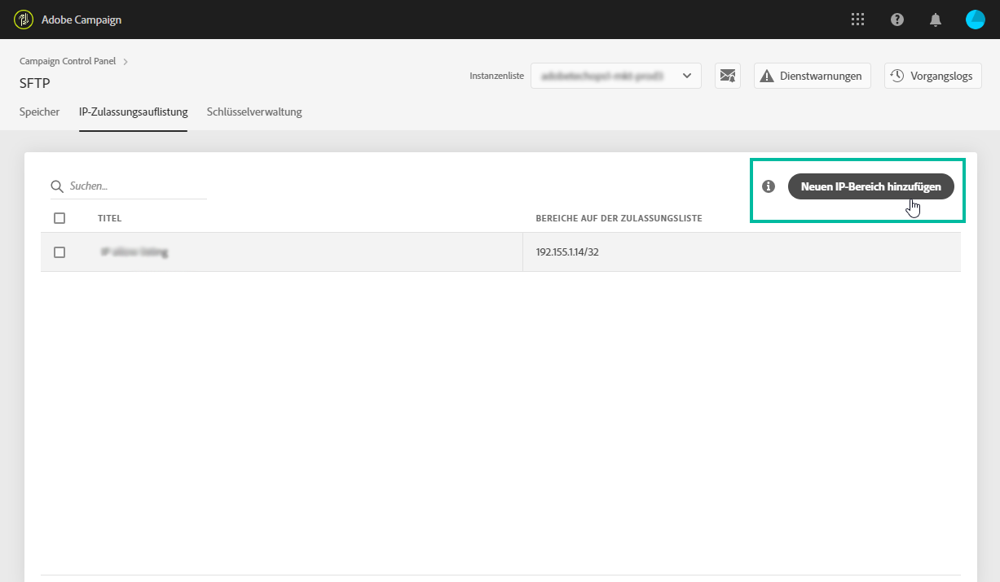

1. Definieren Sie den IP-Bereich, den Sie der Zulassungsliste hinzufügen möchten. Dieses Feld akzeptiert ausschließlich IP-Bereiche im CIDR-Format, z. B. *192.150.5.0/24*.

   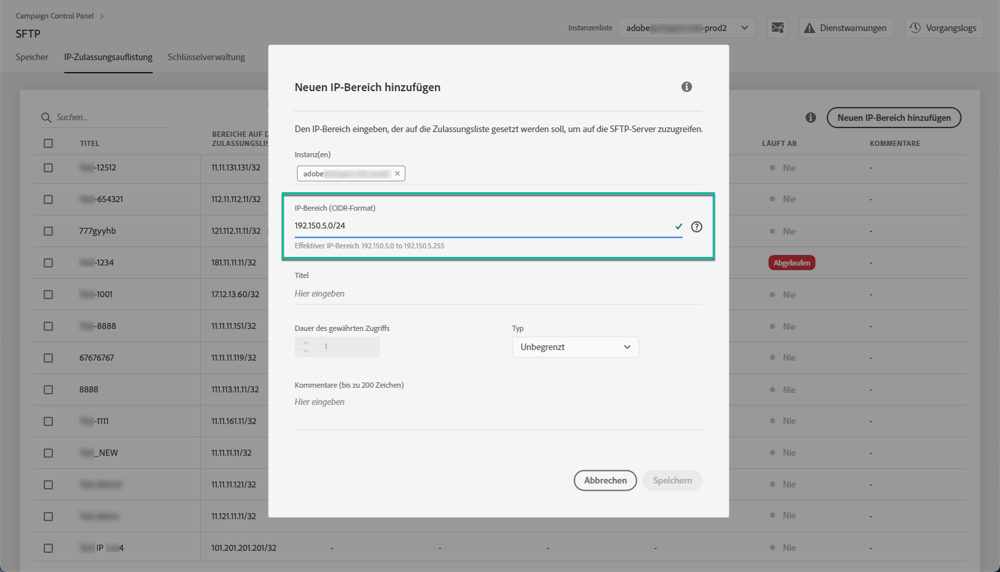

   >[!IMPORTANT]
   >
   >Ein IP-Bereich darf sich nicht mit einem bereits auf der Zulassungsliste vorhandenen Bereich überschneiden. Löschen Sie in diesem Fall zunächst den Bereich, der die überlappende IP enthält.

1. Es ist möglich, der Zulassungsliste einen Bereich für mehrere Instanzen hinzuzufügen. Verwenden Sie dazu die Abwärtspfeiltaste oder geben Sie die ersten Buchstaben der gewünschten Instanz ein und wählen Sie sie dann aus der Liste aus.

   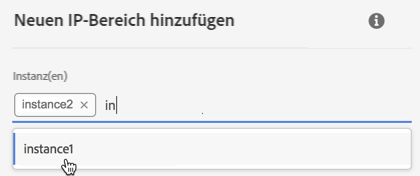

1. Definieren Sie den Titel, der für diesen IP-Bereich in der Liste angezeigt wird.

   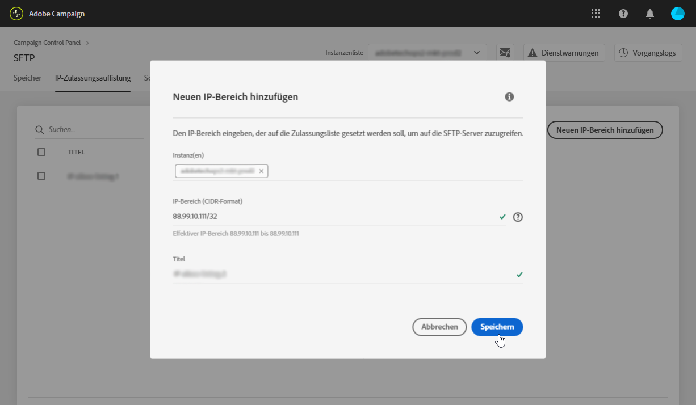

   >[!NOTE]
   >
   >Diese Sonderzeichen sind im Feld **[!UICONTROL Titel]** erlaubt:
   > `. _ - : / ( ) # , @ [ ] + = & ; { } ! $`

1. Um Ihre IP-Zulassungsliste besser zu verwalten, können Sie eine Dauer für die Verfügbarkeit der einzelnen IP-Bereiche festlegen. Wählen Sie dazu eine Einheit in der Dropdown-Liste **[!UICONTROL Typ]** aus und legen Sie eine Dauer im entsprechenden Feld fest. Weitere Informationen zum Ablauf des IP-Bereichs finden Sie in [diesem Abschnitt](#expiry).

   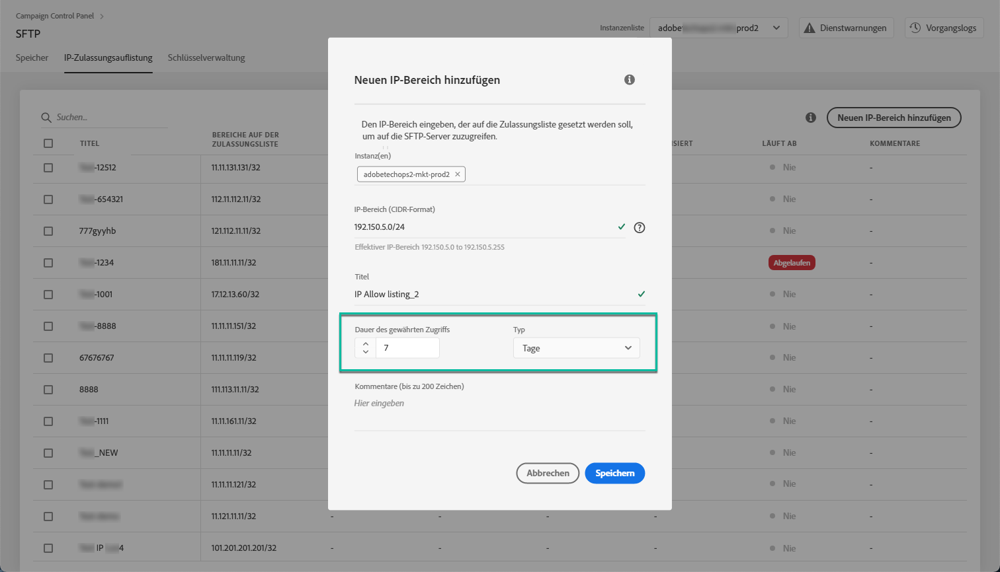

   >[!NOTE]
   >
   >Standardmäßig ist das Feld **[!UICONTROL Typ]** auf **[!UICONTROL Unbegrenzt]** gesetzt, was bedeutet, dass der IP-Bereich nie abläuft.

1. Im Feld **[!UICONTROL Kommentar]** können Sie einen Grund angeben, warum Sie diesen IP-Bereich zulassen (warum, für wen usw.).

1. Wählen Sie die Schaltfläche **[!UICONTROL Speichern]** aus. Der zur Zulassungsliste hinzugefügte IP-Bereich wird als **[!UICONTROL Ausstehend]** angezeigt, bis die Anfrage vollständig verarbeitet wurde. Dies sollte nur einige Sekunden dauern.

   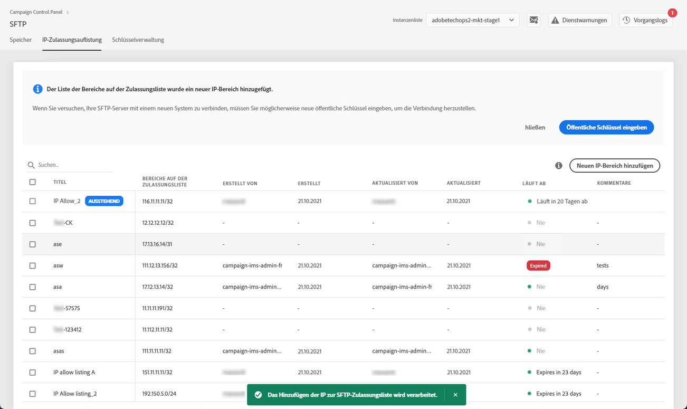

>[!IMPORTANT]
>
>Wenn Sie versuchen, Ihre SFTP-Server mit einem neuen System zu verbinden und so der Zulassungsliste neue IP-Bereiche hinzufügen, müssen Sie möglicherweise neue öffentliche Schlüssel eingeben, um die Einrichtung der Verbindung abzuschließen. Weiterführende Informationen hierzu finden Sie in [diesem Abschnitt](key-management.md).

## Verwalten von IP-Bereichen {#managing-ip-ranges}

Die von Ihnen erstellten IP-Bereiche werden auf der Registerkarte **[!UICONTROL IP-Zulassungsauflistung]** angezeigt.

Sie können die Elemente nach Erstellungsdatum, Bearbeitungsdatum, Benutzer, der sie erstellt oder bearbeitet hat, sowie nach Ablaufdatum des IP-Bereichs sortieren.

Sie können auch einen IP-Bereich durchsuchen, indem Sie eine Bezeichnung, einen Bereich, einen Namen oder einen Kommentar eingeben.

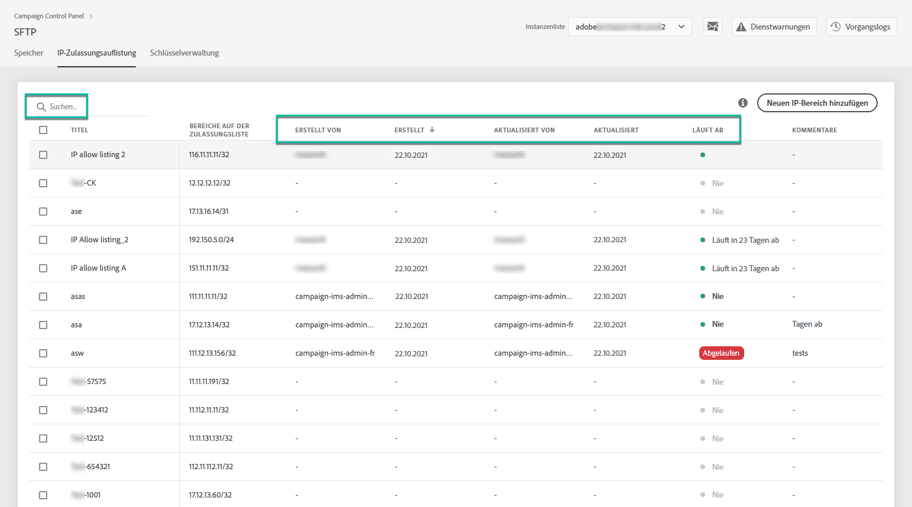

Informationen zum Bearbeiten eines oder mehrerer IP-Bereiche finden Sie in [diesem Abschnitt](#editing-ip-ranges).

Um einen oder mehrere IP-Bereiche aus der Zulassungsliste zu löschen, wählen Sie sie aus und klicken Sie anschließend auf die Schaltfläche **[!UICONTROL IP-Bereich löschen]**.

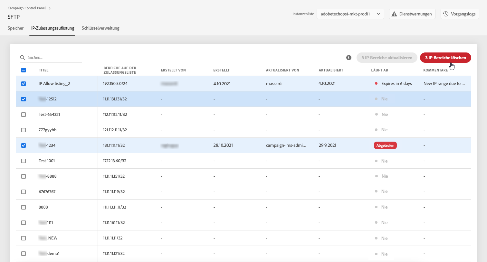

### Ablauf {#expiry}

Die Spalte **[!UICONTROL Läuft ab]** gibt an, wie viele Tage bis zum Ablauf des IP-Bereichs verbleiben.

Wenn Sie [E-Mail-Warnungen](../../performance-monitoring/using/email-alerting.md) abonniert haben, erhalten Sie Benachrichtigungen per E-Mail 10 Tage und 5 Tage, bevor ein IP-Bereich abläuft, und auch an dem Tag, an dem er abläuft. Nach Erhalt des Warnhinweises können Sie [den IP-Bereich bearbeiten](#editing-ip-ranges), um die Gültigkeitsdauer bei Bedarf zu verlängern.

Ein abgelaufener IP-Bereich wird nach 7 Tagen automatisch gelöscht. Er wird als **[!UICONTROL Abgelaufen]** in der Spalte **[!UICONTROL Läuft ab]** angezeigt. Innerhalb dieses 7-tägigen Zeitraums:

* Ein abgelaufener IP-Bereich kann nicht mehr für den Zugriff auf die SFTP-Server verwendet werden.

* Sie können keinen IP-Bereich erstellen, der sich mit einem abgelaufenen Bereich überschneidet. Sie müssen zunächst den abgelaufenen IP-Bereich löschen, bevor Sie den neuen erstellen.

* Sie können einen abgelaufenen IP-Bereich [bearbeiten](#editing-ip-ranges) und seine Dauer aktualisieren, um ihn erneut verfügbar zu machen.

* Sie können ihn aus der Zulassungsliste löschen.

## Bearbeiten von IP-Bereichen {#editing-ip-ranges}

>[!CONTEXTUALHELP]
>id="cp_sftp_iprange_update"
>title="Aktualisieren von IP-Bereichen"
>abstract="Aktualisieren Sie die ausgewählten IP-Bereiche, die eine Verbindung zu Ihrem SFTP-Server herstellen dürfen."

Gehen Sie wie folgt vor, um IP-Bereiche zu bearbeiten.

>[!NOTE]
>
>Sie können nur IP-Bereiche bearbeiten, die seit der Control Panel-Version Oktober 2021 erstellt wurden.

<!--Edition is not available for IP ranges that have been created before the Control Panel October 2021 release.-->

1. Wählen Sie einen oder mehrere IP-Bereiche aus der Liste **[!UICONTROL IP-Zulassungsauflistung]** aus.

1. Klicken Sie auf die Schaltfläche **[!UICONTROL IP-Bereich aktualisieren]**.

   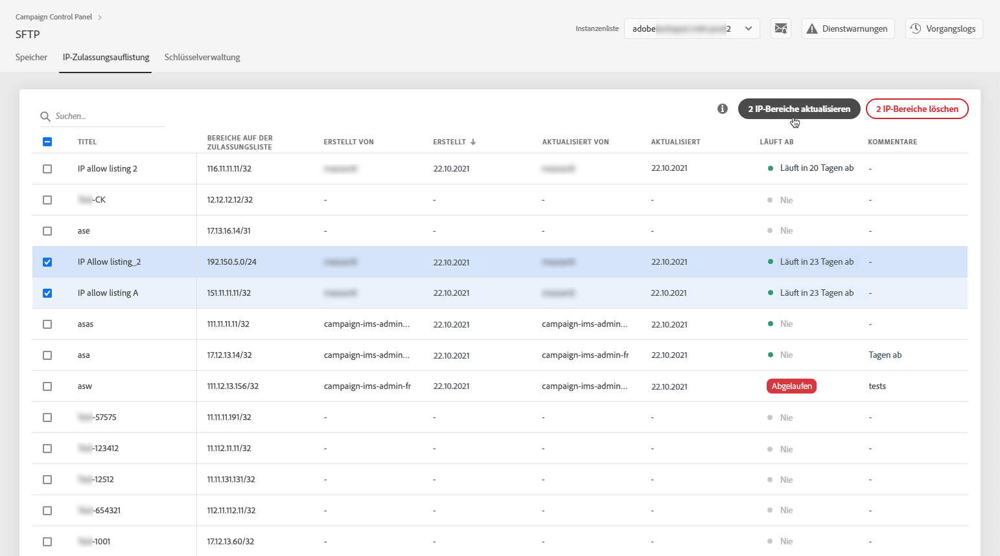

1. Sie können nur den Ablaufzeitpunkt des IP-Bereichs bearbeiten und/oder einen neuen Kommentar hinzufügen.

   >[!NOTE]
   >
   >Um das CIDR-Format, seinen Titel oder die zugehörige(n) Instanz(en) zu ändern, müssen Sie zunächst den IP-Bereich löschen und dann einen neuen, Ihren Anforderungen entsprechenden erstellen.

   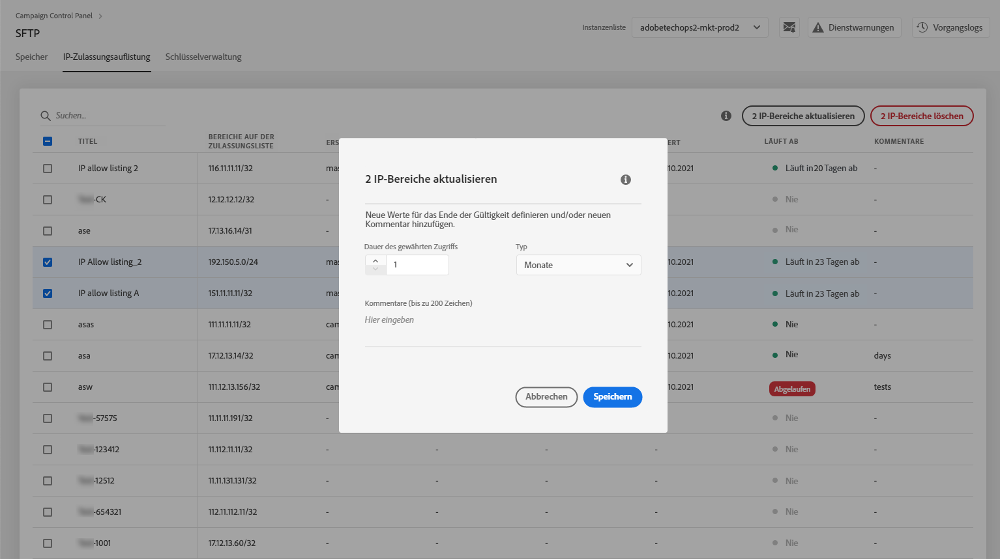

1. Speichern Sie Ihre Änderungen.

## Überwachen von Änderungen {#monitoring-changes}

Auf der Startseite im Control Panel können Sie mit der Option **[!UICONTROL Vorgangslogs]** alle Änderungen an IP-Adressen überwachen, die sich auf der Zulassungsliste befinden.

Weitere Informationen zur Benutzeroberfläche des Control Panels finden Sie in [diesem Abschnitt](../../discover/using/discovering-the-interface.md).

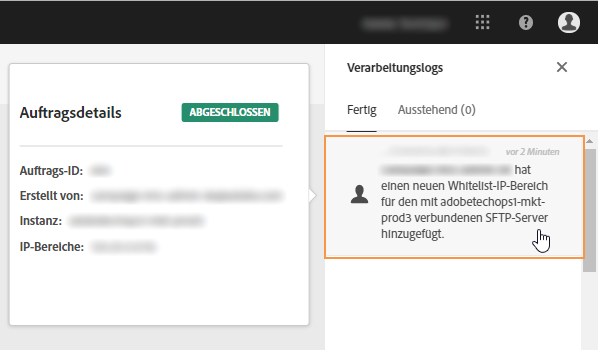
