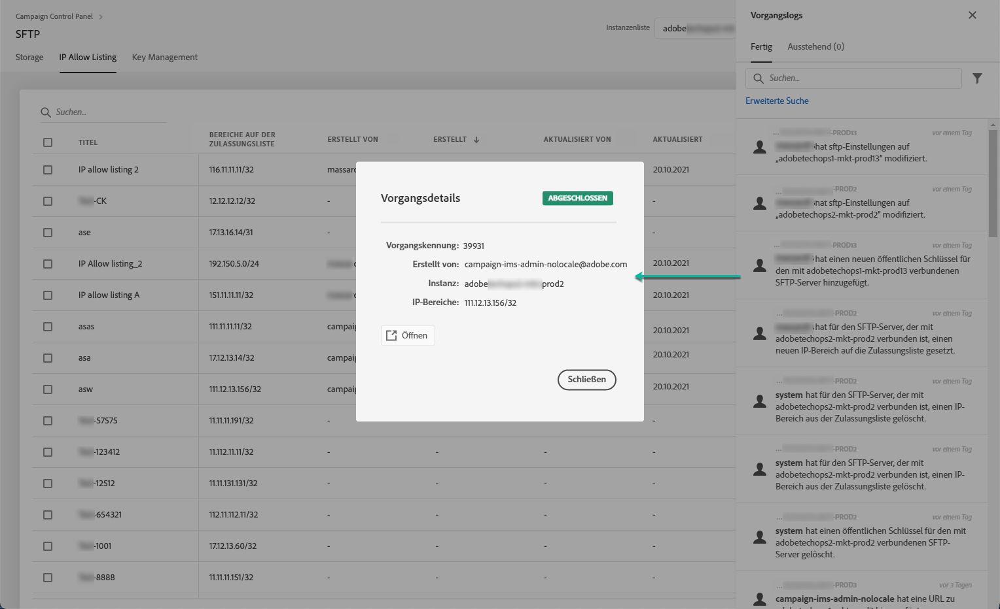

# IP-Bereich-Zulassungsauflistung {#ip-range-allow-listing}

>[!CONTEXTUALHELP]
>id="cp_ip_whitelist"
>title="Über die Zulassungsauflistung"
>abstract="Auf dieser Registerkarte können Sie der zulassungsliste IP-Bereiche hinzufügen, um eine Verbindung zu Ihren SFTP-Servern herzustellen. Hier werden nur SFTP-Server aufgeführt, auf die Sie Zugriff haben. Wenn Sie Zugriff auf andere SFTP-Server wünschen, kontaktieren Sie Ihren Administrator."
>additional-url="https://images-tv.adobe.com/mpcv3/8a977e03-d76c-44d3-853c-95d0b799c870_1560205338.1920x1080at3000_h264.mp4#t=98" text="Demovideo ansehen"

SFTP-Server sind geschützt. Um auf die Dateien zugreifen zu können, um Ansichten zu erstellen oder neue zu schreiben, müssen Sie die öffentliche IP-Adresse des Systems oder Clients, der auf die Server zugreift, zur zulassungsliste hinzufügen.

## Über das CIDR-Format {#about-cidr-format}

IP-Bereiche werden über das Control Panel im CIDR-Format (Classless Inter-Domain Routing) hinzugefügt.

Die Syntax besteht aus einer IP-Adresse, gefolgt vom Zeichen / und einer Dezimalzahl. Format und Syntax sind in [diesem Artikel](https://whatismyipaddress.com/cidr) ausführlich beschrieben.

Sie können im Internet nach kostenlosen Online-Tools suchen, mit denen Sie Ihren IP-Bereich in das CIDR-Format konvertieren können.

## Best Practices {#best-practices}

Beachten Sie unbedingt die folgenden Empfehlungen und Einschränkungen, wenn Sie IP-Adressen über das Control Panel auf die Zulassungsliste setzen.

* **Hinzufügen IP-Adressen werden für die zulassungsliste** und nicht für einzelne IP-Adressen verwendet. Um eine einzelne IP-Adresse zur zulassungsliste hinzuzufügen, hängen Sie ein &quot;/32&quot;an, um anzugeben, dass der Bereich nur eine einzige IP enthält.
* **Fügen Sie der zulassungsliste** keine sehr breiten Bereiche hinzu, z. B. > 265 IP-Adressen. Das Control Panel lehnt Bereiche im CIDR-Format ab, die zwischen /0 und /23 liegen.
* Der zulassungsliste können nur **öffentliche IP-Adressen** hinzugefügt werden.
* Achten Sie darauf, **regelmäßig IP-Adressen** zu löschen, die Sie nicht mehr benötigen.

## Hinzufügen von IP-Adressen zur zulassungsliste {#adding-ip-addresses-allow-list}

>[!CONTEXTUALHELP]
>id="cp_sftp_iprange_add"
>title="Hinzufügen neuer IP-Bereiche"
>abstract="Definieren Sie die IP-Bereiche, die Sie zur zulassungsliste hinzufügen möchten, um eine Verbindung zu Ihren SFTP-Servern herzustellen."

Gehen Sie wie folgt vor, um der zulassungsliste einen IP-Bereich hinzuzufügen:

1. Open the **[!UICONTROL SFTP]** card, then select the **[!UICONTROL IP Allow Listing]** tab.
1. Die Liste der IP-Adressen auf der zulassungsliste wird für jede Instanz angezeigt. Wählen Sie in der linken Liste die gewünschte Instanz und danach die Schaltfläche **[!UICONTROL Neuen IP-Bereich hinzufügen]** aus.

   

1. Definieren Sie den IP-Bereich, den Sie der zulassungsliste hinzufügen möchten, im CIDR-Format und definieren Sie dann die Beschriftung, die in der Liste angezeigt werden soll.

   >[!NOTE]
   >
   >Diese Sonderzeichen sind im Feld &quot;Titel&quot; erlaubt:
   > `. _ - : / ( ) # , @ [ ] + = & ; { } ! $`

   

   >[!IMPORTANT]
   >
   >Ein IP-Bereich kann einen bestehenden Bereich auf der zulassungsliste nicht überlappen. Löschen Sie in diesem Fall zunächst den Bereich, der die überlappende IP enthält.
   >
   >Es ist möglich, einen Bereich auf der zulassungsliste für mehrere Instanzen hinzuzufügen. Verwenden Sie dazu die Abwärtspfeiltaste oder geben Sie die ersten Buchstaben der gewünschten Instanz ein und wählen Sie sie dann aus der Liste aus.

   

1. Wählen Sie die Schaltfläche **[!UICONTROL Speichern]** aus. IP-Zusatz zur zulassungsliste wird als &quot;AUSSTEHEND&quot;angezeigt, bis die Anforderung vollständig verarbeitet ist. Dies dauert nur einige Sekunden.

Um IP-Bereiche aus der Zulassungsliste zu löschen, wählen Sie sie aus und klicken Sie anschließend auf die Schaltfläche **[!UICONTROL IP-Bereich löschen]**.

>[!NOTE]
>
>Es ist derzeit nicht möglich, einen Bereich auf der zulassungsliste zu bearbeiten. Um einen IP-Bereich zu ändern, löschen Sie ihn und erstellen Sie danach einen, der Ihren Anforderungen entspricht.

## Änderungen überwachen {#monitoring-changes}

The **[!UICONTROL Job Logs]** in the Control Panel home page let you monitor all changes that have been made to IP addresses on the allow list.

Weitere Informationen zur Benutzeroberfläche des Control Panels finden Sie in [diesem Abschnitt](../../discover/using/discovering-the-interface.md).

