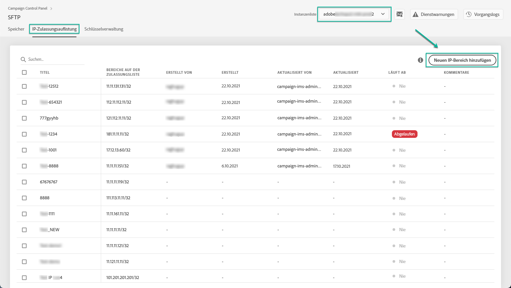
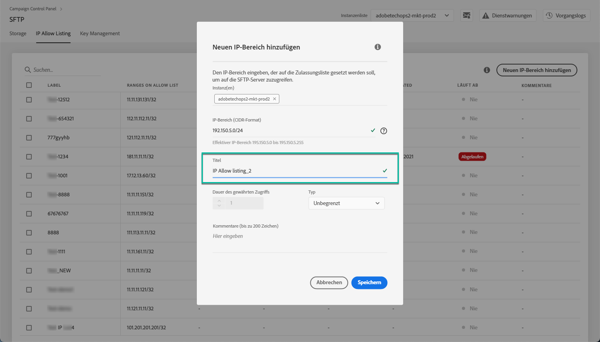

# Zulassungsauflistung von IP-Bereichen{#ip-range-allow-listing}

>[!CONTEXTUALHELP]
>id="cp_ip_whitelist"
>title="Über die Zulassungsauflistung von IP-Bereichen"
>abstract="Auf dieser Registerkarte können Sie der Zulassungsliste IP-Bereiche hinzufügen, um eine Verbindung zu Ihren SFTP-Servern herzustellen. Hier werden nur SFTP-Server aufgeführt, auf die Sie Zugriff haben. Wenn Sie Zugriff auf andere SFTP-Server wünschen, kontaktieren Sie Ihren Administrator."
>additional-url="https://images-tv.adobe.com/mpcv3/8a977e03-d76c-44d3-853c-95d0b799c870_1560205338.1920x1080at3000_h264.mp4#t=98" text="Demovideo ansehen"

SFTP-Server sind geschützt. Damit Sie auf den Server zugreifen und Dateien anzeigen oder neue erstellen können, müssen Sie die öffentliche IP-Adresse des Systems oder des Clients, über das bzw. den der Zugriff auf den Server erfolgt, auf die Zulassungsliste setzen.

## Über das CIDR-Format {#about-cidr-format}

IP-Bereiche werden über das Control Panel im CIDR-Format (Classless Inter-Domain Routing) hinzugefügt.

Die Syntax besteht aus einer IP-Adresse, gefolgt vom Zeichen / und einer Dezimalzahl. Format und Syntax sind in [diesem Artikel](https://whatismyipaddress.com/cidr) ausführlich beschrieben.

Sie können im Internet nach kostenlosen Online-Tools suchen, mit denen Sie Ihren IP-Bereich in das CIDR-Format konvertieren können.

## Best Practices {#best-practices}

Beachten Sie unbedingt die folgenden Empfehlungen und Einschränkungen, wenn Sie IP-Adressen über das Control Panel auf die Zulassungsliste setzen.

* **Fügen Sie der Zulassungsliste IP-Bereiche** anstelle einzelner IP-Adressen hinzu. Um eine einzelne IP-Adresse auf die Zulassungsliste zu setzen, fügen Sie &quot;/32&quot; an sie an, um zu kennzeichnen, dass der Bereich nur eine einzelne IP-Adresse enthält.
* **Fügen Sie der Zulassungsliste keine sehr großen Bereiche hinzu**, z. B. mehr als 265 IP-Adressen. Das Control Panel lehnt Bereiche im CIDR-Format ab, die zwischen /0 und /23 liegen.
* Der Zulassungsliste können nur **öffentliche IP-Adressen** hinzugefügt werden.
* Achten Sie darauf, dass Sie aus der Zulassungsliste **regelmäßig IP-Adressen löschen**, die Sie nicht mehr benötigen.

## Hinzufügen von IP-Adressen zur Zulassungsliste {#adding-ip-addresses-allow-list}

>[!CONTEXTUALHELP]
>id="cp_sftp_iprange_add"
>title="Hinzufügen neuer IP-Bereiche"
>abstract="Definieren Sie IP-Bereiche, die Sie auf die Zulassungsliste setzen möchten, um sich mit Ihren SFTP-Servern zu verbinden."

Gehen Sie wie folgt vor, um einen IP-Bereich auf die Zulassungsliste zu setzen:

1. Open the **[!UICONTROL SFTP]** card, then select the **[!UICONTROL IP Allow Listing]** tab.
1. Die Liste der IP-Adressen auf der Zulassungsliste wird für jede Instanz angezeigt. Wählen Sie in der linken Liste die gewünschte Instanz und danach die Schaltfläche **[!UICONTROL Neuen IP-Bereich hinzufügen]** aus.

   

1. Definieren Sie den IP-Bereich, den Sie auf die Zulassungsliste setzen möchten, im CIDR-Format und geben Sie dann den Titel ein, der in der Liste angezeigt werden soll.

   >[!NOTE]
   >
   >Diese Sonderzeichen sind im Feld &quot;Titel&quot; erlaubt:
   > `. _ - : / ( ) # , @ [ ] + = & ; { } ! $`

   

   >[!IMPORTANT]
   >
   >Ein IP-Bereich darf sich nicht mit einem bereits auf der Zulassungsliste vorhandenen Bereich überschneiden. Löschen Sie in diesem Fall zunächst den Bereich, der die überlappende IP enthält.
   >
   >Es ist möglich, der Zulassungsliste einen Bereich für mehrere Instanzen hinzuzufügen. Verwenden Sie dazu die Abwärtspfeiltaste oder geben Sie die ersten Buchstaben der gewünschten Instanz ein und wählen Sie sie dann aus der Liste aus.

   

1. Wählen Sie die Schaltfläche **[!UICONTROL Speichern]** aus. Die der Zulassungsliste hinzugefügten IPs werden als &quot;AUSSTEHEND&quot; angezeigt, bis die Anfrage vollständig verarbeitet wurde. Dies dauert nur einige Sekunden.

Um IP-Bereiche aus der Zulassungsliste zu löschen, wählen Sie sie aus und klicken Sie anschließend auf die Schaltfläche **[!UICONTROL IP-Bereich löschen]**.

>[!NOTE]
>
>Es ist derzeit nicht möglich, einen Bereich auf der Zulassungsliste zu bearbeiten. Um einen IP-Bereich zu ändern, löschen Sie ihn und erstellen Sie danach einen, der Ihren Anforderungen entspricht.

## Änderungen überwachen {#monitoring-changes}

Auf der Startseite im Control Panel können Sie mit der Option **[!UICONTROL Verarbeitungslogs]** alle Änderungen bei IP-Adressen überwachen, die sich auf der Zulassungsliste befinden.

Weitere Informationen zur Benutzeroberfläche des Control Panels finden Sie in [diesem Abschnitt](../../discover/using/discovering-the-interface.md).

