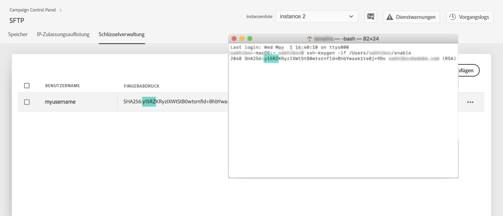

# Schlüsselverwaltung {#key-management}

>[!CONTEXTUALHELP]
>id="cp_key_management"
>title="Über die Verwaltung öffentlicher Schlüssel"
>abstract="Erstellen, verwalten und bearbeiten Sie auf dieser Registerkarte Ihre öffentlichen Schlüssel."
>additional-url="https://images-tv.adobe.com/mpcv3/8a977e03-d76c-44d3-853c-95d0b799c870_1560205338.1920x1080at3000_h264.mp4#t=166" text="Demovideo ansehen"

Adobe empfiehlt allen Kunden, die Verbindung zu ihren SFTP-Servern mit einem **Paar aus öffentlichem und privatem Schlüssel** herzustellen.

Im Folgenden werden die Schritte zum Erstellen und Hinzufügen eines öffentlichen SSH-Schlüssels für den Zugriff auf den SFTP-Server sowie Empfehlungen zur Authentifizierung beschrieben.

Nachdem der Zugriff auf den Server eingerichtet wurde, müssen die **IP-Adressen auf die Zulassungsliste gesetzt werden, die Zugriff auf den Server benötigen**, damit Sie eine Verbindung mit ihm herstellen können. Weiterführende Informationen hierzu finden Sie in [diesem Abschnitt](../../instances-settings/using/ip-allow-listing-instance-access.md).

 Entdecken Sie diese Funktion bei der Verwendung von [Campaign v7/v8](https://experienceleague.adobe.com/docs/campaign-classic-learn/control-panel/sftp-management/generate-ssh-key.html?lang=de#sftp-management) oder [Campaign Standard](https://experienceleague.adobe.com/docs/campaign-standard-learn/control-panel/sftp-management/generate-ssh-key.html?lang=de#sftp-management) im Video.

## Best Practices {#best-practices}

**Über den öffentlichen SSH-Schlüssel**

Verwenden Sie immer dieselbe Authentifizierung für die Verbindung zum Server und achten Sie darauf, dass der Schlüssel ein unterstütztes Format besitzt.

**API-Integration mit Benutzername und Passwort**

In sehr seltenen Fällen ist die passwortbasierte Authentifizierung auf manchen SFTP-Servern aktiviert. Adobe empfiehlt die Verwendung der schlüsselbasierten Authentifizierung, da diese Methode effizienter und sicherer ist. Sie können die Umstellung auf schlüsselbasierte Authentifizierung bei der Kundenunterstützung anfordern.

>[!IMPORTANT]
>
>Sollte Ihr Passwort seine Gültigkeit verlieren, können Sie sich nicht mehr bei Ihren SFTP-Konten anmelden, auch wenn auf Ihrem System Schlüssel installiert sind.

## Installation des SSH-Schlüssels {#installing-ssh-key}

>[!CONTEXTUALHELP]
>id="cp_sftp_publickey_add"
>title="Hinzufügen öffentlicher Schlüssel"
>abstract="Generieren Sie einen öffentlichen SSH-Schlüssel für eine Instanz und fügen Sie ihn dem Control Panel hinzu, um auf den SFTP-Server zuzugreifen."

>[!IMPORTANT]
>
>Sie müssen bezüglich der SSH-Schlüssel stets die Richtlinien Ihrer Organisation befolgen. Die folgenden Schritte sind nur ein Beispiel für die SSH-Schlüsselerstellung und können Ihnen als Referenz dafür dienen, welche Informationen Sie Ihrem Team oder Ihrer internen Netzwerkgruppe mitteilen müssen.

1. Öffnen Sie die Registerkarte **[!UICONTROL Schlüsselverwaltung]** und wählen Sie dann die Schaltfläche **[!UICONTROL Neuen öffentlichen Schlüssel hinzufügen]** aus.

   

1. Wählen Sie in dem sich öffnenden Dialogfeld den Benutzernamen, für den Sie den öffentlichen Schlüssel erstellen möchten, und den Server, für den Sie den Schlüssel aktivieren möchten.

   

   >[!NOTE]
   >
   >Im Control Panel wird geprüft, ob dieser Benutzername auf der jeweiligen Instanz aktiv ist. Sie erhalten dann die Möglichkeit, den Schlüssel auf einer oder mehreren Instanzen zu aktivieren.
   >
   >Für jeden Benutzer kann einer oder mehrere öffentliche SSH-Schlüssel hinzugefügt werden.

1. Um Ihre öffentlichen Schlüssel besser zu verwalten, können Sie eine Dauer für die Verfügbarkeit der einzelnen Schlüssel festlegen. Wählen Sie dazu eine Einheit in der Dropdown-Liste **[!UICONTROL Typ]** aus und legen Sie eine Dauer im entsprechenden Feld fest. Weitere Informationen zum Ablauf des öffentlichen Schlüssels finden Sie in [diesem Abschnitt](#expiry).

   

   >[!NOTE]
   >
   >Standardmäßig ist das Feld **[!UICONTROL Typ]** auf **[!UICONTROL Unbegrenzt]** gesetzt, was bedeutet, dass der öffentliche Schlüssel nie abläuft.

1. Im Feld **[!UICONTROL Kommentar]** können Sie einen Grund für das Hinzufügen dieses öffentlichen Schlüssels angeben (warum, für wen usw.).

1. Damit Sie das Feld **[!UICONTROL Öffentlicher Schlüssel]** ausfüllen können, müssen Sie einen öffentlichen SSH-Schlüssel generieren. Führen Sie die folgenden Schritte je nach Betriebssystem aus.

   **Linux und Mac:**

   Verwenden Sie das Terminal, um ein Paar aus öffentlichem und privatem Schlüssel zu generieren:
   1. Geben Sie folgenden Befehl ein: `ssh-keygen -m pem -t rsa -b 2048 -C "your_email@example.com"`.
   1. Geben Sie Ihrem Schlüssel einen Namen, wenn Sie dazu aufgefordert werden. Wenn das Verzeichnis &quot;.ssh&quot; nicht vorhanden ist, wird eines vom System erstellt.
   1. Geben Sie eine Passphrase ein und wiederholen Sie die Eingabe, wenn Sie dazu aufgefordert werden. Dieses Feld kann auch leer gelassen werden.
   1. Das Schlüsselpaar &quot;name&quot; und &quot;name.pub&quot; wird vom System erstellt. Suchen Sie nach der Datei &quot;name.pub&quot; und öffnen Sie sie. Sie hat eine alphanumerische Zeichenfolge, die mit der von Ihnen angegebenen E-Mail-Adresse endet.

   **Windows:**

   Möglicherweise müssen Sie ein Tool eines Drittanbieters installieren, mit dem Sie ein Schlüsselpaar aus privatem und öffentlichem Schlüssel im Format „name.pub“ erstellen können.

1. Öffnen Sie die .pub-Datei und kopieren Sie die gesamte Zeichenfolge beginnend mit „ssh...“ in das Control Panel.

   

   >[!NOTE]
   >
   >Das Feld **[!UICONTROL Öffentlicher Schlüssel]** akzeptiert nur das OpenSSH-Format. Die Größe des öffentlichen SSH-Schlüssels sollte **2048 Bit** betragen.

1. Wählen Sie die Schaltfläche **[!UICONTROL Speichern]** aus, um den Schlüssel zu erstellen. Das Control Panel speichert den öffentlichen Schlüssel und den zugehörigen Fingerabdruck, verschlüsselt im SHA256-Format.

>[!IMPORTANT]
>
>Wenn der von Ihnen erstellte Schlüssel verwendet wird, um eine Verbindung zu einem System herzustellen, das noch nie mit dem ausgewählten SFTP-Server verbunden war, müssen Sie eine öffentliche IP-Adresse dieses Systems auf die Zulassungsliste setzen. Erst danach können Sie dieses System mit dem SFTP-Server verwenden. Weitere Informationen finden Sie in [diesem Abschnitt](ip-range-allow-listing.md).

Sie können Fingerabdrücke verwenden, um die auf Ihrem Computer gespeicherten privaten Schlüssel mit den entsprechenden öffentlichen Schlüsseln im Control Panel abzugleichen.

Mit der Schaltfläche **...** können Sie einen vorhandenen Schlüssel löschen oder seinen zugehörigen Fingerabdruck in die Zwischenablage kopieren.

## Verwalten öffentlicher Schlüssel {#managing-public-keys}

Die von Ihnen erstellten öffentlichen Schlüssel werden auf der Registerkarte **[!UICONTROL Schlüsselverwaltung]** angezeigt.

Sie können die Elemente nach Erstellungsdatum, Bearbeitungsdatum, Benutzer, der sie erstellt oder bearbeitet hat, sowie nach Ablaufdatum des IP-Bereichs sortieren.

Sie können auch einen öffentlichen Schlüssel durchsuchen, indem Sie mit der Eingabe eines Namens oder Kommentars beginnen.

Informationen zum Bearbeiten eines oder mehrerer IP-Bereiche finden Sie in [diesem Abschnitt](#editing-public-keys).

Um einen oder mehrere öffentliche Schlüssel aus der Liste zu löschen, wählen Sie diese aus und klicken Sie auf die Schaltfläche ]**Öffentlichen Schlüssel löschen**[!UICONTROL .

### Ablauf {#expiry}

Die Spalte **[!UICONTROL Läuft ab]** gibt an, wie viele Tage bis zum Ablauf des öffentlichen Schlüssels verbleiben.

Wenn Sie [E-Mail-Warnungen](../../performance-monitoring/using/email-alerting.md) abonniert haben, erhalten Sie Benachrichtigungen per E-Mail 10 Tage und 5 Tage, bevor ein öffentlicher Schlüssel abläuft, und auch an dem Tag, an dem er abläuft. Nach Erhalt des Warnhinweises können Sie [den öffentlichen Schlüssel bearbeiten](#editing-public-keys), um die Gültigkeitsdauer bei Bedarf zu verlängern.

Ein abgelaufener öffentlicher Schlüssel wird nach 7 Tagen automatisch gelöscht. Dies wird als **[!UICONTROL Abgelaufen]** in der Spalte **[!UICONTROL Läuft ab]** angezeigt. Innerhalb dieses 7-tägigen Zeitraums:

* Ein abgelaufener öffentlicher Schlüssel kann nicht mehr zur dazu verwendet werden, eine Verbindung zum SFTP-Server herzustellen.

* Sie können einen abgelaufenen öffentlichen Schlüssel [bearbeiten](#editing-public-keys) und seine Dauer aktualisieren, um ihn erneut verfügbar zu machen.

* Sie können ihn aus der Liste löschen.

## Bearbeiten öffentlicher Schlüssel {#editing-public-keys}

>[!CONTEXTUALHELP]
>id="cp_sftp_publickey_update"
>title="Öffentliche Schlüssel bearbeiten"
>abstract="Aktualisieren Sie die ausgewählten öffentlichen Schlüssel, um auf Ihren SFTP-Server zuzugreifen."

Gehen Sie wie folgt vor, um öffentliche Schlüssel zu bearbeiten.

>[!NOTE]
>
>Sie können nur öffentliche Schlüssel bearbeiten, die seit der Control Panel-Version Oktober 2021 erstellt wurden.

1. Wählen Sie ein oder mehrere Elemente aus der Liste **[!UICONTROL Schlüsselverwaltung]** aus.
1. Klicken Sie auf die Schaltfläche **[!UICONTROL Öffentlichen Schlüssel aktualisieren]**.

   

1. Sie können nur den Ablauf des öffentlichen Schlüssels bearbeiten und/oder einen neuen Kommentar hinzufügen.

   >[!NOTE]
   >
   >Um den Benutzernamen, die Instanz und den öffentlichen Schlüssel im OpenSSH-Format zu ändern, löschen Sie den öffentlichen Schlüssel und erstellen Sie einen neuen, Ihren Anforderungen entsprechenden Schlüssel.

1. Speichern Sie Ihre Änderungen.
