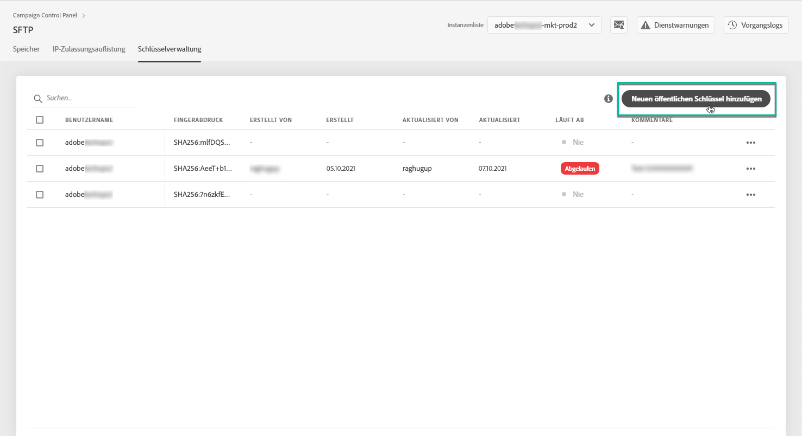

# Schlüsselverwaltung {#key-management}

>[!CONTEXTUALHELP]
>id=&quot;cp_key_management&quot;
>title=&quot;Über die Schlüsselverwaltung&quot;
>abstract=&quot;Auf dieser Registerkarte können Sie Ihre öffentlichen Schlüssel verwalten.&quot;
>additional-url=&quot;https://images-tv.adobe.com/mpcv3/8a977e03-d76c-44d3-853c-95d0b799c870_1560205338.1920x1080at3000_h264.mp4#t=166&quot; text=&quot;Demovideo ansehen&quot;

Adobe empfiehlt allen Kunden, die Verbindung zu ihren SFTP-Servern mit einem **Paar aus öffentlichem und privatem Schlüssel** herzustellen.

Im Folgenden werden die Schritte zum Erstellen und Hinzufügen eines öffentlichen SSH-Schlüssels für den Zugriff auf den SFTP-Server sowie Empfehlungen zur Authentifizierung beschrieben.

Nachdem der Zugriff auf den Server eingerichtet wurde, müssen die **IP-Adressen auf die Whitelist gesetzt werden**, die Zugriff auf den Server benötigen, damit Sie eine Verbindung mit ihm herstellen können. Weiterführende Informationen hierzu finden Sie in [diesem Abschnitt](../../instances-settings/using/ip-whitelisting-instance-access.md).

>[!NOTE]
>
>Derzeit ist es nicht möglich, einen öffentlichen SSH-Schlüssel zu löschen.

## Best Practices {#best-practices}

**Über den öffentlichen SSH-Schlüssel**

Verwenden Sie immer dieselbe Authentifizierung für die Verbindung zum Server und achten Sie darauf, dass der Schlüssel ein unterstütztes Format besitzt.

**API-Integration mit Benutzername und Passwort**

In sehr seltenen Fällen ist die passwortbasierte Authentifizierung auf manchen SFTP-Servern aktiviert. Adobe empfiehlt die Verwendung der schlüsselbasierten Authentifizierung, da diese Methode effizienter und sicherer ist. Sie können die Umstellung auf schlüsselbasierte Authentifizierung bei der Kundenunterstützung anfordern.

>[!IMPORTANT]
>
>Sollte Ihr Passwort seine Gültigkeit verlieren, können Sie sich nicht mehr bei Ihren SFTP-Konten anmelden, auch wenn auf Ihrem System Schlüssel installiert sind.

## Installation des SSH-Schlüssels {#installing-ssh-key}

>[!CONTEXTUALHELP]
>id=&quot;cp_sftp_publickey_add&quot;
>title=&quot;Hinzufügen eines neuen öffentlichen Schlüssels&quot;
>abstract=&quot;Fügen Sie einen neuen öffentlichen Schlüssel für eine Instanz hinzu.&quot;

>[!IMPORTANT]
>
>Die folgenden Schritte sind nur ein Beispiel für die Erstellung von SSH-Schlüsseln. Beachten Sie Ihre Unternehmensrichtlinien in Bezug auf SSH-Schlüssel. Das folgende Beispiel veranschaulicht die Vorgehensweise und zeigt, welche Informationen Sie Ihrem Team oder Ihrer internen Netzwerkgruppe mitteilen müssen.

1. Navigieren Sie zur **[!UICONTROL Key Management]** Registerkarte und klicken Sie dann auf die **[!UICONTROL Add new public key]** Schaltfläche.

   

1. Wählen Sie in dem sich öffnenden Dialogfeld den Benutzernamen, für den Sie den öffentlichen Schlüssel erstellen möchten, und den Server, für den Sie den Schlüssel aktivieren möchten.

   >[!NOTE]
   >
   >Danach wird geprüft, ob dieser Benutzername auf der jeweiligen Instanz aktiv ist. Sie erhalten dann die Möglichkeit, den Schlüssel auf einer oder mehreren Instanzen zu aktivieren.
   >
   >Für jeden Benutzer kann einer oder mehrere öffentliche SSH-Schlüssel hinzugefügt werden.

   

1. Kopieren Sie den öffentlichen SSH-Schlüssel. Führen Sie je nach Betriebssystem die folgenden Schritte aus, um einen öffentlichen Schlüssel zu erstellen:

   >[!NOTE]
   >
   >Die Größe des öffentlichen SSH-Schlüssels sollte **2048 Bit** betragen.

   **Linux und Mac:**

   Verwenden Sie das Terminal, um ein Paar aus öffentlichem und privatem Schlüssel zu generieren:
   1. Geben Sie folgenden Befehl ein: `ssh-keygen -t rsa -C <your_email@example.com>`.
   1. Geben Sie Ihrem Schlüssel einen Namen, wenn Sie dazu aufgefordert werden. Wenn das Verzeichnis &quot;.ssh&quot; nicht vorhanden ist, wird eines vom System erstellt.
   1. Geben Sie eine Passphrase ein und wiederholen Sie die Eingabe, wenn Sie dazu aufgefordert werden. Dieses Feld kann auch leer gelassen werden.
   1. Das Schlüsselpaar &quot;name&quot; und &quot;name.pub&quot; wird vom System erstellt. Suchen Sie nach der Datei &quot;name.pub&quot; und öffnen Sie sie. Sie hat eine alphanumerische Zeichenfolge, die mit der von Ihnen angegebenen E-Mail-Adresse endet.
   **Windows:**

   Möglicherweise müssen Sie ein Tool eines Drittanbieters installieren, mit dem Sie ein privates/öffentliches Schlüsselpaar im gleichen Format wie &quot;name.pub&quot; erstellen können.

1. Öffnen Sie die .pub-Datei und kopieren Sie die gesamte Zeichenfolge beginnend mit &quot;ssh...&quot; in das Control Panel.

   

1. Click the **[!UICONTROL Save]** button to create the key. Das Control Panel speichert den öffentlichen Schlüssel und den zugehörigen Fingerabdruck, verschlüsselt im SHA256-Format.

Sie können Fingerabdrücke verwenden, um die auf Ihrem Computer gespeicherten privaten Schlüssel mit den entsprechenden öffentlichen Schlüsseln im Control Panel abzugleichen.

Mit der Schaltfläche &quot;**...**&quot; können Sie einen vorhandenen Schlüssel löschen oder seinen zugehörigen Fingerabdruck in die Zwischenablage kopieren.

