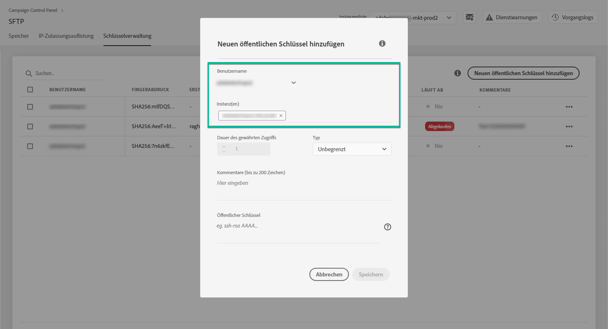
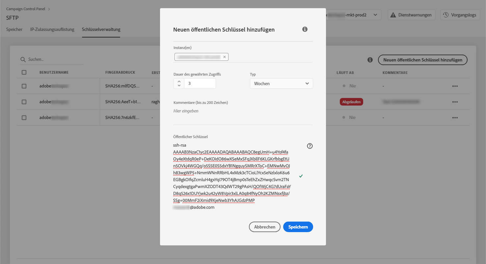
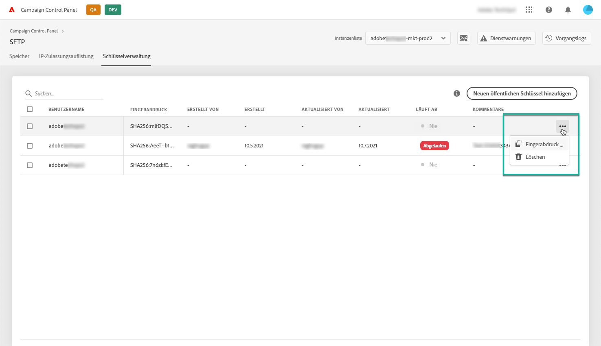

# Schlüsselverwaltung {#key-management}

Adobe empfiehlt allen Kunden, die Verbindung zu ihren SFTP-Servern mit einem **Paar aus öffentlichem und privatem Schlüssel** herzustellen.

Die Schritte zum Generieren eines öffentlichen SSH-Schlüssels und zum Hinzufügen des Schlüssels zum Zugriff auf den SFTP-Server werden nachfolgend beschrieben sowie Empfehlungen zur Authentifizierung.

Once access to the server is set up, remember to **whitelist the IP addresses** that will require access to the server so that you can connect to it. Weiterführende Informationen hierzu finden Sie in [diesem Abschnitt](../../instances-settings/using/ip-whitelisting-instance-access.md).

>[!NOTE]
>
>Derzeit ist es nicht möglich, einen öffentlichen SSH-Schlüssel zu löschen.

## Best Practices {#best-practices}

**Über den öffentlichen SSH-Schlüssel**

Verwenden Sie immer dieselbe Authentifizierung für die Verbindung zum Server und achten Sie darauf, dass der Schlüssel ein unterstütztes Format besitzt.

**API-Integration mit Benutzername und Passwort**

In sehr seltenen Fällen ist die passwortbasierte Authentifizierung auf manchen SFTP-Servern aktiviert. Adobe empfiehlt die Verwendung der schlüsselbasierten Authentifizierung, da diese Methode effizienter und sicherer ist. Sie können die Umstellung auf schlüsselbasierte Authentifizierung bei der Kundenunterstützung anfordern.

>[!CAUTION]
>
>Sollte Ihr Passwort seine Gültigkeit verlieren, können Sie sich nicht mehr bei Ihren SFTP-Konten anmelden, auch wenn auf Ihrem System Schlüssel installiert sind.

## Installation des SSH-Schlüssels {#installing-ssh-key}

>[!CAUTION]
>
>Die folgenden Schritte sind nur ein Beispiel für die Erstellung von SSH-Schlüsseln. Beachten Sie Ihre Unternehmensrichtlinien in Bezug auf SSH-Schlüssel. Das unten stehende Beispiel ist nur ein Beispiel dafür, wie dies erreicht werden kann, und dient als nützlicher Bezugspunkt für die Übermittlung von Anforderungen an Ihr Team oder Ihre interne Netzwerkgruppe.

1. Navigieren Sie zur Registerkarte **[!UICONTROL Schlüsselverwaltung]** und klicken Sie dann auf die Schaltfläche **[!UICONTROL Öffentlichen Schlüssel hinzufügen]**.

   

1. Wählen Sie im daraufhin geöffneten Dialogfeld den Benutzernamen, für den Sie den öffentlichen Schlüssel erstellen möchten, und den Server, für den Sie den Schlüssel aktivieren möchten.

   >[!NOTE]
   >
   >Danach wird geprüft, ob dieser Benutzername auf der jeweiligen Instanz aktiv ist. Sie erhalten dann die Möglichkeit, den Schlüssel auf einer oder mehreren Instanzen zu aktivieren.
   >
   >Für jeden Benutzer kann einer oder mehrere öffentliche SSH-Schlüssel hinzugefügt werden.

   

1. Kopieren Sie den öffentlichen SSH-Schlüssel. Führen Sie je nach Betriebssystem die folgenden Schritte aus, um einen öffentlichen Schlüssel zu erstellen:

   >[!NOTE]
   >
   >The public SSH key size should be **2048 bits**.

   **Linux und Mac:**

   Verwenden Sie das Terminal, um ein Paar aus öffentlichem und privatem Schlüssel zu generieren:
   1. Geben Sie folgenden Befehl ein: `ssh-keygen -t rsa -C <your_email@example.com>`.
   1. Geben Sie Ihrem Schlüssel einen Namen, wenn Sie dazu aufgefordert werden. Wenn der .ssh-Ordner nicht vorhanden ist, erstellt das System einen für Sie.
   1. Geben Sie eine Passphrase ein und wiederholen Sie die Eingabe, wenn Sie dazu aufgefordert werden. Dieses Feld kann auch leer gelassen werden.
   1. Das Schlüsselpaar "name" und "name.pub" wird vom System erstellt. Suchen Sie nach der Datei "name.pub"und öffnen Sie sie. Sie hat eine alphanumerische Zeichenfolge, die mit der von Ihnen angegebenen E-Mail-Adresse endet.
   **Windows:**

   Möglicherweise müssen Sie ein Tool eines Drittanbieters installieren, mit der Sie ein privates/öffentliches Schlüsselpaar im gleichen Format wie "name.pub" erstellen können.

1. Öffnen Sie die .pub-Datei und kopieren Sie die gesamte Zeichenfolge beginnend mit "ssh..." in das Control Panel.

   

1. Wählen Sie die Schaltfläche **[!UICONTROL Speichern]aus, um den Schlüssel zu erstellen.** Das Control Panel speichert den öffentlichen Schlüssel und den zugehörigen Fingerabdruck, verschlüsselt im SHA256-Format.

Sie können Fingerabdrücke verwenden, um die auf Ihrem Computer gespeicherten privaten Schlüssel mit den entsprechenden öffentlichen Schlüsseln im Control Panel abzugleichen.

The "**...**" button allows you to delete an existing key, or to copy its associated fingerprint into your clipboard.

