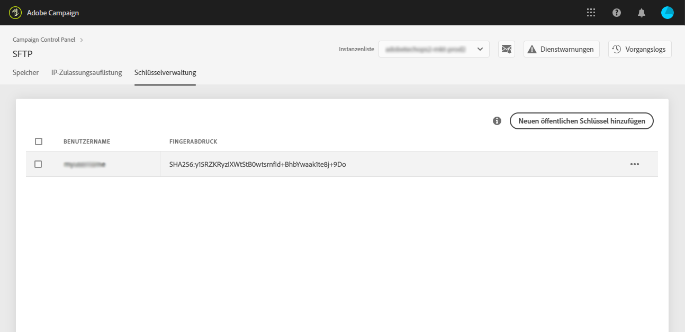

# Anmeldung bei Ihrem SFTP-Server {#logging-into-sft-server}

Die folgenden Schritte beschreiben, wie Sie mit Ihrer SFTP-Client-Anwendung eine Verbindung mit Ihrem SFTP-Server herstellen.

Bevor Sie sich beim Server anmelden, überprüfen Sie, ob folgende Voraussetzungen gegeben sind:

* Ihr SFTP-Server wird von **Adobe gehostet**.
* Ihr **Benutzername** wurde für den Server eingerichtet. Sie können diese Informationen direkt im Control Panel auf der Registerkarte **Schlüsselverwaltung** der SFTP-Karte überprüfen.
* Sie verfügen über ein **Paar aus privatem und öffentlichem Schlüssel**, um sich am SFTP-Server anzumelden. Lesen Sie [diesen Abschnitt](../../sftp/using/key-management.md), um mehr darüber zu erfahren, wie Sie den SSH-Schlüssel hinzufügen können.
* Ihre **öffentliche IP-Adresse wurde auf dem SFTP-Server auf die Whitelist** gesetzt. Ist dies nicht der Fall, lesen Sie [diesen Abschnitt](../../sftp/using/ip-range-whitelisting.md), um mehr darüber zu erfahren, wie Sie einen IP-Bereich auf die Whitelist setzen.
* Sie haben Zugriff auf eine **SFTP-Client-Software**. Fragen Sie Ihre IT-Abteilung nach der von ihr empfohlenen SFTP-Client-Anwendung oder suchen Sie im Internet nach einer, wenn dies durch Ihre Unternehmensrichtlinien erlaubt ist.

Gehen Sie wie folgt vor, um eine Verbindung mit dem SFTP-Server herzustellen:

1. Starten Sie das Control Panel und wählen Sie dann die Registerkarte **[!UICONTROL Schlüsselverwaltung]** auf der Karte **[!UICONTROL SFTP]** aus.

   

1. Starten Sie Ihre SFTP-Client-Anwendung, kopieren Sie dann die Server-Adresse aus dem Control Panel gefolgt von &quot;campaign.adobe.com&quot; hinein und geben Sie Ihren Benutzernamen ein.

   

1. Wählen Sie im Feld **[!UICONTROL SSH Private Key]** die auf Ihrem Computer gespeicherte Datei für den privaten Schlüssel aus. Sie ist eine Textdatei und hat denselben Namen wie Ihr öffentlicher Schlüssel, jedoch ohne die Erweiterung &quot;.pub&quot; (z. B. &quot;enable&quot;).

   

   Der private Schlüssel der Datei wird automatisch in das Feld **[!UICONTROL Password]** eingetragen.

   

   Sie können überprüfen, ob der Schlüssel, den Sie verwenden möchten, im Control Panel gespeichert ist, indem Sie den Fingerabdruck des privaten oder öffentlichen Schlüssels mit dem Fingerabdruck der Schlüssel vergleichen, die auf der Registerkarte &quot;Schlüsselverwaltung&quot; der SFTP-Karte angezeigt werden.

   

   >[!NOTE]
   >
   >Wenn Sie einen Mac-Computer verwenden, können Sie den Fingerabdruck des auf Ihrem Computer gespeicherten privaten Schlüssels anzeigen, indem Sie diesen Befehl ausführen:
   >
   >`ssh-keygen -lf <path of the privatekey>`

1. Sobald alle Informationen ausgefüllt sind, wählen Sie **[!UICONTROL Connect]** aus, um sich bei Ihrem SFTP-Server anzumelden.

   
