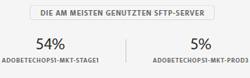

# SFTP-Speicherverwaltung {#sftp-storage-management}

>[!CONTEXTUALHELP]
>id=&quot;cp_storage&quot;
>title=&quot;Informationen zur Speicherkapazität&quot;
>abstract=&quot;Auf dieser Registerkarte können Sie die Informationen zur Speicherkapazität und Nutzung Ihrer SFTP-Server anzeigen. Hier werden nur SFTP-Server aufgeführt, auf die Sie Zugriff haben. Wenn Sie Zugriff auf andere SFTP-Server wünschen, kontaktieren Sie Ihren Administrator.&quot;
>additional-url=&quot;https://images-tv.adobe.com/mpcv3/8a977e03-d76c-44d3-853c-95d0b799c870_1560205338.1920x1080at3000_h264.mp4&quot; text=&quot;Demovideo ansehen&quot;

Abhängig von Ihrem Vertrag kann Ihr SFTP-Server eine andere Speicherkapazität aufweisen.

Es ist wichtig, dass Sie laufend den verfügbaren Speicherplatz eines jeden SFTP-Servers überwachen. Andernfalls könnte es passieren, dass keine weiteren Dateien mehr auf dem Server gespeichert oder keine Workflows mehr erfolgreich ausgeführt werden können, die auf die Aktualisierung dieses Servers angewiesen sind.

**Verwandte Themen:**

* [Tutorial für Campaign Standard](https://docs.adobe.com/content/help/en/campaign-learn/campaign-standard-tutorials/administrating/control-panel/monitoring-server-capacity-whitelisting-adding-ssh-key.html)
* [Tutorial für Campaign Classic](https://docs.adobe.com/content/help/en/campaign-learn/campaign-classic-tutorials/administrating/control-panel-acc/managing-sftp-servers.html)

## Zugriff auf Informationen zur Speicherkapazität {#accessing-storage-capacity-information}

The **[!UICONTROL Top utilized SFTP disk capacity]** section in the header includes the top three most utilized servers attached to the instances that you have Admin access to. Diese Informationen sind auf jeder Registerkarte der SFTP-Karte verfügbar.

Information about the space used by all instances you have access to is available in the **[!UICONTROL Storage]** tab of the SFTP card. Dieser Wert wird bei jeder Seitenaktualisierung neu berechnet.

Eine visuelle Warnung wird für jede Instanz angezeigt, bei der die Speicherkapazität ausgeschöpft ist:

* **Orange**: Mehr als 80 % der Kapazität der Instanz sind ausgelastet,
* **Rot**: Mehr als 90 % der Kapazität der Instanz sind ausgelastet.

Außerdem erfahren Sie, wie Sie vorgehen sollten, wenn die Server-Kapazität nahezu erschöpft ist.

## Best Practices, wenn die Speicherkapazität erschöpft ist {#best-practices-when-capacity-runs-out}

1. **Entfernen Sie vom SFTP-Server alte oder unnötige Dateien**. Weitere Informationen zum Zugriff auf Ihren SFTP-Server-Ordner finden Sie in [diesem Abschnitt](../../sftp/using/logging-into-sftp-server.md).
1. Stellen Sie sicher, dass die **Workflows**, die Ihre SFTP-Server bereinigen, ordnungsgemäß ausgeführt werden. Weitere Informationen zu technischen Workflows in Adobe Campaign finden Sie in den Dokumentationen zu [Campaign Classic](https://docs.campaign.adobe.com/doc/AC/en/WKF__General_operation_Building_a_workflow.html#Technical_workflows) und [Campaign Standard](https://helpx.adobe.com/campaign/standard/administration/using/technical-workflows.html).
1. Wenden Sie sich an Ihr Account-Team, um **mehr Speicherplatz anzufordern** (möglicherweise fallen zusätzliche Gebühren an).
1. Wenden Sie sich an die **Kundenunterstützung**, wenn Sie glauben, dass ein Problem vorliegt.
