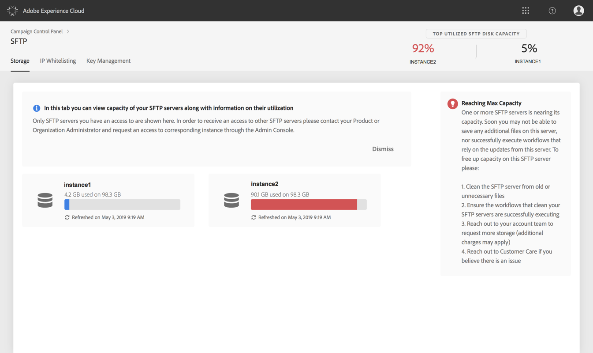

# SFTP-Speicherverwaltung {#sftp-storage-management}

Abhängig von Ihrem Vertrag kann Ihr SFTP-Server eine andere Speicherkapazität aufweisen.

Es ist wichtig, dass Sie laufend den verfügbaren Speicherplatz eines jeden SFTP-Servers überwachen. Andernfalls könnte es passieren, dass keine weiteren Dateien mehr auf dem Server gespeichert oder keine Workflows mehr erfolgreich ausgeführt werden können, die auf die Aktualisierung dieses Servers angewiesen sind.

**Verwandte Themen:**

* [Tutorial für Campaign Standard](https://docs.adobe.com/content/help/en/campaign-learn/campaign-standard-tutorials/administrating/control-panel/managing-sftp-servers.html)
* [Tutorial für Campaign Classic](https://docs.adobe.com/content/help/en/campaign-learn/campaign-classic-tutorials/administrating/control-panel-acc/managing-sftp-servers.html)

## Zugriff auf Informationen zur Speicherkapazität {#accessing-storage-capacity-information}

Der Bereich **[!UICONTROL Die am meisten genutzten SFTP-Server]im Header enthält die drei am häufigsten genutzten Server, die mit den Instanzen verbunden sind, auf die Sie Administratorzugriff haben.** Diese Informationen sind auf jedem Tab der SFTP-Karte verfügbar.

Information about the space used by all instances you have access to is available in the **[!UICONTROL Storage]** tab of the SFTP card. Dieser Wert wird bei jeder Seitenaktualisierung neu berechnet.

Für jede Instanz wird eine visuelle Warnung angezeigt, wenn der Speicher seine Kapazität überschreitet:

* **Orange**: der Fall 80 % seiner Kapazität übersteigt,
* **Rot**: die Instanz überschreitet 90 % ihrer Kapazität.

Außerdem erfahren Sie, wie Sie vorgehen sollten, wenn die Serverkapazität nahezu erschöpft ist.

## Best Practices, wenn die Speicherkapazität erschöpft ist {#best-practices-when-capacity-runs-out}

1. **Entfernen Sie vom SFTP-Server alte oder unnötige Dateien**. Weitere Informationen zum Zugriff auf Ihren SFTP-Serverordner finden Sie in [diesem Abschnitt](../../sftp/using/logging-into-sftp-server.md).
1. Stellen Sie sicher, dass die **Workflows**, die Ihre SFTP-Server bereinigen, ordnungsgemäß ausgeführt werden. For more on technical workflows in Adobe Campaign, refer to the dedicated [Campaign Classic](https://docs.campaign.adobe.com/doc/AC/en/WKF__General_operation_Building_a_workflow.html#Technical_workflows) and [Campaign Standard](https://helpx.adobe.com/campaign/standard/administration/using/technical-workflows.html) documentations.
1. Wenden Sie sich an Ihr Account-Team, um **mehr Speicherplatz anzufordern** (möglicherweise fallen zusätzliche Gebühren an).
1. Wenden Sie sich an die **Kundenunterstützung**, wenn Sie glauben, dass ein Problem vorliegt.
