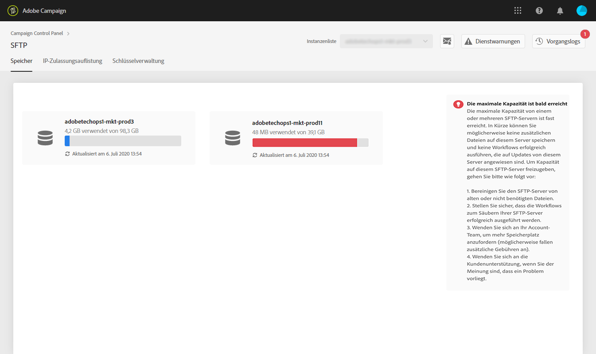

# SFTP-Speicherverwaltung {#sftp-storage-management}

>[!CONTEXTUALHELP]
>id="cp_storage"
>title="Über die Speicherkapazität"
>abstract="Auf diesem Tab finden Sie die Speicherkapazität und die Nutzungsinformationen Ihrer SFTP-Server. Sie können auch die 10 wichtigsten Dateien auflisten, die den meisten Speicherplatz auf einem SFTP-Server belegen, indem Sie auf dessen Namen klicken. Hier werden nur SFTP-Server aufgeführt, auf die Sie Zugriff haben. Wenn Sie Zugriff auf andere SFTP-Server wünschen, kontaktieren Sie Ihren Administrator."
>additional-url="https://images-tv.adobe.com/mpcv3/8a977e03-d76c-44d3-853c-95d0b799c870_1560205338.1920x1080at3000_h264.mp4" text="Demovideo ansehen"

Abhängig von Ihrem Vertrag kann Ihr SFTP-Server eine andere Speicherkapazität aufweisen.

Es ist wichtig, dass Sie laufend den verfügbaren Speicherplatz eines jeden SFTP-Servers überwachen. Andernfalls könnte es passieren, dass keine weiteren Dateien mehr auf dem Server gespeichert oder keine Workflows mehr erfolgreich ausgeführt werden können, die auf die Aktualisierung dieses Servers angewiesen sind.

Wenn Sie [E-Mail-Benachrichtigungen](../../performance-monitoring/using/email-alerting.md) abonniert haben, erhalten Sie Benachrichtigungen per E-Mail, wenn einer Ihrer SFTP-Server 80 % oder mehr seiner Kapazität erreicht hat. Siehe [SFTP-Speicherverwaltung](../../sftp/using/sftp-storage-management.md).

 Entdecken Sie diese Funktion bei der Verwendung von [Campaign v7/v8](https://experienceleague.adobe.com/docs/campaign-classic-learn/control-panel/sftp-management/monitoring-server-capacity.html?lang=de#sftp-management) oder [Campaign Standard](https://experienceleague.adobe.com/docs/campaign-standard-learn/control-panel/sftp-management/monitoring-server-capacity.html?lang=de#sftp-management) im Video

## Zugriff auf Informationen zur Speicherkapazität {#accessing-storage-capacity-information}

Informationen zum Speicherplatz, der von allen Instanzen verwendet wird, auf die Sie zugreifen können, finden Sie auf der Registerkarte **[!UICONTROL Speicher]** der SFTP-Karte. Dieser Wert wird bei jeder Seitenaktualisierung neu berechnet.

Eine visuelle Warnung wird für jede Instanz angezeigt, bei der die Speicherkapazität ausgeschöpft ist:

* **Orange**: Mehr als 80 % der Kapazität der Instanz sind ausgelastet,
* **Rot**: Mehr als 90 % der Kapazität der Instanz sind ausgelastet.

Sie können auch die 10 wichtigsten Dateien identifizieren, die den meisten Speicherplatz auf einem SFTP-Server belegen, indem Sie auf dessen Namen klicken.

Außerdem erfahren Sie, wie Sie vorgehen sollten, wenn die Server-Kapazität nahezu erschöpft ist.

## Best Practices, wenn die Speicherkapazität erschöpft ist {#best-practices-when-capacity-runs-out}

1. **Entfernen Sie vom SFTP-Server alte oder unnötige Dateien**. Weitere Informationen zum Zugriff auf Ihren SFTP-Server-Ordner finden Sie in [diesem Abschnitt](../../sftp/using/logging-into-sftp-server.md).
1. Stellen Sie sicher, dass die **Workflows**, die Ihre SFTP-Server bereinigen, ordnungsgemäß ausgeführt werden. Weitere Informationen zu technischen Workflows in Adobe Campaign finden Sie in den entsprechenden Dokumentationen zu [Campaign v7/v8](https://experienceleague.adobe.com/docs/campaign-classic/using/automating-with-workflows/advanced-management/about-technical-workflows.html?lang=de) und [Campaign Standard](https://experienceleague.adobe.com/docs/campaign-standard/using/administrating/application-settings/technical-workflows.html?lang=de).
1. Wenden Sie sich an Ihr Account-Team, um **mehr Speicherplatz anzufordern** (möglicherweise fallen zusätzliche Gebühren an).
1. Wenden Sie sich an die **Kundenunterstützung**, wenn Sie glauben, dass ein Problem vorliegt.
