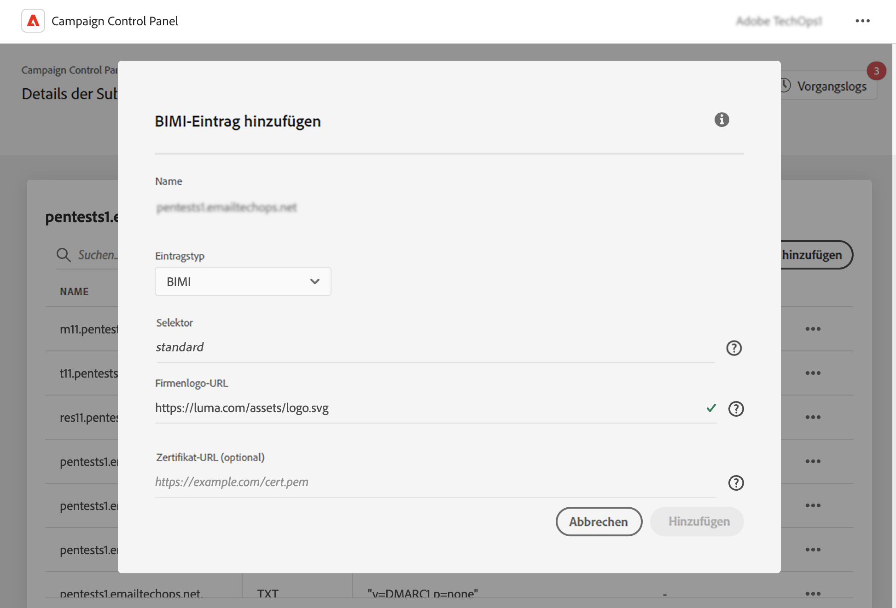

# Hinzufügen von BIMI-Einträgen {#dmarc}

## Über BIMI-Einträge {#about}

Brand Indicators for Message Identification (BIMI) ist ein Branchenstandard, der es ermöglicht, neben der E-Mail eines Absenders in den Postfächern von Postfachanbietern ein genehmigtes Logo anzuzeigen, um die Markenerkennung und das Vertrauen zu stärken.

Detaillierte Informationen zur BIMI-Implementierung finden Sie im [Adobe-Handbuch für Best Practices zur Zustellbarkeit](https://experienceleague.adobe.com/docs/deliverability-learn/deliverability-best-practice-guide/additional-resources/technotes/implement-bimi.html?lang=de)

{width="70%" align="center"}

## Einschränkungen und Voraussetzungen {#limitations}

* SPF-, DKIM- und DMARC-Einträge sind Voraussetzung für das Erstellen eines BIMI-Eintrags.

* BIMI-Eintrag muss im DNS veröffentlicht werden. Für vollständig delegierte Domains ist dies über das Control Panel möglich. [Hier finden Sie weitere Informationen zu den Konfigurationsmethoden von Subdomains](subdomains-branding.md#subdomain-delegation-methods)

* Voraussetzungen für DMARC-Einträge:

   * Der Richtlinientyp für die Aufzeichnung der Organisationsdomäne muss auf &quot;Quarantäne&quot;oder &quot;Ablehnen&quot;eingestellt sein. Die Erstellung von BIMI-Einträgen ist nicht verfügbar, wenn der DMARC-Richtlinientyp auf „Keine“ festgelegt ist.
   * Der Prozentsatz der E-Mails, auf die die DMARC-Richtlinie angewendet wird, muss 100 % betragen. BIMI unterstützt keine DMARC-Richtlinien, deren Prozentsatz auf weniger als 100 % festgelegt ist.

[Erfahren Sie, wie Sie DMARC-Einträge konfigurieren](dmarc.md)

## Hinzufügen eines BIMI-Eintrags für eine Subdomain {#add}

Gehen Sie wie folgt vor, um einen BIMI-Eintrag für eine Subdomain hinzuzufügen:

1. Klicken Sie in der Liste der Subdomains auf die Schaltfläche mit den Auslassungspunkten neben der gewünschten Subdomain und wählen Sie **[!UICONTROL Details der Subdomain]**.

1. Klicken Sie auf die Schaltfläche **[!UICONTROL TXT-Eintrag hinzufügen]** und wählen Sie **[!UICONTROL BIMI]** aus der Dropdown-Liste **[!UICONTROL Typ des Eintrages]**.

   

1. Mit dem Feld **[!UICONTROL Selektor]** können Sie einen BIMI-Selektor für den Eintrag angeben. Ein BIMI-Selektor ist eine eindeutige Kennung, die Sie einem BIMI-Eintrag zuweisen können. Auf diese Weise können Sie mehrere Logos für eine bestimmte Subdomain definieren. Dies wird derzeit von Postfachanbietern nicht unterstützt.

1. Geben Sie in der **[!UICONTROL Firmen-Logo-URL]** die URL der SVG-Datei an, die Ihr Logo enthält.

1. Obwohl die **[!UICONTROL Zertifikat-URL]** optional ist, ist sie für einige Postfachanbieter wie Gmail und Apple erforderlich. Daher empfehlen wir, ein Verified Mark Certificate (VMC) zu erhalten, um BIMI wirklich auszunutzen.

   +++Wie erhalte ich ein VMC?

   Die wichtigsten Schritte zum Erhalten eines VMC sind:

   1. Registrieren Sie Ihr Markenlogo als Marke bei einem Büro für geistiges Eigentum, das von VMC-Emittierenden anerkannt wird. Wenn Sie über eine Rechtsabteilung verfügen, empfehlen wir Ihnen, mit ihr zusammenzuarbeiten, um Ihr Logo zu schützen oder zu überprüfen, ob es bereits geschützt ist.

   1. Nachdem Sie sich vergewissert haben, dass Ihr Logo geschützt ist, wenden Sie sich an die Zertifizierungsstelle (certificate authority, CA) DigiCert oder Entrust, um ein VMC anzufordern.

   1. Wenn Ihr VMC genehmigt ist, erhalten Sie eine Privacy Enhanced Mail(PEM)-Datei mit einem Entitätszertifikat. Hängen Sie alle anderen Zwischenzertifikate, die Sie von der CA erhalten, an diese PEM-Datei an. Laden Sie die PEM-Datei (zusammen mit angehängten Dateien) auf Ihren öffentlichen Webserver hoch und notieren Sie sich die URL der PEM-Datei. Sie werden diese URL in Ihrem BIMI-TXT-Eintrag verwenden.

   1. Sobald der BIMI-Eintrag auf der Detailseite einer bestimmten Subdomain sichtbar ist, können Sie den [hier](https://bimigroup.org/bimi-generator/) verfügbaren BIMI-Inspektor verwenden, um zu überprüfen, ob der BIMI-Eintrag ordnungsgemäß funktioniert.

   Detaillierte Informationen zur BIMI-Implementierung finden Sie in der [Dokumentation zu den BIMI-Standards](https://bimigroup.org/implementation-guide/)
+++

1. Klicken Sie auf **[!UICONTROL Hinzufügen]**, um die Erstellung des BIMI-Eintrags zu bestätigen.

Sobald die Erstellung des BIMI-Eintrags verarbeitet wurde (etwa 5 Minuten), wird er im Detailbildschirm der Subdomains angezeigt. [Erfahren Sie, wie Sie TXT-Einträge für Ihre Subdomains überwachen.](gs-txt-records.md#monitor)
