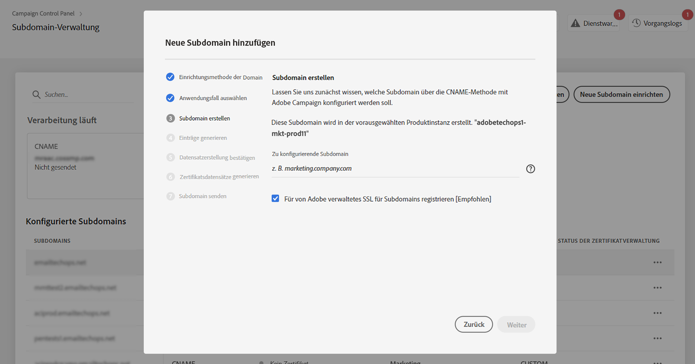
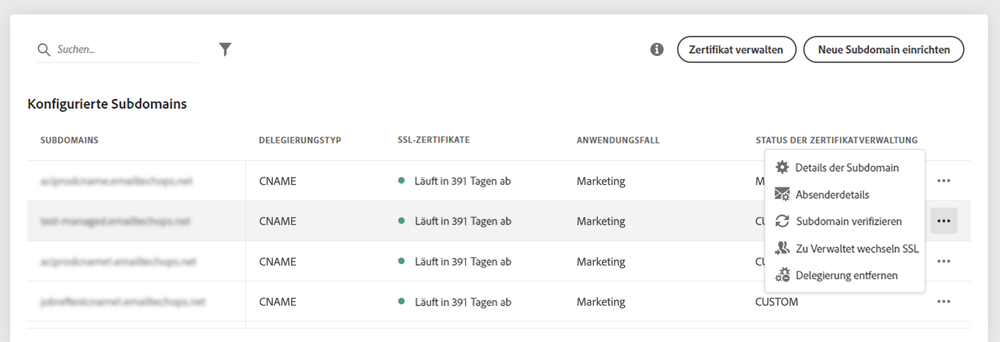
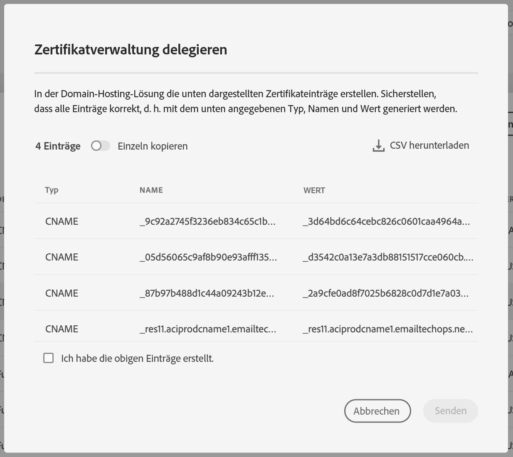

# Delegieren von SSL-Zertifikaten von Subdomains an Adobe {#delegate-ssl-certificates}

>[!CONTEXTUALHELP]
>id="cp_managed_ssl"
>title="Delegieren von SSL-Zertifikaten von Subdomains an Adobe"
>abstract="Mit dem Control Panel können Sie die SSL-Zertifikate Ihrer Subdomains von Adobe verwalten lassen. Wenn Sie CNAMEs zum Einrichten Ihrer Subdomain verwenden, werden automatisch Zertifikatdatensätze generiert und bereitgestellt, um ein Zertifikat in Ihrer Domain-Hosting-Lösung zu generieren."

Es wird dringend empfohlen, die SSL-Zertifikate Ihrer Subdomains an Adobe zu delegieren, da Adobe das Zertifikat automatisch erstellt und jedes Jahr erneuert, bevor das Zertifikat abläuft.

Wenn Sie CNAMEs zum Einrichten einer Subdomain-Delegierung verwenden, stellt Adobe Zertifikatdatensätze bereit, die in Ihrer Domain-Hosting-Lösung zum Generieren Ihres Zertifikats verwendet werden.

Die Delegierung von SSL-Zertifikaten an Adobe kann beim Einrichten einer neuen Subdomain oder für bereits delegierte Subdomains durchgeführt werden.

>[!NOTE]
>
>Adobe Managed SSL ist eine kostenlose Funktion, die Benutzenden gebührenfrei zur Verfügung steht.

## Delegieren von SSL-Zertifikaten neuer Subdomains {#new}

Um SSL-Zertifikate beim Einrichten einer neuen Subdomain zu delegieren, aktivieren Sie die Option **[!UICONTROL Für von Adobe verwaltetes SSL für Subdomains registrieren]** im Konfigurationsassistenten für Subdomains. Zertifikatsdatensätze, die in Ihre Hosting-Lösung kopiert werden sollen, werden später im Konfigurationsassistenten bereitgestellt. Detaillierte Schritte sind in [diesem Abschnitt](setting-up-new-subdomain.md) dokumentiert.

{width="70%" align="left"}

## Delegieren von SSL-Zertifikaten für bereits delegierte Subdomains {#delegated}

Um SSL-Zertifikate für eine bereits delegierte Subdomain zu delegieren, klicken Sie auf die Ellipsen-Schaltfläche neben der gewünschten Subdomain und klicken Sie auf **[!UICONTROL Zu verwaltetem SSL wechseln]**.

{width="70%" align="left"}

Es wird ein Dialogfeld mit den Zertifikatsdatensätzen angezeigt, die automatisch von Adobe generiert wurden. Kopieren Sie diese Einträge entweder einzeln oder durch Herunterladen einer CSV-Datei, und navigieren Sie dann zu Ihrer Domain-Hosting-Lösung, um die passenden Zertifikate zu generieren.

Stellen Sie sicher, dass alle Zertifikate aus den vorherigen Schritten in Ihrer Domain-Hosting-Lösung generiert wurden. Wenn alles ordnungsgemäß konfiguriert ist, bestätigen Sie die Erstellung der Datensätze und klicken Sie auf **[!UICONTROL Senden]**.

{width="70%" align="left"}
