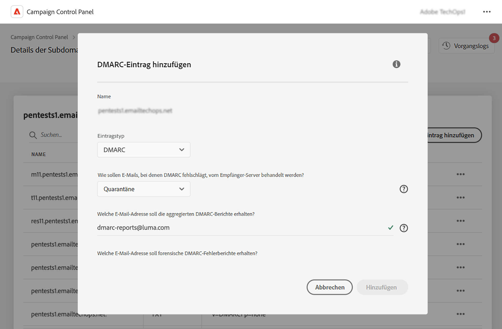
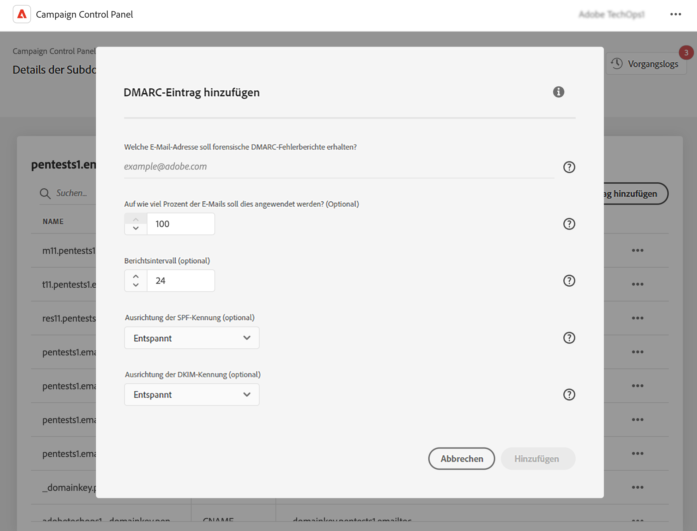

# Hinzufügen von DMARC-Einträgen {#dmarc}

## Über DMARC-Einträge {#about}

Domain based Message Authentication, Reporting and Conformance (DMARC) ist ein E-Mail-Authentifizierungsprotokollstandard, der Unternehmen dabei unterstützt, ihre E-Mail-Domains vor Phishing- und Spoofing-Angriffen zu schützen. Sie können damit festlegen, wie ein E-Mail-Anbieter E-Mails verarbeiten soll, die bei SPF- und DKIM-Prüfungen fehlschlagen. So können Sie die Absender-Domain authentifizieren und eine unbefugte Nutzung der Domain zu bösartigen Zwecken verhindern.

Detaillierte Informationen zur DMARC-Implementierung finden Sie im [Adobe-Handbuch für Best Practices zur Zustellbarkeit](https://experienceleague.adobe.com/docs/deliverability-learn/deliverability-best-practice-guide/additional-resources/technotes/implement-dmarc.html?lang=de)

## Einschränkungen und Voraussetzungen {#limitations}

* SPF- und DKIM-Einträge sind Voraussetzung für das Erstellen eines DMARC-Eintrags.
* DMARC-Einträge können nur für Subdomains hinzugefügt werden, die eine vollständige Subdomain-Delegierung verwenden. [Hier finden Sie weitere Informationen zu den Konfigurationsmethoden von Subdomains](subdomains-branding.md#subdomain-delegation-methods)

## Hinzufügen eines DMARC-Eintrags für eine Subdomain {#add}

Gehen Sie wie folgt vor, um einen DMARC-Eintrag für eine Subdomain hinzuzufügen:

1. Klicken Sie in der Liste der Subdomains auf die Schaltfläche mit den Auslassungspunkten neben der gewünschten Subdomain und wählen Sie **[!UICONTROL Details der Subdomain]**.

1. Klicken Sie auf **[!UICONTROL TXT-Eintrag hinzufügen]** und wählen Sie **[!UICONTROL DMARC]** aus der Dropdown-Liste **[!UICONTROL Typ des Eintrages]**.

   

1. Wählen Sie den **[!UICONTROL Richtlinientyp]**, dem der Empfänger-Server folgen sollte, wenn eine Ihrer E-Mails fehlschlägt. Verfügbare Richtlinientypen sind:

   * **[!UICONTROL Keine]**,
   * **[!UICONTROL Quarantäne]** (Platzierung im Spam-Ordner),
   * **[!UICONTROL Ablehnen]** (E-Mail blockieren).

   Als Best Practice wird empfohlen, die DMARC-Implementierung langsam einzuführen, indem Sie Ihre DMARC-Richtlinie von p = Keine auf p = Quarantäne und p = Ablehnen anheben, sobald Sie die potenziellen Auswirkungen von DMARC verstehen.

   * **Schritt 1:** Analysieren Sie das Feedback, das Sie erhalten, und verwenden Sie p = Keine, was den Empfangs-Server anweist, keine Aktionen für Nachrichten durchzuführen, deren Authentifizierung fehlgeschlagen ist, aber trotzdem E-Mail-Berichte an die Absenderin bzw. den Absender zu senden. Überprüfen und beheben Sie außerdem Probleme mit SPF/DKIM, wenn die Authentifizierung für legitime Nachrichten fehlschlägt.

   * **Schritt 2:** Bestimmen Sie, ob SPF und DKIM aufeinander abgestimmt sind und die Authentifizierung für alle legitime E-Mails übergeben, und verschieben Sie dann die Richtlinie auf p = Quarantäne, wodurch der E-Mail-Empfangs-Server angewiesen wird, E-Mails unter Quarantäne zu stellen, deren Authentifizierung fehlgeschlagen ist (im Allgemeinen bedeutet dies, dass diese Nachrichten im Spam-Ordner abgelegt werden). Wenn die Richtlinie auf Quarantäne gesetzt ist, wird empfohlen, mit einem kleinen Prozentsatz Ihrer E-Mails zu beginnen.

   * **Schritt 3:** Festegen der Richtlinie auf p = Ablehnen. HINWEIS: Verwenden Sie diese Richtlinie mit Vorsicht und prüfen Sie, ob sie für Ihre Organisation geeignet ist. Die Richtlinie p = Ablehnen weist den Empfangs-Server an, jede E-Mail für die Domain, bei der die Authentifizierung fehlschlägt, komplett zu verweigern (Bounce). Wenn diese Richtlinie aktiviert ist, haben nur E-Mails, die zu 100 % von Ihrer Domain authentifiziert wurden, überhaupt die Möglichkeit, im Posteingang platziert zu werden.

   >[!NOTE]
   >
   > Die Erstellung von BIMI-Einträgen ist nicht verfügbar, wenn der DMARC-Eintragstyp auf „Keine“ festgelegt ist.

1. Tragen Sie die E-Mail-Adressen ein, an die die DMARC-Berichte gesendet werden sollen. Wenn eine Ihrer E-Mails fehlschlägt, werden DMARC-Berichte automatisch an die E-Mail-Adresse Ihrer Wahl gesendet:

   * Aggregierte DMARC-Berichte enthalten allgemeine Informationen wie z. B. die Anzahl der E-Mails, die in einem bestimmten Zeitraum fehlgeschlagen sind.
   * Forensische DMARC-Fehlerberichte enthalten detaillierte Informationen, z. B. von welcher IP-Adresse die fehlgeschlagene E-Mail stammte.

1. Wenn die DMARC-Richtlinie auf „Keine“ gesetzt ist, geben Sie einen Prozentsatz ein, der für 100 % der E-Mails gilt.

   Wenn die Richtlinie auf „Ablehnen“ oder „Quarantäne“ gesetzt ist, wird empfohlen, mit einem kleinen Prozentsatz Ihrer E-Mails zu beginnen. Wenn mehr E-Mails von Ihrer Domäne die Authentifizierung bei den Empfangsservern bestehen, aktualisieren Sie Ihren Eintrag langsam mit einem höheren Prozentsatz.

   >[!NOTE]
   >
   >Wenn Ihre Domain BIMI verwendet, muss Ihre DMARC-Richtlinie einen Prozentwert von 100 % haben. BIMI unterstützt keine DMARC-Richtlinien, deren Wert auf unter 100 % festgelegt ist.

   

1. DMARC-Berichte werden alle 24 Stunden gesendet. Sie können die Versandfrequenz der Berichte im Feld **[!UICONTROL Berichtsintervall]** ändern. Das zulässige Mindestintervall beträgt 1 Stunde, der maximal zulässige Wert 2190 Stunden (d. h. 3 Monate).

1. Geben Sie in den Feldern **SPF** und **[!UICONTROL DKIM-Kennungsausrichtung]** an, wie streng die Empfangs-Server beim Überprüfen der SPF- und DKIM-Authentifizierung für eine E-Mail sein sollen.

   * **[!UICONTROL Entspannter]** Modus: Der Server akzeptiert die Authentifizierung, selbst wenn die E-Mail von einer Subdomain gesendet wird,
   * Der **[!UICONTROL strenge]** Modus akzeptiert nur dann die Authentifizierung, wenn die Absender-Domain genau mit einer SPF- und DKIM-Domain übereinstimmt.

   Angenommen, wir arbeiten mit der Domain `http://www.luma.com`. Im Modus „Entspannt“ werden E-Mails von der Subdomain `marketing.luma.com` vom Server autorisiert, während sie im Modus „Streng“ zurückgewiesen werden.

1. Klicken Sie auf **[!UICONTROL Hinzufügen]**, um die Erstellung des DMARC-Eintrags zu bestätigen.

Sobald die Erstellung des DMARC-Eintrags verarbeitet wurde (etwa 5 Minuten), wird er im Detailbildschirm der Subdomains angezeigt. [Erfahren Sie, wie Sie TXT-Einträge für Ihre Subdomains überwachen.](gs-txt-records.md#monitor)
