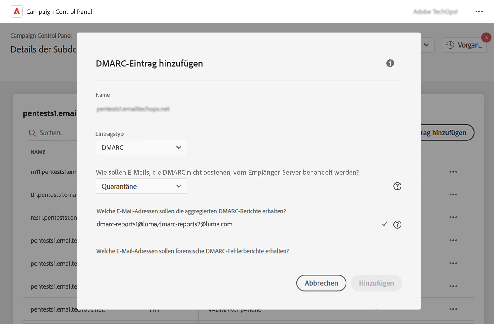

# Hinzufügen von DMARC-Datensätzen {#dmarc}

## Über DMARC-Einträge {#about}

Domain based Message Authentication, Reporting and Conformance (DMARC) ist ein E-Mail-Authentifizierungsprotokollstandard, der Unternehmen dabei unterstützt, ihre E-Mail-Domains vor Phishing- und Spoofing-Angriffen zu schützen. Sie können damit festlegen, wie ein Postfachanbieter E-Mails verarbeiten soll, die bei SPF- und DKIM-Prüfungen fehlschlagen. So können Sie die Domäne des Absenders authentifizieren und eine unbefugte Nutzung der Domain zu bösartigen Zwecken verhindern.

## Einschränkungen und Voraussetzungen {#limitations}

* SPF- und DKIM-Datensätze sind Voraussetzungen für die Erstellung eines DMARC-Datensatzes.
* DMARC-Einträge können nur für Subdomains hinzugefügt werden, die eine vollständige Subdomain-Zuweisung verwenden. [Weitere Informationen zu den Konfigurationsmethoden von Subdomains](subdomains-branding.md#subdomain-delegation-methods)

## Hinzufügen eines DMARC-Datensatzes für eine Subdomain {#add}

Gehen Sie wie folgt vor, um einen DMARC-Datensatz für eine Subdomain hinzuzufügen:

1. Klicken Sie in der Liste der Subdomains auf die Suchschaltfläche neben der gewünschten Subdomain und wählen Sie **[!UICONTROL Details der Subdomain]**.

1. Klicken Sie auf **[!UICONTROL TXT-Eintrag hinzufügen]** und wählen Sie **[!UICONTROL DMARC]** aus dem **[!UICONTROL Record Type]** Dropdown-Liste.

   

1. Wählen Sie die **[!UICONTROL Richtlinientyp]** dass der Empfängerserver folgen sollte, wenn eine Ihrer E-Mails fehlschlägt. Verfügbare Richtlinientypen sind:

   * Keine,
   * Quarantäne (Platzierung des Spam-Ordners),
   * Ablehnen (E-Mail blockieren).

   Wenn Ihre Subdomain gerade konfiguriert wurde, empfehlen wir, diesen Wert auf &quot;Keine&quot;festzulegen, bis Ihre Subdomain vollständig eingerichtet ist und Ihre E-Mails korrekt gesendet werden. Sobald alles ordnungsgemäß konfiguriert ist, können Sie den Richtlinientyp in &quot;Quarantäne&quot;oder &quot;Ablehnen&quot;ändern.

   >[!NOTE]
   >
   > Die Erstellung von BIMI-Datensätzen ist nicht verfügbar, wenn der DMARC-Datensatzrichtlinientyp auf &quot;Keine&quot;festgelegt ist.

1. Füllen Sie die E-Mail-Adressen aus, an die die DMARC-Berichte gesendet werden sollen. Wenn eine Ihrer E-Mails fehlschlägt, werden DMARC-Berichte automatisch an die E-Mail-Adresse Ihrer Wahl gesendet:

   * Aggregate-DMARC-Berichte enthalten allgemeine Informationen wie z. B. die Anzahl der E-Mails, die in einem bestimmten Zeitraum fehlgeschlagen sind.
   * Berichte zu forensischen DMARC-Fehlern enthalten detaillierte Informationen, z. B. von welcher IP-Adresse die fehlgeschlagene E-Mail stammt.

1. Standardmäßig wird die ausgewählte DMARC-Richtlinie auf alle E-Mails angewendet. Sie können diesen Parameter so ändern, dass er nur auf einen bestimmten Prozentsatz von E-Mails angewendet wird.

   Wenn Sie DMARC schrittweise bereitstellen, können Sie mit einem kleinen Prozentsatz Ihrer Nachrichten beginnen. Wenn mehr Nachrichten aus Ihrer Domäne die Authentifizierung mit Empfangs-Servern bestehen, aktualisieren Sie Ihren Datensatz mit einem höheren Prozentsatz, bis Sie 100 Prozent erreichen.

   >[!NOTE]
   >
   >Wenn Ihre Domäne BIMI verwendet, muss Ihre DMARC-Richtlinie einen Prozentwert von 100 % haben. BIMI unterstützt keine DMARC-Richtlinien, deren Wert auf unter 100 % festgelegt ist.

   

1. DMARC-Berichte werden alle 24 Stunden gesendet. Sie können die Versandfrequenz der Berichte im **[!UICONTROL Berichtsintervall]** -Feld. Das zulässige Mindestintervall beträgt 1 Stunde, der maximal zulässige Wert 2190 Stunden (d. h. 3 Monate).

1. Im **SPF** und **[!UICONTROL DKIM-Identifikationsausrichtung]** Geben Sie an, wie streng die Empfängerserver sein sollten, während Sie die SPF- und DKIM-Authentifizierung für eine E-Mail überprüfen.

   * **[!UICONTROL Relaxed]** mode: der Server akzeptiert die Authentifizierung, selbst wenn die E-Mail von einer Subdomain gesendet wird,
   * **[!UICONTROL Streng]** Der -Modus akzeptiert nur dann die Authentifizierung, wenn die Absenderdomäne genau mit einer SPF- und DKIM-Domäne übereinstimmt.

   Angenommen, wir arbeiten mit der `http://www.luma.com` Domäne. Im Modus &quot;Entspannt&quot; werden E-Mails von der `marketing.luma.com` Die Subdomain wird vom Server autorisiert, während sie im Modus &quot;Streng&quot; zurückgewiesen wird.

1. Klicks **[!UICONTROL Hinzufügen]** , um die Erstellung des DMARC-Datensatzes zu bestätigen.

Sobald die Erstellung des DMARC-Datensatzes verarbeitet wurde (etwa 5 Minuten), wird er im Detailbildschirm der Subdomains angezeigt. [Erfahren Sie, wie Sie TXT-Einträge für Ihre Subdomains überwachen.](gs-txt-records.md#monitor)