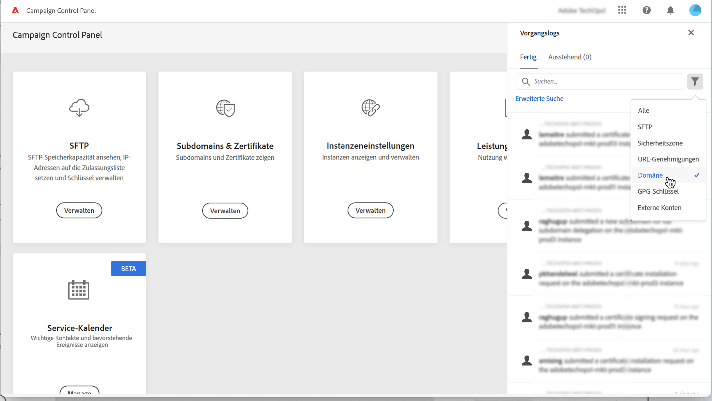

# CSR generieren {#generating-csr}

>[!CONTEXTUALHELP]
>id="cp_generate_csr"
>title="CSR-Generierung"
>abstract="Vor dem Kauf eines Zertifikats muss eine Certificate Signing Request für die Instanz und die Subdomains generiert werden, die Sie schützen möchten."

>[!CONTEXTUALHELP]
>id="cp_select_subdomains"
>title="Auswählen der Subdomains für Ihre CSR"
>abstract="Sie können auswählen, ob Sie alle oder nur bestimmte Subdomains in Ihre Certificate Signing Request aufnehmen möchten. Nur ausgewählte Subdomains werden über das erworbene SSL-Zertifikat zertifiziert."
>additional-url="https://experienceleague.adobe.com/docs/control-panel/using/subdomains-and-certificates/subdomains-branding.html?lang=de" text="Über Subdomain-Branding"

## CSR generieren {#generate}

Gehen Sie wie folgt vor, um eine Certificate Signing Request (CSR) zu erstellen:

1. Wählen Sie zuerst auf der Karte **[!UICONTROL Subdomains &amp; Zertifikate]** die gewünschte Instanz und danach **[!UICONTROL Zertifikat verwalten]** aus.

   

1. Wählen Sie **[!UICONTROL 1 - Erstellen einer CSR]** und dann **[!UICONTROL Weiter]** aus, um den Assistenten zu starten, der Sie durch den CSR-Generierungsprozess führt.

   

1. Daraufhin wird ein Formular mit allen Details angezeigt, die zum Generieren Ihrer CSR erforderlich sind.

   Vergewissern Sie sich, dass Sie die angeforderten Informationen vollständig und korrekt ausgefüllt haben. Anderenfalls kann das Zertifikat möglicherweise nicht verlängert werden. (Wenden Sie sich bei Bedarf an Ihr internes Team bzw. Ihr Sicherheits- oder IT-Team.) Wählen Sie dann **[!UICONTROL Weiter]** aus.

   * **[!UICONTROL Organisation]**: Offizieller Name der Organisation.
   * **[!UICONTROL Organisationseinheit]**: Die mit der Subdomain verknüpfte Einheit (Beispiel: Marketing, IT).
   * **[!UICONTROL Instanz]** (vorbelegt): URL der Campaign-Instanz, die mit der Subdomain verknüpft ist.
   * **[!UICONTROL Gebrauchsname]**: Wenn der Gebrauchsname standardmäßig ausgewählt ist, können Sie bei Bedarf eine der Subdomains auswählen.

   

1. Wählen Sie zuerst die Subdomains aus, die in die CSR einbezogen werden sollen, und danach **[!UICONTROL OK]**.

   

1. Die ausgewählten Subdomains werden in der Liste angezeigt. Wählen Sie für jede davon die einzubeziehenden Subdomains und dann **[!UICONTROL Weiter]** aus.

   

1. In einer Zusammenfassung werden alle Subdomains angezeigt, die in die CSR einbezogen werden sollen. Bestätigen Sie Ihre Anfrage durch die Auswahl von **[!UICONTROL Senden]**.

   

   >[!NOTE]
   >
   >Mit der Schaltfläche **[!UICONTROL CSR-Inhalt kopieren]** können Sie alle mit der CSR verbundenen Informationen kopieren (Org-ID, Instanz, Organisationsname, Gebrauchsname, enthaltene Subdomains usw.).

1. Die CSR-Datei wird entsprechend Ihrer Auswahl automatisch generiert und heruntergeladen. Mit dieser Datei können Sie nun das SSL-Zertifikat bei der von Ihrem Unternehmen genehmigten Zertifizierungsstelle erwerben. Wenn Sie die CSR erneut herunterladen müssen, befolgen Sie die in [diesem Abschnitt](#download) beschriebenen Schritte.

Sobald Ihre CSR erstellt und heruntergeladen wurde, können Sie damit ein SSL-Zertifikat bei einer von Ihrer Organisation genehmigten Zertifizierungsstelle erwerben.

Nachdem Sie das SSL-Zertifikat erworben haben, können Sie es in Ihrer Instanz installieren, um Ihre Subdomain zu sichern. [Weitere Informationen](install-ssl-certificate.md)

## CSR herunterladen {#download}

Um ein SSL-Zertifikat zu erwerben, müssen Sie zunächst den „Certificate Signing Request“ herunterladen. Die CSR wird automatisch heruntergeladen, nachdem sie generiert wurde. Sie können ihn auch jederzeit in den Vorgangslogs erneut herunterladen:

1. Wählen Sie in den **[!UICONTROL Vorgangslogs]** die Registerkarte **[!UICONTROL Abgeschlossen]** und filtern Sie dann die Liste, um Vorgänge im Zusammenhang mit der Verwaltung von Subdomains anzuzeigen.

   

1. Öffnen Sie den Vorgang, der der Generierung der CSR entspricht, und klicken Sie dann auf den **[!UICONTROL Downbload]**-Link, um die CSR-Datei zu erhalten.

   
