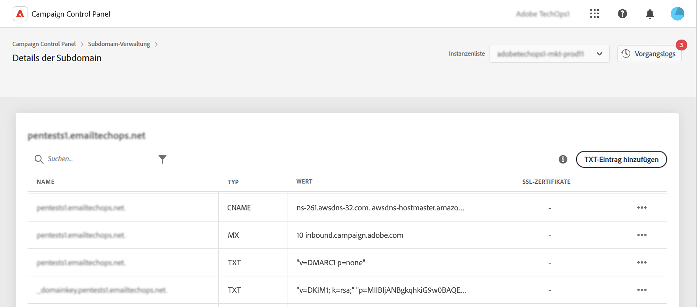

# Erste Schritte mit TXT-Einträgen {#managing-txt-records}

>[!CONTEXTUALHELP]
>id="cp_siteverification_add"
>title="Verwalten von TXT-Einträgen"
>abstract="TXT-Einträge sind eine Art von DNS-Einträgen, die der Bereitstellung von Textinformationen zu einer Domain dienen und von externen Quellen gelesen werden können. Mit Control Panel können Sie Ihren Subdomains drei Arten von Einträgen hinzufügen: Google Site-Überprüfungs-, DMARC- und BIMI-Einträge."

## Über TXT-Einträge {#about}

TXT-Einträge sind eine Art von DNS-Einträgen, die der Bereitstellung von Textinformationen zu einer Domain dienen und von externen Quellen gelesen werden können. Mit Control Panel können Sie Ihren Subdomains drei Eintragstypen hinzufügen:

* **Google TXT-Einträge** erlauben Ihnen zu bestätigen, dass Sie Ihre Domain besitzen, was hohe Posteingangsraten und niedrige Spam-Raten für Ihre E-Mails sicherstellt. [Erfahren Sie, wie Sie Google TXT-Einträge hinzufügen](managing-txt-records.md)
* **DMARC-Einträge** bieten eine Möglichkeit, die Absender-Domain zu authentifizieren und die unbefugte Nutzung der Domain für böswillige Zwecke zu verhindern. [Erfahren Sie, wie Sie DMARC-Einträge hinzufügen](dmarc.md)
* **BIMI-Einträge** ermöglichen es Ihnen, ein genehmigtes Logo neben Ihren E-Mails in den Postfächern von E-Mail-Anbietern anzuzeigen, um die Markenerkennung und das Vertrauen zu fördern. [Erfahren Sie, wie Sie BIMI-Einträge hinzufügen](bimi.md)

## Überwachen der Einträge Ihrer Subdomains {#monitor}

Sie können alle TXT-Einträge überwachen, die für jede Subdomain hinzugefügt wurden, indem Sie auf die Details der Subdomains zugreifen.

In diesem Bildschirm werden alle TXT-Einträge für die ausgewählte Subdomain mit Informationen in der Spalte „Wert“ ihrer Konfiguration angezeigt. Um einen Google TXT-, DMARC- oder BIMI-Eintrag zu löschen, klicken Sie auf die Schaltfläche mit den Auslassungspunkten und wählen Sie dann „Löschen“ aus. Sie können DMARC- und BIMI-Einträge bei Bedarf auch bearbeiten.

